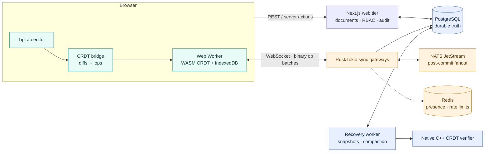
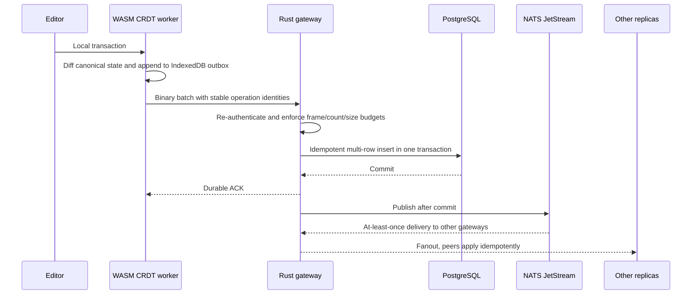
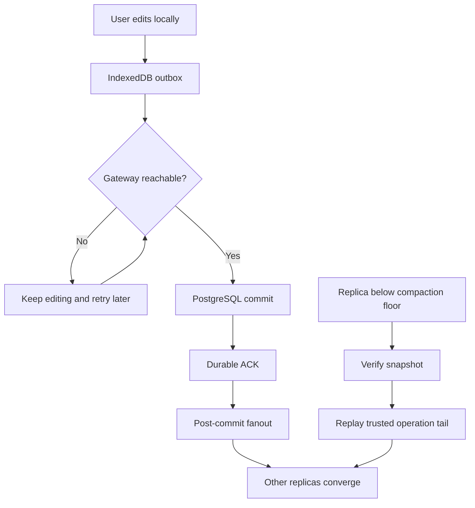

<p align="center">
  
</p>

<h1 align="center">Concord — Local-First Collaborative Editor &amp; Distributed Sync Engine</h1>

<p align="center">
  A document workspace where the browser owns a durable replica first, and a
  Rust/PostgreSQL sync path makes shared edits converge.
</p>

<p align="center">
  <a href="https://github.com/UtkarsHMer05/Concord-Dev/actions/workflows/phase6-pr-ci.yml"></a>
  <a href="https://github.com/UtkarsHMer05/Concord-Dev/actions/workflows/codeql.yml"></a>
  
  
  
  
</p>

> Verification boundary — 2026-09-24: this page documents the current local
> implementation and a fresh reliability-fix pass. TypeScript, lint, web,
> database, realtime, Rust gateway, native, WASM, production-build, and
> dependency-audit checks passed locally. This is not a release verdict: no
> hosted deployment, authenticated Clerk browser journey, or fresh container
> image scan is claimed. The release and image-scan evidence dated
> 2026-09-14 below remains historical and is linked to its original record.

## The short version

Concord is a document editor built around the distributed-systems problem
behind collaborative writing: many replicas must converge while users type,
networks disappear, processes crash, and an acknowledgement must still mean
that the operation is durable.

The repository contains the complete candidate path:

- a deterministic sequence CRDT implemented once in C++20 and compiled for
  both native services and the browser's WebAssembly worker;
- a local-first browser runtime that writes to an IndexedDB-backed replica
  before it waits for the network;
- Rust/Tokio WebSocket gateways that persist operations to PostgreSQL before
  sending a durable acknowledgement;
- NATS JetStream for at-least-once inter-gateway fanout and Redis for
  intentionally ephemeral presence and rate-limit state.

The visible product is intentionally familiar. The project’s identity is the
replication, durability, recovery, and verification work underneath it.


## See it in the browser

These are screenshots captured from the real application with the repository's
authenticated browser harness. The harness used a clean disposable database,
the real Rust gateway, the real Next.js app, and temporary Clerk test users;
the editor text is synthetic and contains no personal or production data.

<table>
  <tr>
    <td width="50%"></td>
    <td width="50%"></td>
  </tr>
  <tr>
    <td align="center"><sub>Dashboard and document templates</sub></td>
    <td align="center"><sub>Editor surface and toolbar</sub></td>
  </tr>
  <tr>
    <td width="50%"></td>
    <td width="50%"></td>
  </tr>
  <tr>
    <td align="center"><sub>Two browser contexts converged</sub></td>
    <td align="center"><sub>Offline edit saved locally</sub></td>
  </tr>
</table>

The second collaboration context is captured separately in
[`collaborative-b.png`](docs/assets/readme/collaborative-b.png). The browser
journey that produced these states is reproducible with the command in
[Browser verification](#browser-verification).

A matching [social-preview.png](docs/assets/readme/social-preview.png) is
included for the repository owner to upload in GitHub’s Social preview
settings; no account-side metadata was changed here.

## What is interesting here

| Boundary | Concord’s answer | Why it matters |
|---|---|---|
| Replica state | C++20 sequence CRDT, compiled to native and WebAssembly | Merge semantics stay aligned across the browser and server-side tooling. |
| Local-first editing | Web Worker + IndexedDB operation log and snapshots | A network interruption does not have to stop typing or erase the pending work. |
| Durable acknowledgement | PostgreSQL commit precedes the WebSocket ACK | “Saved” has a concrete durability boundary. |
| Distributed fanout | NATS JetStream delivers post-commit batches to other gateways | Gateways can fan out without becoming the ordering authority. |
| Recovery | Snapshot verification, operation replay, compaction, and resync floors | Slow or stale replicas have a bounded way back to a trusted state. |
| Authorization | Clerk supplies identity; Concord re-checks document roles server-side | Authentication and authorization stay separate, with deny-by-default access. |

## Architecture

The current implementation candidate is a local-first web editor plus a
separately runnable Rust sync tier. PostgreSQL is the durable source of truth;
NATS is transport, and Redis is ephemeral state. A load balancer can sit in
front of multiple gateways in a deployment-shaped environment, but no live
deployment is claimed by this README.



### One operation, end to end



The important ordering is **local durable intent → database commit → ACK →
fanout**. If the client, gateway, broker, or network fails before the ACK,
the operation remains pending and can be retried with the same identity. If a
message is delivered twice, the database and replicas have idempotent
boundaries.

### Durability and failure handling

The current implementation makes the local and server durability boundaries
explicit across reloads and failures:

| Area | Current behavior | Regression coverage |
|---|---|---|
| Editor seed and local fallback | Template HTML is parsed into editor JSON before it seeds the CRDT. If a local CRDT append fails, the provider switches to local document persistence and saves the editor's current content. | `tests/crdt/bridge.test.ts`, `tests/crdt/worker.test.ts` |
| Catch-up cursor | Remote operations and their cursor are committed together in IndexedDB. A failed apply does not advance the cursor; duplicate-only pages still persist the cursor safely. | `tests/sync/worker-engine-port.test.ts`, `tests/sync/sync-unit.test.ts` |
| Local outbox recovery | On startup and authentication, the sync session compares the durable CRDT log with the outbox and restores missing resend records. ACKed records are compacted only after exact operations are covered by the durable catch-up state. | `tests/sync/worker-engine-port.test.ts`, `tests/realtime/reliability.test.ts` |
| Operation identity and ownership | A repeated operation identity with different payload bytes is rejected transactionally. Replica identities are associated with the authenticated user, and concurrent gateway tests use independent PostgreSQL pools. | `rust/sync-gateway/tests/db_integration.rs` |
| Save and sync feedback | The editor distinguishes local-only work, pending/sent operations, durable ACKs, confirmed synchronization, and sync errors. A transport reconnect alone cannot clear a sync error or claim a server save. | `tests/save-status.test.ts`, `tests/sync/sync-status-store.test.ts` |
| API and audited mutations | Content accepts the supported envelope version; document pagination preserves requested offsets; rename and permission changes commit with their audit event. | `tests/content.test.ts`, `tests/db/documents.test.ts` |
| Gateway frame and shutdown limits | The configured frame ceiling covers inbound and outbound traffic, catch-up batches are split to fit, snapshot size uses a rounded-up base64 estimate, and slow-consumer or shutdown closure bypasses the data queue. | Rust WebSocket and lifecycle integration tests |
| Editor export cost | WASM export traverses the CRDT stream once instead of repeatedly walking it from the head. The local export benchmark includes serialization and JSON parsing, but excludes worker RPC, IndexedDB, and TipTap rendering. | [`wasm/bench-export.mjs`](wasm/bench-export.mjs) |

The document and permission mutations write their audit records in the same
database transaction as the change. The gateway's idempotency and replica
checks likewise run at the PostgreSQL transaction boundary, so competing
gateway processes cannot accept different content for one operation identity
or claim one replica for different users.

### Failure and recovery shape



## Current local verification — 2026-09-24

These checks were run against the current local change set. They establish
that the affected code paths build and pass their local test suites; they do
not replace the release orchestrator, authenticated browser journey, image
scan, or deployment checks.

| Surface | Result |
|---|---|
| Web quality and production build | `npm run typecheck`, `npm run lint`, and `npm run build` passed. |
| Web and database tests | `npm run test:all`: **230 unit tests and 71 database tests passed**. |
| Realtime tests | `npm run test:realtime`: **21 tests passed** with the local test database and generated disposable signing keys. |
| Rust gateway | `cargo test --manifest-path rust/Cargo.toml -p sync-gateway -- --test-threads=1`: all enabled unit and integration groups passed; **1 test ignored**. Rust release build and formatting check passed. |
| Native C++ | Release build was current; CTest passed **3/3**. |
| WebAssembly | `npm run wasm:smoke` passed engine creation, operation application, duplicate handling, snapshot validation, and restore checks. |
| Dependency advisories | `npm audit` found **0 vulnerabilities**; `cargo audit --file rust/Cargo.lock` found no vulnerable locked crates. |
| Patch hygiene | `git diff --check` passed. |

The local realtime suite used the repository's generated E2E key fixture; it
does not exercise a live Clerk account or hosted identity provider. The local
PostgreSQL service was stopped after the checks, with its data volume
preserved.

### Editor export microbenchmark

The latest local run measured **0.287 ms** per export for 100 entries,
**1.073 ms** for 1,000, and **3.922 ms** for 5,000. Each measurement includes
stream serialization and JSON parsing on this host. It does not measure
worker messaging, IndexedDB, TipTap mapping, or end-to-end editor latency, and
it is not a cross-machine performance claim. Re-run it with:

```bash
node --disable-warning=MODULE_TYPELESS_PACKAGE_JSON \
  --experimental-strip-types wasm/bench-export.mjs
```

## Historical candidate verification — 2026-09-14

The following values are bound to implementation candidate
`42dcb17dd26c11a05dd20109102f37ea3fb5135a`, run locally on 2026-09-14. They
are retained as a dated record and are not current results for this checkout.

| Surface | Result recorded on 2026-09-14 | Evidence |
|---|---:|---|
| TypeScript quality gates | `typecheck` pass; `lint` pass | [fresh evidence](docs/audits/CANONICAL_FRESH_EVIDENCE.md) |
| Web unit tests | **16 files / 209 tests** | [fresh evidence](docs/audits/CANONICAL_FRESH_EVIDENCE.md) |
| Web coverage | **86.96% statements**, **78.51% branches**, **88.20% functions**, **87.50% lines** | [fresh evidence](docs/audits/CANONICAL_FRESH_EVIDENCE.md) |
| Database project | **7 files / 69 tests** | [fresh evidence](docs/audits/CANONICAL_FRESH_EVIDENCE.md) |
| Realtime project | **3 files / 21 tests** | [fresh evidence](docs/audits/CANONICAL_FRESH_EVIDENCE.md) |
| Rust workspace | **258 passed / 1 ignored / 0 failed** | [fresh evidence](docs/audits/CANONICAL_FRESH_EVIDENCE.md) |
| Native CTest | **3/3 passed** | [fresh evidence](docs/audits/CANONICAL_FRESH_EVIDENCE.md) |
| WASM | Smoke pass; **5 files / 31 CRDT tests** | [fresh evidence](docs/audits/CANONICAL_FRESH_EVIDENCE.md) |
| Property campaign | **30/30 seeds**, 60,000 operations, 5 replicas × 2,000 operations | [fresh evidence](docs/audits/CANONICAL_FRESH_EVIDENCE.md) |
| Native fuzz targets | **160,000 executions**, 0 reported crashes | [fresh evidence](docs/audits/CANONICAL_FRESH_EVIDENCE.md) |
| Sanitizers | ASan/UBSan CTest 3/3; TSan CTest 3/3 with no diagnostic | [fresh evidence](docs/audits/CANONICAL_FRESH_EVIDENCE.md) |
| Chaos matrix | **27/27 passed**, 0 lost durable-ACKed operations, 0 divergent replicas | [chaos summary](evidence/v1.0.1/chaos-summary.json) |
| Container dependency scan | **Release blocker:** 44 critical, 180 high, 158 moderate, 20 low | [fresh evidence](docs/audits/CANONICAL_FRESH_EVIDENCE.md) |

That dated evidence also records image smoke **3/3**, immutable image pins
**19**, SBOM inventories for Web/Rust/native, secret-history checks, and
provenance assertions. Those checks do not override the container scan or
turn a candidate into a release.

### Historical native benchmark baseline — 2026-09-14

These were Release-mode measurements on the recorded local environment
(Apple M2, 8 cores, 8 GB RAM). They are a baseline for that candidate, not a
current result or a cross-version improvement claim.

| Operation | Measurement |
|---|---:|
| Sequential append | **137.400 ms** median for 10,000 units, 5 runs |
| Random-position insert | **93.456 ms** median for 5,000 units, 5 runs |
| Random delete | **23.768 ms** median for 2,000 deletes, 5 runs |
| Remote batch apply | **2,530.292 ms** median for 19,998 units, 5 runs |
| Snapshot export / import | **1.215 ms / 1.834 ms** |
| Snapshot size | **580,045 bytes** for 10,000 items; serialized op average **47 bytes** |

Full environment and command details live in
[`evidence/v1.0.1/native-benchmark.txt`](evidence/v1.0.1/native-benchmark.txt).

## Historical records are labeled separately

The repository contains earlier phase campaigns that are useful engineering
history but are not current release acceptance. For example, the historical
record includes a 98.4% faster snapshot-plus-tail recovery result, an
8,685-ops/s ingest measurement after batching, a 27-scenario chaos campaign,
and a multi-million-execution fuzz campaign. Those values remain tied to the
commits, environments, and reproduction commands in
[`docs/BENCHMARKS.md`](docs/BENCHMARKS.md); they are not silently presented as
fresh measurements above.

## Engineering highlights

### One core, two runtimes

The sequence CRDT lives in `cpp/` and is compiled for both native tooling and
the browser's WebAssembly worker. The TypeScript bridge translates TipTap
transactions into canonical operations; the worker owns the local replica,
IndexedDB persistence, and outbox. Native snapshot and recovery tooling reuse
the same merge semantics.

### Durable truth before fanout

The gateway re-checks authorization, validates frame and batch budgets, and
inserts operations idempotently into PostgreSQL. It sends the client ACK only
after the transaction commits. NATS carries post-commit fanout; it is not the
ordering authority and not the durable store.

### Honest degradation

The collaborative CRDT subset currently covers text, headings, and basic
formatting. Unsupported content falls back to whole-document persistence and
the UI reports the mode instead of pretending that realtime convergence is
available. Offline edits show “saved locally” while they wait for reconnect.

### Recovery as a first-class path

Snapshots are checksum-verified, compaction is staged and crash-safe, and a
stale client can resync from a snapshot plus a trusted operation tail. The
failure model documents what happens across client crashes, gateway restarts,
broker redelivery, data-service outages, and stale replicas.

## Security and provenance

- Clerk provides identity only. Concord owns document membership and
  server-side roles: `OWNER`, `EDITOR`, `COMMENTER`, and `VIEWER`.
- Reads and writes are re-authorized on every request/batch; denied document
  reads are masked as not-found to reduce enumeration.
- The browser surface uses a pinned CSP, hardened headers, CSWSH/origin
  checks, rate limits, and explicit frame/size budgets.
- Permission changes and revocations are recorded in an append-only audit
  path. Credentials stay in environment/configuration boundaries and are not
  written into screenshots, README text, or source.
- The provenance record is path-specific. It distinguishes retained UI
  primitives and tutorial ancestry from the Concord-owned CRDT, gateway,
  recovery, and verification work. No blanket “100% original” claim is made.

Details: [SECURITY](docs/SECURITY.md),
[AUTHORIZATION](docs/AUTHORIZATION.md),
[PROVENANCE](docs/PROVENANCE.md), [NOTICE](NOTICE), and
[LICENSE](LICENSE).

## Quick start

The web editor needs Node 24, PostgreSQL, and a matching Clerk development
instance. Use a matching publishable/secret key pair; mixing keys from two
Clerk instances produces an authentication redirect loop before the editor can
load.

```bash
nvm use 24
npm ci
cp .env.example .env.local
# Fill .env.local with the matching Clerk keys and DATABASE_URL.
docker compose up -d db
npm run db:migrate
npm run dev
```

Open `http://localhost:3000`. The local-first editor path is available with
the Web Worker and IndexedDB. To exercise realtime sync with the local
gateway/broker stack, see [DEPLOYMENT](docs/DEPLOYMENT.md) and
[OPERATIONS](docs/OPERATIONS.md); those procedures are local runbooks, not
evidence of a hosted runtime.

## Verification commands

### Browser verification

The authenticated browser journey provisions disposable Clerk users, resets a
dedicated `concord_e2e` database, starts the real gateway and Next app, and
cleans up the temporary resources when it exits. This Clerk-backed flow is
separate from the locally signed Vitest realtime suite:

```bash
CONCORD_E2E_VERBOSE=1 \
  npx playwright test \
  --config=playwright.config.ts \
  --project=chromium \
  tests/browser/journey.spec.ts
```

The last recorded run completed **7 tests on 2026-09-14**; it was not rerun in
the 2026-09-24 reliability pass. The local capture script is retained at
[`scripts/readme/capture-screenshots.mjs`](scripts/readme/capture-screenshots.mjs)
so the gallery can be refreshed from the same real application path.

### Focused local gates

```bash
npm run typecheck
npm run lint
npm run test:all
npm run test:coverage
npm run test:realtime
npm run build
npm audit
npm run wasm:smoke
bash scripts/verify-native.sh Release
bash scripts/verify-wasm.sh
cargo test --manifest-path rust/Cargo.toml -p sync-gateway -- --test-threads=1
cargo audit --file rust/Cargo.lock
bash scripts/native/campaign.sh pr
bash scripts/chaos/run-suite.sh all
```

The database and realtime suites require the dedicated local `concord_test`
database through `DATABASE_TEST_URL`. The realtime suite also requires the
gateway/native test binaries and disposable local signing keys; generate the
keys with `node scripts/ci/generate-e2e-keys.mjs` before the run. Those keys
are test-only and must never be used for a deployed issuer.

The strict release orchestrator and the evidence ledger are the source of
truth for the current candidate. Run the whole release-shaped suite before
describing a future tag or deployment as ready.

## Project map

```text
cpp/      C++20 sequence CRDT, native worker, CTest, fuzzers, campaigns
rust/     Rust/Tokio sync gateway, auth, ingest, fanout, drain, chaos tests
src/      Next.js editor, CRDT client, Web Worker bridge, server authorization
wasm/     Emscripten build and parity/smoke tooling
scripts/  build, browser, verification, benchmark, and operational tooling
tests/    web unit, database, realtime, and rendered-browser suites
docs/     architecture, protocol, consistency, security, recovery, evidence
public/   canonical logo, template artwork, CRDT worker, and WASM assets
```

## Documentation index

Start with the [documentation index](docs/README.md), then choose the layer
you want to inspect:

- [Architecture](docs/ARCHITECTURE.md) · [Engineering brief](docs/ENGINEERING_BRIEF.md)
- [Consistency model](docs/CONSISTENCY_MODEL.md) · [Protocol](docs/PROTOCOL.md)
- [Database and storage](docs/DATABASE.md) · [Recovery](docs/RECOVERY.md)
- [Failure model](docs/FAILURE_MODEL.md) · [Operations](docs/OPERATIONS.md)
- [Security](docs/SECURITY.md) · [Testing](docs/TESTING.md)
- [Browser support](docs/BROWSER_SUPPORT.md) · [Configuration](docs/CONFIGURATION.md)
- [Benchmarks](docs/BENCHMARKS.md) · [Verification](docs/VERIFICATION.md)
- [Decisions](docs/DECISIONS.md) · [Deployment](docs/DEPLOYMENT.md)
- [Fresh candidate evidence](docs/audits/CANONICAL_FRESH_EVIDENCE.md) ·
  [release ledger](docs/audits/CANONICAL_RELEASE_LEDGER.json)

## Current limits and owner actions

The current state is deliberately bounded:

- No current AWS, Vercel, Neon, or other hosted runtime is claimed. The
  historical AWS exercise was torn down; do not infer availability from old
  deployment records or a configured URL.
- No v1.0.1 tag or GitHub Release has been published. Release identity,
  release artifacts, and account-side deployment still require owner action.
- Authenticated browser CI was intentionally removed from the remote workflow;
  local authenticated browser verification is available when the configured
  Clerk instance and services are present.
- The data tier is single-node per environment in this candidate. Gateways
  can scale horizontally, but PostgreSQL/NATS/Redis topology and operating
  contracts remain explicit work rather than an implicit scale claim.
- History/restore UI is outside the v1 product boundary even though protocol
  and recovery machinery are exercised.
- Embedded WebViews and hosted production behavior need separate verification.

Before publishing a release or portfolio link, rerun the complete release
gate, including a fresh container image scan, complete the legal/provenance
review, verify account-side CI and release settings, and independently
verify any hosted runtime. The 2026-09-24 source dependency audits passed,
but the container image scan was not rerun as part of that local code pass.
This README does not claim those external actions were completed.

## Provenance and attribution

Concord began from the Code With Antonio “Google Docs Clone” tutorial shape
(Next.js, React, Clerk, Convex, and Liveblocks) and was rebuilt into a
systems-focused project in this repository. That historical phrase is kept
only for attribution; it is not the product identity. The pristine tutorial
baseline is preserved at the `antonio-original-baseline` tag, and the
path-specific evidence and retained third-party UI attribution are documented
in [`docs/PROVENANCE.md`](docs/PROVENANCE.md) and [`NOTICE`](NOTICE).

## License

MIT — see [`LICENSE`](LICENSE). Third-party components remain under their own
licenses, summarized in [`NOTICE`](NOTICE).
