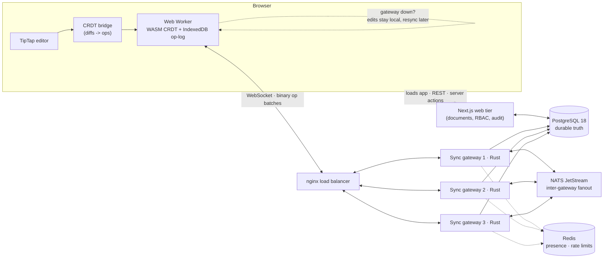
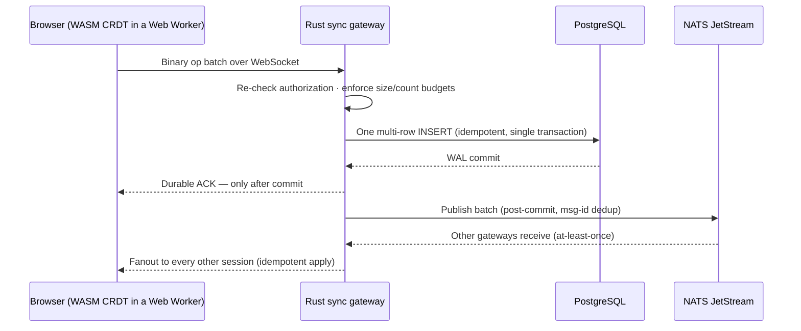

<p align="center">
  
</p>

<h1 align="center">Concord</h1>

<p align="center">
  A local-first collaborative document workspace — with the entire
  synchronization engine built from scratch.
</p>

<p align="center">
  
  
  
  
  
  
</p>

<p align="center">
  <strong>Live demo →
  <a href="https://concord-dev.vercel.app">concord-dev.vercel.app</a></strong><br />
  Sign in with an email code, create a document, start typing.
  Everything you type is CRDT-merged and durable.
</p>

---

## The 30-second version

Concord looks like a document editor — but the hard part of a
Google-Docs-class product is **not the text box**. It is keeping many
replicas of the same document converging while people type
simultaneously, on unreliable networks, without ever losing an edit
that was acknowledged as saved.

Concord's answer, all built in this repository:

- a **sequence CRDT written once in C++20**, compiled twice — native
  (server) and **WebAssembly** (browser) — so every replica runs the
  same merge code;
- **Rust WebSocket gateways** that acknowledge an edit *only after its
  PostgreSQL commit*, backed by an at-least-once, idempotent transport
  that survives crashes, duplicates, and partitions;
- a **local-first client**: you type into a local replica inside a Web
  Worker (IndexedDB op-log), online or offline, and sync when a
  gateway is reachable.

No collaboration SaaS is involved. Liveblocks and Convex were removed
deliberately (Phases 0–1, asserted by smoke tests: their old endpoints
404). The sync stack — merge semantics, wire protocol, gateways,
recovery — is original to this repo, and **every number in this README
is measured**, with reproduction commands in
[`docs/BENCHMARKS.md`](docs/BENCHMARKS.md).

## What is hard about this (and how it is answered)

**1. Every replica must merge to the exact same document.**
One C++20 core (YATA-style origin anchoring, tombstones, last-writer-wins
attribute registers) is compiled to native *and* WASM; every
correctness suite asserts the two produce byte-identical digests.
Replicas converge under arbitrary reordering, duplication, and
partition — verified by a 130-seed randomized campaign
(**1.06 M operations, 0 divergent replicas**) and a 27-scenario chaos
matrix (**0 lost durable-ACKed operations**).

**2. "Saved" must actually mean saved.**
An operation is acknowledged only after its PostgreSQL WAL commit;
delivery is at-least-once with idempotent ingestion (operation
identity = canonical bytes; a unique index is the dedup boundary).
Client crash mid-batch, gateway SIGKILL after commit-before-ACK, NATS
redelivery storm — all tested scenarios, none lose an acknowledged
operation. The exact claims (and non-claims) are written down in
[`docs/FAILURE_MODEL.md`](docs/FAILURE_MODEL.md).

**3. Local-first has to be real, not a marketing word.**
The browser edits into its own replica (IndexedDB op-log + snapshots
inside a Web Worker). Offline edits queue durably and re-send with
stable identities on reconnect; a stale client past a compaction floor
resyncs from a checksum-verified snapshot before trusting anything.

## How the system fits together



| Layer | Language | Why |
|---|---|---|
| CRDT core, snapshots, hashing, verification worker | C++20 (native + Emscripten → WASM) | one deterministic merge engine, compiled twice; the server worker reuses it for snapshot/recovery verification |
| Browser runtime: TipTap ⇄ CRDT bridge, Web Worker, IndexedDB, sync session | TypeScript | product UI + the client half of the wire protocol |
| Sync gateways: WebSocket transport, authN/authZ, bounded queues, backpressure, graceful drain | Rust (tokio) | long-lived connections, strict frame budgets, measured SIGTERM draining |
| Durable truth: operations, ACLs, snapshots, history, audit | PostgreSQL 18 | the only durable store; WAL commit precedes every ACK |
| Inter-gateway fanout | NATS JetStream | event transport with msg-id dedup — explicitly *not* the ordering authority, *not* durable truth |
| Presence, rate limits, caches | Redis | ephemeral only; safe to FLUSHALL by design |

## The write path: keystroke → durable → everyone else



In words: a keystroke diffs against the replica's canonical state and
emits CRDT operations with stable identities (`replica:counter`); the
gateway ingests them in one `INSERT … ON CONFLICT DO NOTHING`; the ACK
fires only after commit; on any failure the ops stay pending in the
client outbox and re-send under the same identities — the server
dedups.

## Snapshots, recovery, compaction

History is the operation log; snapshots compress it. Recovery can
replay 100 k operations (65.2 s p50) or import a snapshot plus the 1 k
tail after it (**0.96 s p50 — 98.4 % faster**, digest-verified on every
run, reproduced four times: 98.6 / 98.5 / 98.6 / 98.4 %). Safe
compaction prunes operations covered by a snapshot boundary (staged,
crash-safe, integrity-checked): after fully compacting a 50 k-op
document, **50.1 %** of durable bytes remain.

## Measured results

| Claim | Measured |
|---|---|
| Durable-ACK ingest, 25-op batch | p50 31.45 → **2.72 ms** (−91.4 %) after replacing per-op INSERT round trips with one multi-row `unnest` INSERT; throughput 771 → **8 685 ops/s** (11.3×). Profiler-driven; replay digests identical before/after. |
| Scale-out, 1 → 4 gateways (200 ops/s open-loop) | ack p95 13.19 → **15.23 ms**, **zero loss, 0.000 % errors** — a gateway costs ~2 ms |
| Snapshot+tail recovery | **98.4 % faster** than full replay (65.2 → 0.96 s p50; 100 k history / 1 k tail; 5 runs) |
| Correctness campaigns | **181/181 scenarios**, 0 divergent replicas, 0 lost durable-ACKed ops |
| Fuzzing | **5 M executions, 0 crashes** (every fixed crash pinned by a corpus regression) |
| Browser WASM path | typing 0.003 ms/op; 5 k-op fanout batch 227 ms; runtime bundle 180 KB |

Environments, run counts, denominators, and reproduction commands for
every number: [`docs/BENCHMARKS.md`](docs/BENCHMARKS.md).

## Proving it: the verification campaign

- **Chaos:** gateway SIGKILL / rolling restart, NATS pause / restart /
  redelivery / lag / storage loss, Redis loss, Postgres outage, worker
  faults, compound scenarios — **27/27 green, 0 acknowledged-op loss**.
- **Graceful drain:** SIGTERM → stop accepting sessions → finish
  in-flight durable writes → close, measured ~2.2–3 s; a production
  rolling gateway restart was verified live with both client sessions
  intact.
- **Sanitizers:** ASan + UBSan and TSan green across the native matrix.
- **Test suites:** 62 web unit (incl. bridge seed-path and adapter
  regressions), native 64 + worker 51, WASM parity 26 + smoke,
  63 database (isolated `concord_test` DB, migrations replayed from
  empty on every run), 16 protocol/WS, 236 Rust gateway tests.

## Security

Deny-by-default server-side authorization with roles
(OWNER / EDITOR / COMMENTER / VIEWER), re-checked on every batch and
document read; read-denial is masked as not-found. A 32-row threat
model maps every threat to a test. Clerk handles identity **only** —
all authorization is enforced against Concord-owned data. The public
surface ships a pinned CSP (including `wasm-unsafe-eval` — its
omission was caught live on production, silently disabling the WASM
engine in WebKit), hardened headers, rate limits, and strict
frame/size budgets. Permission changes and revocations land in an
append-only audit table. Details: [`docs/SECURITY.md`](docs/SECURITY.md).

## How it was built

The project was executed as eight engineered phases, each ending at a
tagged, gated release (milestone IDs, gates, and evidence in
`.agent/`-linked docs and commit history):

| Phase | What shipped |
|---|---|
| 0 | Modernized the product shell; removed Liveblocks (smoke tests assert its endpoints 404) |
| 1 | PostgreSQL 18 + drizzle data layer; RBAC with deny-by-default, live revocation, IDOR-hardened routes; removed Convex |
| 2 | C++20 sequence CRDT (one core → native + WASM); browser Web Worker runtime, IndexedDB durability, editor bridge |
| 3 | Realtime transport: Rust WebSocket gateways, binary wire protocol, authN/authZ per batch, backpressure + graceful drain |
| 4 | Distributed fanout: nginx LB over N gateways, NATS JetStream (msg-id dedup), Redis presence/rate limits; crash/storm/slow/lag E2E; 1→3 gateway scale-out, zero loss |
| 5 | Snapshots, 98.6 % faster recovery, crash-safe compaction, restore-as-forward-ops, retention + audit hardening |
| 6 | Proof phase: 32-row threat model fully mapped to tests, sanitizers, 5 M fuzz execs, 27-scenario chaos, deterministic SBOMs, hardened images, OTel/Prometheus/Grafana live-proven |
| 7 | Production polish + deployment: browser-verified E2E on the release build, CSP/CSWSH live fixes, every benchmark reproduced at the final tree |

The pristine tutorial baseline is preserved at the git tag
`antonio-original-baseline` (see Provenance below).

## Quick start

```bash
nvm use 24                 # Node 24 (.nvmrc pins 24.20.0)
npm ci
docker compose up -d db    # PostgreSQL 18 on localhost:5433
cp .env.example .env.local # then fill Clerk keys + DATABASE_URL
npm run db:migrate
npm run dev                # http://localhost:3000
```

The editor and the local-first CRDT runtime work out of the box (Web
Worker + IndexedDB). Realtime sync additionally runs the Rust gateway
stack — see [`docs/DEPLOYMENT.md`](docs/DEPLOYMENT.md).

### Tests

```bash
npm run typecheck && npm run lint && npm test   # web suites
npm run test:realtime                          # real gateways over real WS
./scripts/verify-native.sh Release              # C++ core 64 + worker 51
./scripts/verify-wasm.sh                       # WASM parity 26 + smoke
cd rust/sync-gateway && cargo test -- --test-threads=1   # 236 tests
```

## Repository layout

```
cpp/      C++20 CRDT core, native worker, tests, fuzz, campaign
rust/     Rust sync gateway: auth, ingest, fanout, drain, chaos tests
src/      Next.js app, CRDT client runtime, sync session
wasm/     Emscripten build + smoke tests
scripts/  verify / benchmark / deploy tooling
tests/    web, realtime, and database test suites
docs/     architecture, protocol, consistency, security, benchmarks, …
```

Deep dives: [ARCHITECTURE](docs/ARCHITECTURE.md) ·
[CONSISTENCY_MODEL](docs/CONSISTENCY_MODEL.md) ·
[PROTOCOL](docs/PROTOCOL.md) ·
[STORAGE](docs/STORAGE.md) ·
[RECOVERY](docs/RECOVERY.md) ·
[FAILURE_MODEL](docs/FAILURE_MODEL.md) ·
[SECURITY](docs/SECURITY.md) ·
[TESTING](docs/TESTING.md) ·
[BENCHMARKS](docs/BENCHMARKS.md) ·
[VERIFICATION](docs/VERIFICATION.md) ·
[DECISIONS](docs/DECISIONS.md)

## What the live demo runs (honest scope)

The demo at [concord-dev.vercel.app](https://concord-dev.vercel.app)
runs the **web tier on Vercel + Neon PostgreSQL + Clerk**, free tier.

Working live: sign-in, creating/renaming/deleting documents,
CRDT-backed editing, and edits durable across reloads in your browser
(the local-first op-log) — documents and permissions live in
PostgreSQL.

Not running on the demo URL: the **multi-user realtime fanout path**
(Rust gateways + nginx + NATS + Redis). That stack is built, tested,
and deployable — it ran live on AWS as a 10-service compose stack and
was verified by browser E2E on the release build; hosting was torn
down to keep the ongoing cost at zero. The client detects the missing
gateway and stays in local-first mode truthfully (no fake
"collaborating" states) — the same degradation any offline session
uses by design.

Remaining v1 limitations, stated plainly:

- Single-node data services per environment (gateways scale
  horizontally; the data tier does not, yet).
- Collaborative subset: text, headings, basic formatting. Content
  outside the subset degrades that session to whole-document save —
  surfaced loudly in the UI, never silent.
- History/restore UI is out of the v1 boundary (the revision/restore
  machinery exists and is tested at the protocol layer).
- Embedded-WebView browsers can need one event or a reload to
  converge the live fanout visually (data path verified sound;
  standard browsers pass 21/21; a render watchdog bounds the path).

## Provenance and attribution

This project originated from the Code With Antonio "Google Docs Clone"
tutorial (Next.js/React/Clerk/Convex/Liveblocks) and was deliberately
rebuilt into an original engineering project: only the tutorial's
product shell survives as a derivative — the synchronization stack,
wire protocol, CRDT, gateways, and data layer are original to this
repository. The pristine tutorial baseline is preserved at the git tag
`antonio-original-baseline`; attribution is retained, and upstream
licensing remains under review before any public release
(see [`docs/DECISIONS.md`](docs/DECISIONS.md)).

## License

Not yet licensed for redistribution; licensing is resolved before
public release (see Provenance above).
