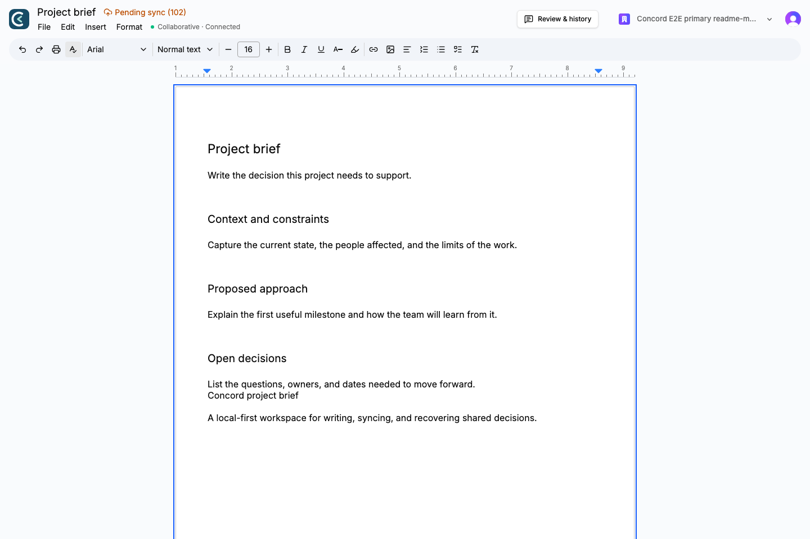
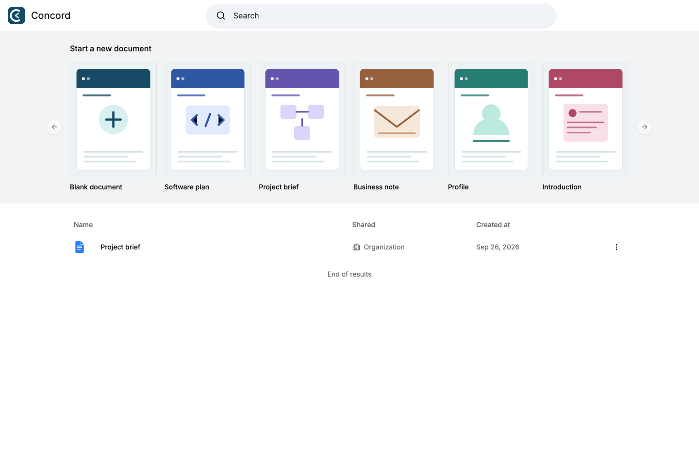
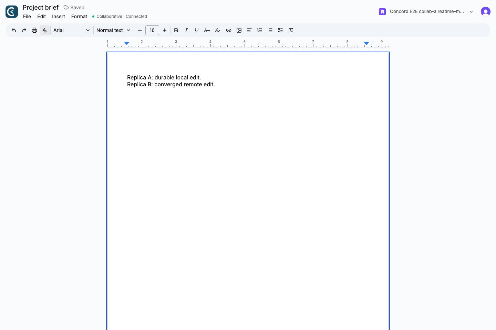
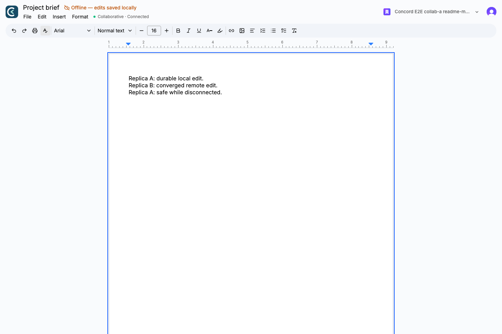
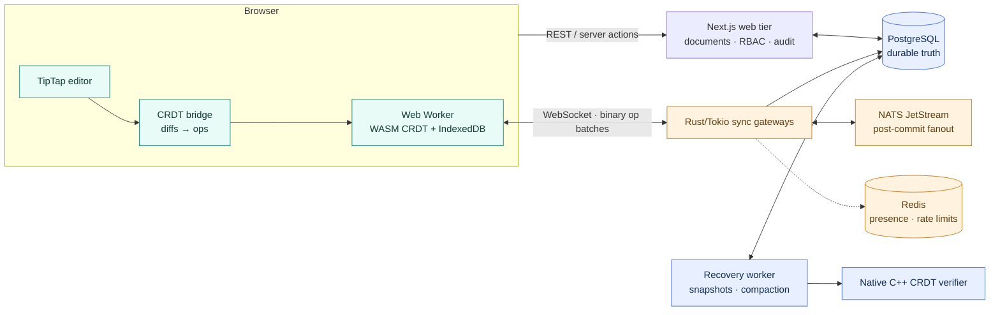
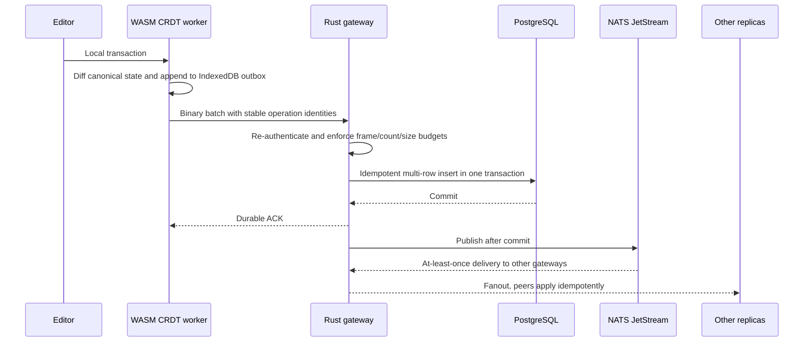
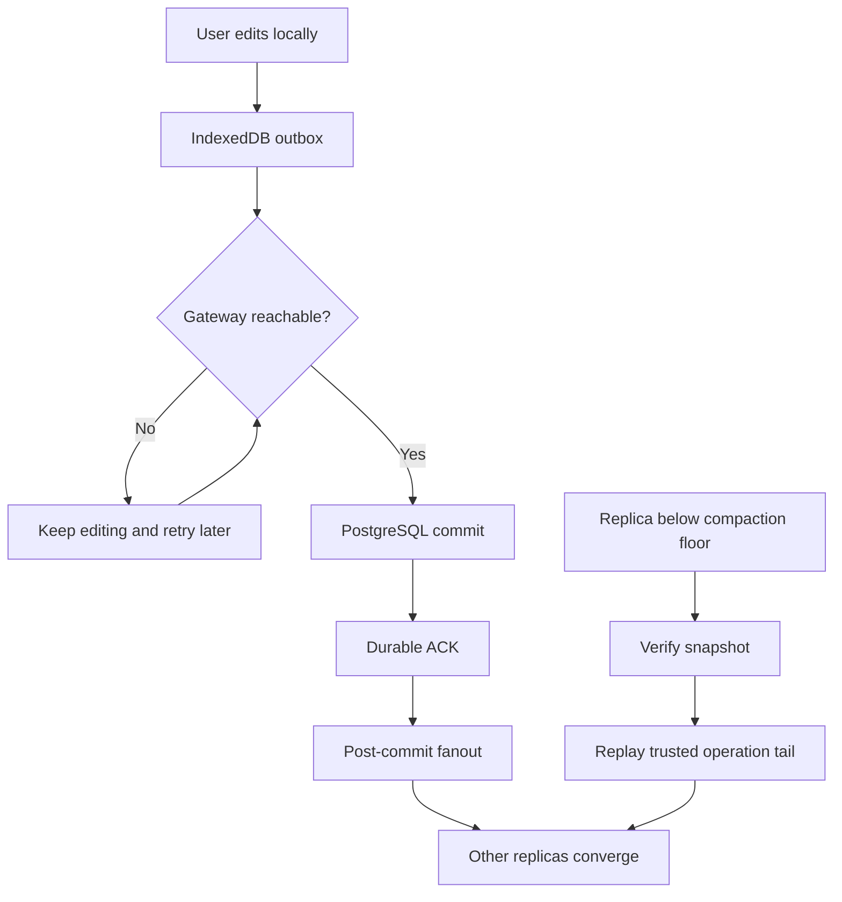

<p align="center">
  
</p>

<h1 align="center">Concord — Local-First Collaborative Editor &amp; Distributed Sync Engine</h1>

<p align="center">
  A document workspace where the browser owns a durable replica first, and a
  Rust/PostgreSQL sync path makes shared edits converge.
</p>

<p align="center">
  <a href="https://github.com/UtkarsHMer05/Concord-Dev/actions/workflows/phase6-pr-ci.yml"></a>
  <a href="https://github.com/UtkarsHMer05/Concord-Dev/actions/workflows/codeql.yml"></a>
  
  
  
  
</p>

> Verification boundary — 2026-09-14: this page presents the checked-in
> v1.0.1 implementation candidate and its traceable local evidence. It does
> not claim a published v1.0.1 release, a live deployment, a current Vercel
> runtime, or a production authenticated-browser result. The strict local
> orchestrator recorded **25 passes, 1 release-blocking dependency-scan
> failure, and 0 skips**; the container scan reported **44 critical** and
> **180 high** findings. The failure is kept visible instead of being hidden
> behind a green badge. See the [fresh evidence ledger](docs/audits/CANONICAL_FRESH_EVIDENCE.md).

## The short version

Concord is a document editor built around the distributed-systems problem
behind collaborative writing: many replicas must converge while users type,
networks disappear, processes crash, and an acknowledgement must still mean
that the operation is durable.

The repository contains the complete candidate path:

- a deterministic sequence CRDT implemented once in C++20 and compiled for
  both native services and the browser's WebAssembly worker;
- a local-first browser runtime that writes to an IndexedDB-backed replica
  before it waits for the network;
- Rust/Tokio WebSocket gateways that persist operations to PostgreSQL before
  sending a durable acknowledgement;
- NATS JetStream for at-least-once inter-gateway fanout and Redis for
  intentionally ephemeral presence and rate-limit state.

The visible product is intentionally familiar. The project’s identity is the
replication, durability, recovery, and verification work underneath it.



## See it in the browser

These are screenshots captured from the real application with the repository's
authenticated browser harness. The harness used a clean disposable database,
the real Rust gateway, the real Next.js app, and temporary Clerk test users;
the editor text is synthetic and contains no personal or production data.

<table>
  <tr>
    <td width="50%"></td>
    <td width="50%"></td>
  </tr>
  <tr>
    <td align="center"><sub>Dashboard and document templates</sub></td>
    <td align="center"><sub>Editor surface and toolbar</sub></td>
  </tr>
  <tr>
    <td width="50%"></td>
    <td width="50%"></td>
  </tr>
  <tr>
    <td align="center"><sub>Two browser contexts converged</sub></td>
    <td align="center"><sub>Offline edit saved locally</sub></td>
  </tr>
</table>

The second collaboration context is captured separately in
[`collaborative-b.png`](docs/assets/readme/collaborative-b.png). The browser
journey that produced these states is reproducible with the command in
[Browser verification](#browser-verification).

A matching [social-preview.png](docs/assets/readme/social-preview.png) is
included for the repository owner to upload in GitHub’s Social preview
settings; no account-side metadata was changed here.

## What is interesting here

| Boundary | Concord’s answer | Why it matters |
|---|---|---|
| Replica state | C++20 sequence CRDT, compiled to native and WebAssembly | Merge semantics stay aligned across the browser and server-side tooling. |
| Local-first editing | Web Worker + IndexedDB operation log and snapshots | A network interruption does not have to stop typing or erase the pending work. |
| Durable acknowledgement | PostgreSQL commit precedes the WebSocket ACK | “Saved” has a concrete durability boundary. |
| Distributed fanout | NATS JetStream delivers post-commit batches to other gateways | Gateways can fan out without becoming the ordering authority. |
| Recovery | Snapshot verification, operation replay, compaction, and resync floors | Slow or stale replicas have a bounded way back to a trusted state. |
| Authorization | Clerk supplies identity; Concord re-checks document roles server-side | Authentication and authorization stay separate, with deny-by-default access. |

## Architecture

The current implementation candidate is a local-first web editor plus a
separately runnable Rust sync tier. PostgreSQL is the durable source of truth;
NATS is transport, and Redis is ephemeral state. A load balancer can sit in
front of multiple gateways in a deployment-shaped environment, but no live
deployment is claimed by this README.



### One operation, end to end



The important ordering is **local durable intent → database commit → ACK →
fanout**. If the client, gateway, broker, or network fails before the ACK,
the operation remains pending and can be retried with the same identity. If a
message is delivered twice, the database and replicas have idempotent
boundaries.

### Failure and recovery shape



## Current verification — candidate, not release verdict

The following values are bound to implementation candidate
`42dcb17dd26c11a05dd20109102f37ea3fb5135a`, run locally on 2026-09-14. They
are reported with denominators and remain separate from historical phase
records.

| Surface | Fresh result | Evidence |
|---|---:|---|
| TypeScript quality gates | `typecheck` pass; `lint` pass | [fresh evidence](docs/audits/CANONICAL_FRESH_EVIDENCE.md) |
| Web unit tests | **16 files / 209 tests** | [fresh evidence](docs/audits/CANONICAL_FRESH_EVIDENCE.md) |
| Web coverage | **86.96% statements**, **78.51% branches**, **88.20% functions**, **87.50% lines** | [fresh evidence](docs/audits/CANONICAL_FRESH_EVIDENCE.md) |
| Database project | **7 files / 69 tests** | [fresh evidence](docs/audits/CANONICAL_FRESH_EVIDENCE.md) |
| Realtime project | **3 files / 21 tests** | [fresh evidence](docs/audits/CANONICAL_FRESH_EVIDENCE.md) |
| Rust workspace | **258 passed / 1 ignored / 0 failed** | [fresh evidence](docs/audits/CANONICAL_FRESH_EVIDENCE.md) |
| Native CTest | **3/3 passed** | [fresh evidence](docs/audits/CANONICAL_FRESH_EVIDENCE.md) |
| WASM | Smoke pass; **5 files / 31 CRDT tests** | [fresh evidence](docs/audits/CANONICAL_FRESH_EVIDENCE.md) |
| Property campaign | **30/30 seeds**, 60,000 operations, 5 replicas × 2,000 operations | [fresh evidence](docs/audits/CANONICAL_FRESH_EVIDENCE.md) |
| Native fuzz targets | **160,000 executions**, 0 reported crashes | [fresh evidence](docs/audits/CANONICAL_FRESH_EVIDENCE.md) |
| Sanitizers | ASan/UBSan CTest 3/3; TSan CTest 3/3 with no diagnostic | [fresh evidence](docs/audits/CANONICAL_FRESH_EVIDENCE.md) |
| Chaos matrix | **27/27 passed**, 0 lost durable-ACKed operations, 0 divergent replicas | [chaos summary](evidence/v1.0.1/chaos-summary.json) |
| Container dependency scan | **Release blocker:** 44 critical, 180 high, 158 moderate, 20 low | [fresh evidence](docs/audits/CANONICAL_FRESH_EVIDENCE.md) |

The fresh evidence also records image smoke **3/3**, immutable image pins
**19**, SBOM inventories for Web/Rust/native, secret-history checks, and
provenance assertions. Those checks do not override the container scan or
turn a candidate into a release.

### Current native benchmark baseline

These are fresh Release-mode measurements on the recorded local environment
(Apple M2, 8 cores, 8 GB RAM). They are a baseline for this candidate, not a
cross-version improvement claim.

| Operation | Measurement |
|---|---:|
| Sequential append | **137.400 ms** median for 10,000 units, 5 runs |
| Random-position insert | **93.456 ms** median for 5,000 units, 5 runs |
| Random delete | **23.768 ms** median for 2,000 deletes, 5 runs |
| Remote batch apply | **2,530.292 ms** median for 19,998 units, 5 runs |
| Snapshot export / import | **1.215 ms / 1.834 ms** |
| Snapshot size | **580,045 bytes** for 10,000 items; serialized op average **47 bytes** |

Full environment and command details live in
[`evidence/v1.0.1/native-benchmark.txt`](evidence/v1.0.1/native-benchmark.txt).

## Historical records are labeled separately

The repository contains earlier phase campaigns that are useful engineering
history but are not current release acceptance. For example, the historical
record includes a 98.4% faster snapshot-plus-tail recovery result, an
8,685-ops/s ingest measurement after batching, a 27-scenario chaos campaign,
and a multi-million-execution fuzz campaign. Those values remain tied to the
commits, environments, and reproduction commands in
[`docs/BENCHMARKS.md`](docs/BENCHMARKS.md); they are not silently presented as
fresh measurements above.

## Engineering highlights

### One core, two runtimes

The sequence CRDT lives in `cpp/` and is compiled for both native tooling and
the browser's WebAssembly worker. The TypeScript bridge translates TipTap
transactions into canonical operations; the worker owns the local replica,
IndexedDB persistence, and outbox. Native snapshot and recovery tooling reuse
the same merge semantics.

### Durable truth before fanout

The gateway re-checks authorization, validates frame and batch budgets, and
inserts operations idempotently into PostgreSQL. It sends the client ACK only
after the transaction commits. NATS carries post-commit fanout; it is not the
ordering authority and not the durable store.

### Honest degradation

The collaborative CRDT subset currently covers text, headings, and basic
formatting. Unsupported content falls back to whole-document persistence and
the UI reports the mode instead of pretending that realtime convergence is
available. Offline edits show “saved locally” while they wait for reconnect.

### Recovery as a first-class path

Snapshots are checksum-verified, compaction is staged and crash-safe, and a
stale client can resync from a snapshot plus a trusted operation tail. The
failure model documents what happens across client crashes, gateway restarts,
broker redelivery, data-service outages, and stale replicas.

## Security and provenance

- Clerk provides identity only. Concord owns document membership and
  server-side roles: `OWNER`, `EDITOR`, `COMMENTER`, and `VIEWER`.
- Reads and writes are re-authorized on every request/batch; denied document
  reads are masked as not-found to reduce enumeration.
- The browser surface uses a pinned CSP, hardened headers, CSWSH/origin
  checks, rate limits, and explicit frame/size budgets.
- Permission changes and revocations are recorded in an append-only audit
  path. Credentials stay in environment/configuration boundaries and are not
  written into screenshots, README text, or source.
- The provenance record is path-specific. It distinguishes retained UI
  primitives and tutorial ancestry from the Concord-owned CRDT, gateway,
  recovery, and verification work. No blanket “100% original” claim is made.

Details: [SECURITY](docs/SECURITY.md),
[AUTHORIZATION](docs/AUTHORIZATION.md),
[PROVENANCE](docs/PROVENANCE.md), [NOTICE](NOTICE), and
[LICENSE](LICENSE).

## Quick start

The web editor needs Node 24, PostgreSQL, and a matching Clerk development
instance. Use a matching publishable/secret key pair; mixing keys from two
Clerk instances produces an authentication redirect loop before the editor can
load.

```bash
nvm use 24
npm ci
cp .env.example .env.local
# Fill .env.local with the matching Clerk keys and DATABASE_URL.
docker compose up -d db
npm run db:migrate
npm run dev
```

Open `http://localhost:3000`. The local-first editor path is available with
the Web Worker and IndexedDB. To exercise realtime sync with the local
gateway/broker stack, see [DEPLOYMENT](docs/DEPLOYMENT.md) and
[OPERATIONS](docs/OPERATIONS.md); those procedures are local runbooks, not
evidence of a hosted runtime.

## Verification commands

### Browser verification

The authenticated browser journey provisions disposable Clerk users, resets a
dedicated `concord_e2e` database, starts the real gateway and Next app, and
cleans up the temporary resources when it exits:

```bash
CONCORD_E2E_VERBOSE=1 \
  npx playwright test \
  --config=playwright.config.ts \
  --project=chromium \
  tests/browser/journey.spec.ts
```

The fresh run used for this README completed **7 tests**. The local capture
script is retained at
[`scripts/readme/capture-screenshots.mjs`](scripts/readme/capture-screenshots.mjs)
so the gallery can be refreshed from the same real application path.

### Focused local gates

```bash
npm run typecheck
npm run lint
npm test
npm run test:coverage
npm run db:test:prepare && npm run db:migrate:test && npm run test:db
npm run test:realtime
bash scripts/verify-native.sh Release
bash scripts/verify-wasm.sh
cargo test --manifest-path rust/Cargo.toml --workspace -- --test-threads=1
bash scripts/native/campaign.sh pr
bash scripts/chaos/run-suite.sh all
```

The strict release orchestrator and the evidence ledger are the source of
truth for the current candidate. Run the whole release-shaped suite before
describing a future tag or deployment as ready.

## Project map

```text
cpp/      C++20 sequence CRDT, native worker, CTest, fuzzers, campaigns
rust/     Rust/Tokio sync gateway, auth, ingest, fanout, drain, chaos tests
src/      Next.js editor, CRDT client, Web Worker bridge, server authorization
wasm/     Emscripten build and parity/smoke tooling
scripts/  build, browser, verification, benchmark, and operational tooling
tests/    web unit, database, realtime, and rendered-browser suites
docs/     architecture, protocol, consistency, security, recovery, evidence
public/   canonical logo, template artwork, CRDT worker, and WASM assets
```

## Documentation index

Start with the [documentation index](docs/README.md), then choose the layer
you want to inspect:

- [Architecture](docs/ARCHITECTURE.md) · [Engineering brief](docs/ENGINEERING_BRIEF.md)
- [Consistency model](docs/CONSISTENCY_MODEL.md) · [Protocol](docs/PROTOCOL.md)
- [Database and storage](docs/DATABASE.md) · [Recovery](docs/RECOVERY.md)
- [Failure model](docs/FAILURE_MODEL.md) · [Operations](docs/OPERATIONS.md)
- [Security](docs/SECURITY.md) · [Testing](docs/TESTING.md)
- [Browser support](docs/BROWSER_SUPPORT.md) · [Configuration](docs/CONFIGURATION.md)
- [Benchmarks](docs/BENCHMARKS.md) · [Verification](docs/VERIFICATION.md)
- [Decisions](docs/DECISIONS.md) · [Deployment](docs/DEPLOYMENT.md)
- [Fresh candidate evidence](docs/audits/CANONICAL_FRESH_EVIDENCE.md) ·
  [release ledger](docs/audits/CANONICAL_RELEASE_LEDGER.json)

## Current limits and owner actions

The current state is deliberately bounded:

- No current AWS, Vercel, Neon, or other hosted runtime is claimed. The
  historical AWS exercise was torn down; do not infer availability from old
  deployment records or a configured URL.
- No v1.0.1 tag or GitHub Release has been published. Release identity,
  release artifacts, and account-side deployment still require owner action.
- Authenticated browser CI was intentionally removed from the remote workflow;
  local authenticated browser verification is available when the configured
  Clerk instance and services are present.
- The data tier is single-node per environment in this candidate. Gateways
  can scale horizontally, but PostgreSQL/NATS/Redis topology and operating
  contracts remain explicit work rather than an implicit scale claim.
- History/restore UI is outside the v1 product boundary even though protocol
  and recovery machinery are exercised.
- Embedded WebViews and hosted production behavior need separate verification.

Before publishing a portfolio link, an owner should resolve the dependency
scan findings, complete the legal/provenance review, verify account-side CI
and release settings, and independently verify any hosted runtime. This
README intentionally does not perform those external actions.

## Provenance and attribution

Concord began from the Code With Antonio “Google Docs Clone” tutorial shape
(Next.js, React, Clerk, Convex, and Liveblocks) and was rebuilt into a
systems-focused project in this repository. That historical phrase is kept
only for attribution; it is not the product identity. The pristine tutorial
baseline is preserved at the `antonio-original-baseline` tag, and the
path-specific evidence and retained third-party UI attribution are documented
in [`docs/PROVENANCE.md`](docs/PROVENANCE.md) and [`NOTICE`](NOTICE).

## License

MIT — see [`LICENSE`](LICENSE). Third-party components remain under their own
licenses, summarized in [`NOTICE`](NOTICE).
