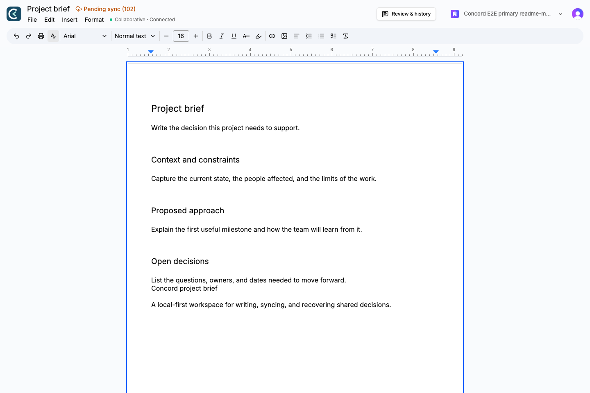
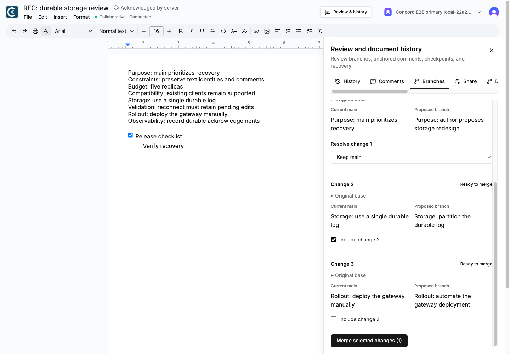
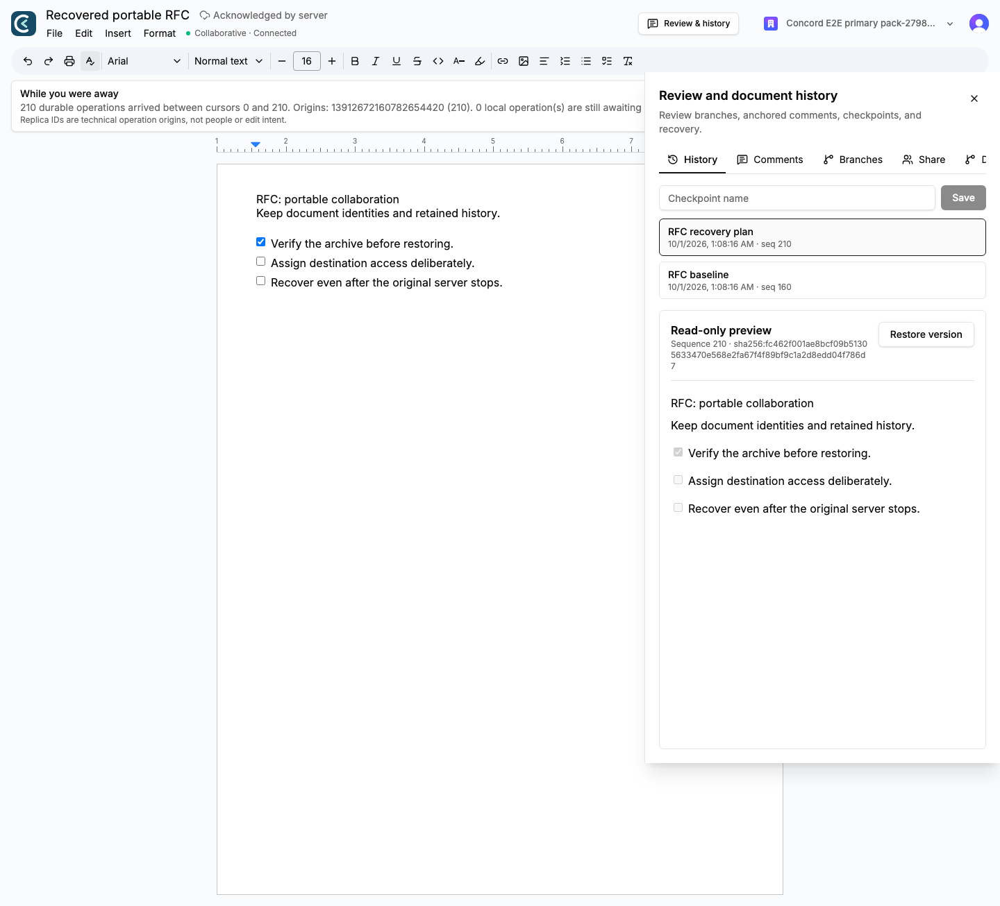
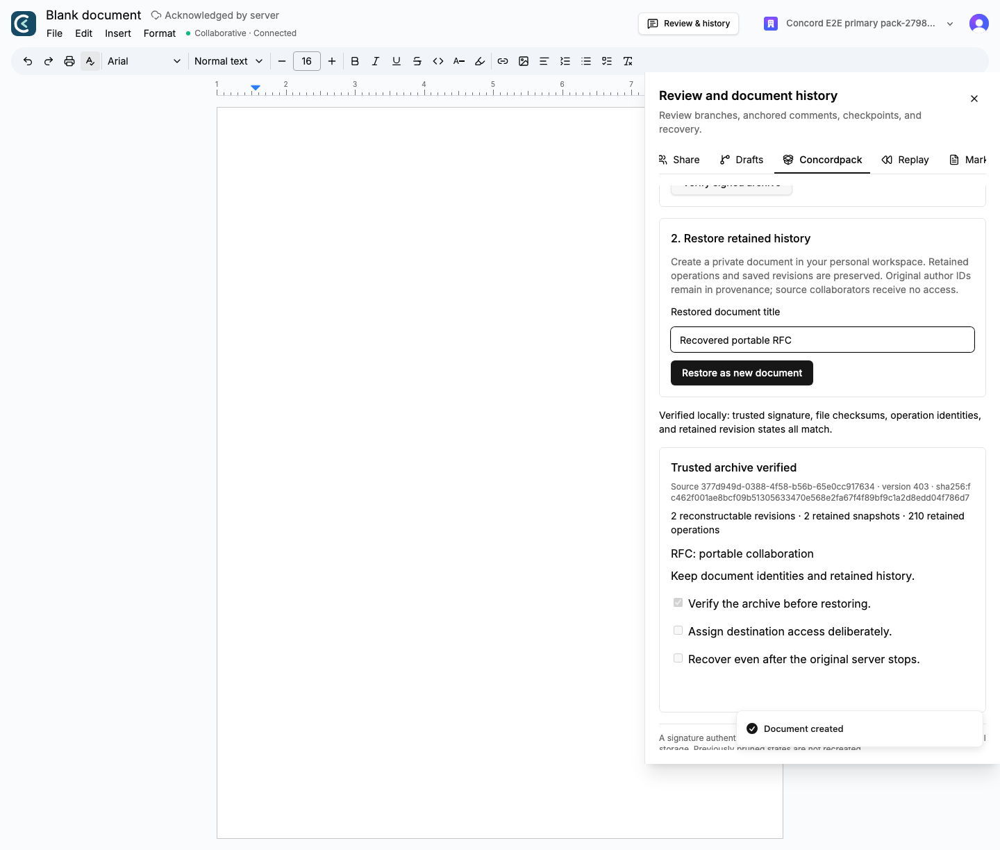
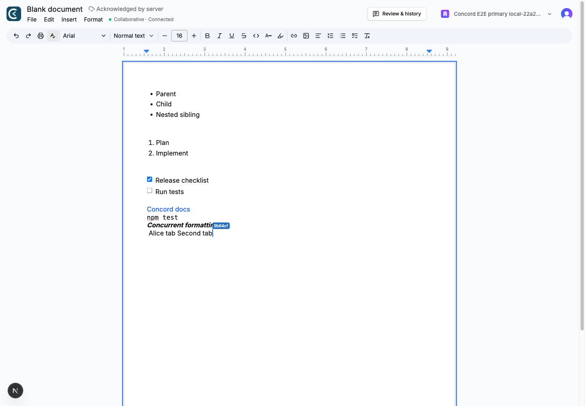
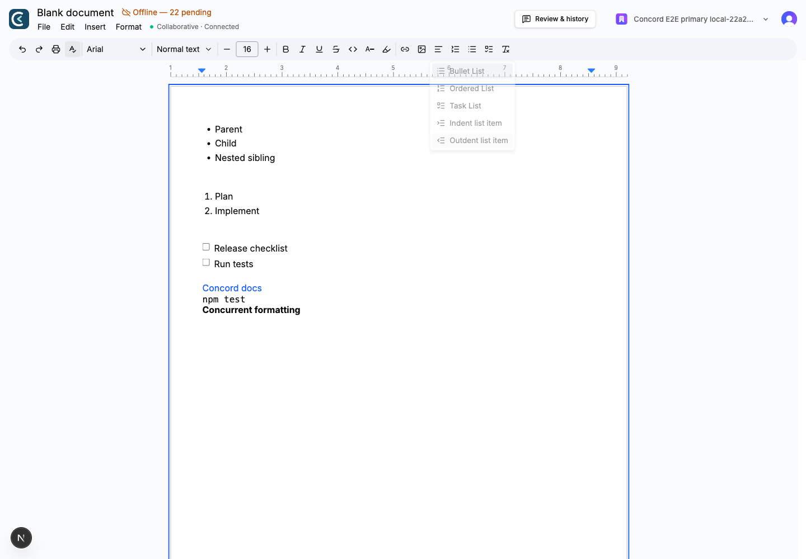
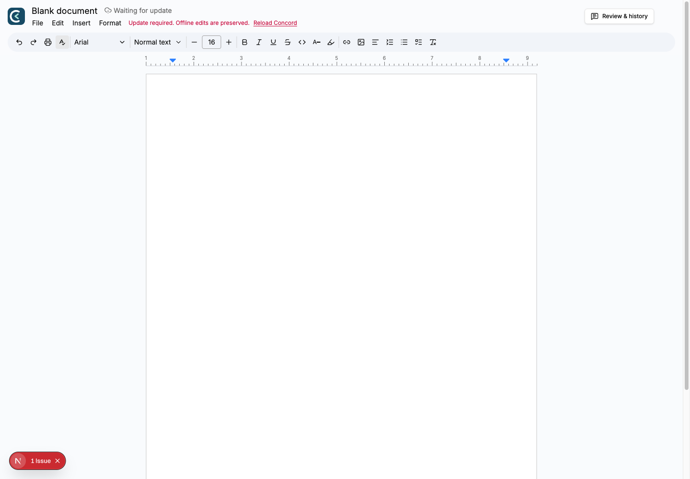
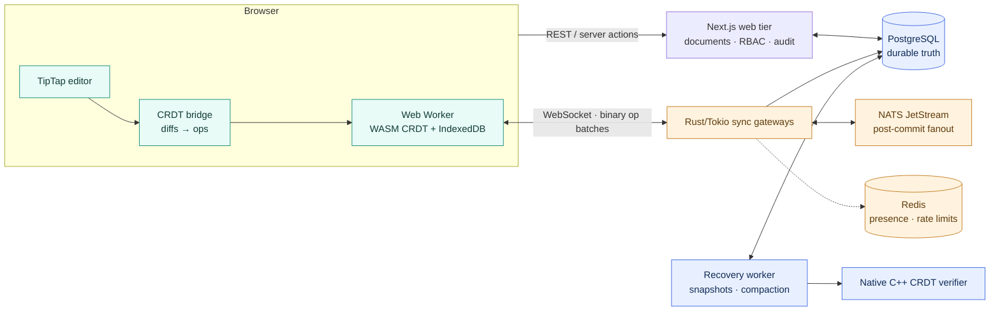
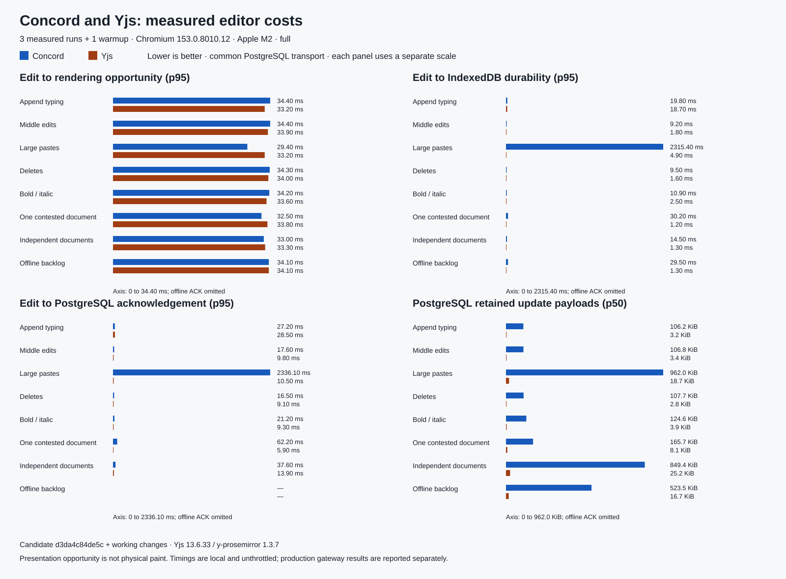
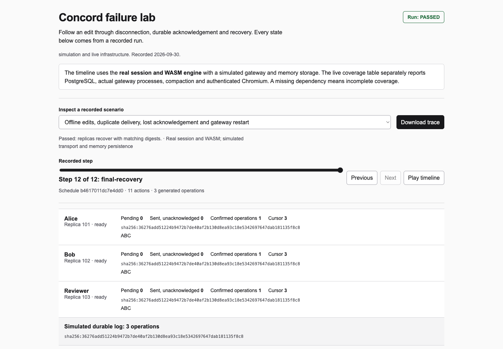

<p align="center">
  
</p>

<h1 align="center">Concord</h1>

<p align="center">
  <strong>Write together. Work offline. Review changes before merging.</strong><br />
  A local-first document workspace with a custom collaboration and recovery engine.
</p>

<p align="center">
  <a href="https://github.com/UtkarsHMer05/Concord-Dev/actions/workflows/phase6-pr-ci.yml"></a>
  <a href="https://github.com/UtkarsHMer05/Concord-Dev/actions/workflows/codeql.yml"></a>
  
  
  
  
</p>

<p align="center">
  <a href="#features">Features</a> ·
  <a href="#architecture">Architecture</a> ·
  <a href="#benchmarks">Benchmarks</a> ·
  <a href="#correctness-and-testing">Testing</a> ·
  <a href="#getting-started">Get started</a> ·
  <a href="#documentation">Documentation</a>
</p>

## What is Concord?

Concord is a collaborative document editor for project briefs, technical
proposals, and shared notes. Create a document, write and format it with
teammates, keep editing through a disconnection, and review proposed changes
on a separate branch before merging them into the shared document. Comments,
checkpoints, and version history keep the discussion connected to the work.
Signed history archives let you verify an exported document independently
and carry its retained revisions to another Concord instance.

Each browser keeps a durable local copy. A custom C++ conflict-free replicated
data type (CRDT), compiled to WebAssembly, merges concurrent edits; a Rust
gateway persists operations in PostgreSQL before acknowledging them. This
makes collaboration, offline recovery, and document history part of the
project's core engineering.



## Features

| Feature | What you can do |
|---|---|
| **Document workspace** | Start from templates, find documents by title, and manage personal or organization documents. |
| **Rich-text collaboration** | Edit paragraphs, headings, nested bullet and numbered lists, task lists, links, inline code, and supported text styles together. See other participants' cursors and selections. |
| **Offline editing** | Keep edits in IndexedDB, recover pending work after reload, and synchronize when the gateway becomes reachable. Save status distinguishes local persistence, pending work, and server acknowledgement. |
| **Review branches** | Create a proposal from a named revision, give reviewers access, compare the original base with the current document and proposal, and merge selected changes while retaining unrelated edits. |
| **Comments and suggestions** | Attach discussions to document ranges, resolve threads, and propose text changes for acceptance or rejection. Pending comment actions have an offline outbox. |
| **History and restore** | Save named checkpoints, preview durable revisions, and restore an earlier version as new edits. A local replay inspector lets you step through the browser's operation log. |
| **Sharing and permissions** | Grant owner, editor, commenter, or viewer access. The server checks document permissions for requests and sync batches, including revocation. |
| **Signed history archives** | Export retained operations, snapshots, and revision provenance; verify them locally or with the standalone offline CLI using a separately trusted key; restore them into a new private document. |
| **Markdown and content bundles** | Import/export the supported Markdown subset, inspect a local content bundle, or apply supported visible content as new edits. |
| **Installable workspace** | Install the production PWA and reopen previously cached documents and editor assets offline. |
| **Collaboration failure lab** | Replay disconnections, duplicate delivery, lost acknowledgements, and recovery; inspect replica states, download traces, and reduce a known failure to a smaller reproduction. |
| **Reproducible performance comparison** | Run identical edits through Concord and Yjs in real Chromium; inspect input/render latency, durability, memory, retained bytes, and offline recovery, with raw results and charts. |

### Review changes before merging

A branch has its own edits, permissions, and review discussion. The comparison
shows what changed since its base, highlights conflicts with the current main
document, and lets the reviewer choose individual changes. A saved merge can
be retried after a lost response without applying it twice.



### Take your document history with you

Export a signed `.concordpack`, verify its signature and reconstructed states
with separately trusted verification details, and restore it into a new
document on another instance. Retained operation identities and saved revisions
survive the move. The recipient owns the private copy and chooses who can
access it; original author IDs remain in provenance.

The standalone verifier works with the original server stopped. A modified
archive or an unexpected signer is rejected, and a retry after a lost import
response returns the same document.



<details>
<summary><strong>See verification before restoration</strong></summary>

The browser checks the trusted source, saved version, file checksums, and
retained revision states before enabling restoration:



</details>

<details>
<summary><strong>See rich-text collaboration and offline recovery</strong></summary>

Nested lists, task checkboxes, links, inline code, and concurrent formatting:



Pending edits retained while the browser is offline:



An older worker receives an explicit upgrade path while local data is retained:



</details>

Feature guides: [rich-text collaboration](docs/RICH_TEXT_COLLABORATION.md),
[review branches](docs/REVIEW_BRANCHES.md),
[signed history archives](docs/CONCORDPACK.md),
[failure lab](docs/FAILURE_LAB.md), and
[performance comparison](docs/PERFORMANCE_COMPARISON.md). See
[review tools](docs/REVIEW_TOOLS.md) for comments, replay, and local bundles.

## Architecture

The editor and sync service run separately. PostgreSQL stores durable
operations, revisions, permissions, and audit records. NATS distributes
committed edits across gateways; Redis holds ephemeral presence and rate-limit
state. The same C++ CRDT core runs in the browser and native recovery tooling.


```mermaid
flowchart LR
    subgraph Browser["Browser"]
        UI["TipTap editor"] --> Bridge["CRDT bridge<br/>diffs → ops"]
        Bridge --> Worker["Web Worker<br/>WASM CRDT + IndexedDB"]
    end

    Browser -->|"REST / server actions"| Web["Next.js web tier<br/>documents · RBAC · audit"]
    Web <--> PG[("PostgreSQL<br/>durable truth")]

    Worker <-->|"WebSocket · binary op batches"| Gateway["Rust/Tokio sync gateways"]
    Gateway --> PG
    Gateway <--> NATS["NATS JetStream<br/>post-commit fanout"]
    Gateway -.-> Redis[("Redis<br/>presence · rate limits")]

    Recovery["Recovery worker<br/>snapshots · compaction"] <--> PG
    Recovery --> Native["Native C++ CRDT verifier"]

    classDef durable fill:#e8f0ff,stroke:#4169e1,color:#102a56
    classDef local fill:#e8fbf7,stroke:#168b78,color:#123b35
    classDef transport fill:#fff3df,stroke:#c47c22,color:#5f3a0b
    class PG,Recovery,Native durable
    class Worker,Bridge,UI local
    class Gateway,NATS,Redis transport
```

An edit follows four steps:

1. **Save locally.** The worker persists operations and pending intent in IndexedDB.
2. **Commit on the server.** The gateway validates identity, permissions, and batch limits, then inserts operations idempotently in PostgreSQL.
3. **Acknowledge and distribute.** The client receives a durable acknowledgement after commit; NATS carries post-commit fanout to other gateways.
4. **Recover when needed.** Pending operations retain their identities for retry. Stale clients reconstruct state from a verified snapshot and its operation tail.

Delivery is at least once, with idempotent boundaries in the database and
replicas. Snapshots and compaction bound replay work; authorization and audited
mutations share their database transaction. See the
[architecture](docs/ARCHITECTURE.md),
[consistency model](docs/CONSISTENCY_MODEL.md), and
[failure model](docs/FAILURE_MODEL.md) for the detailed contracts.

## Benchmarks

### Browser editing: Concord and Yjs

Run the same user edits through real TipTap editors backed by Concord's
production bridge/WASM worker and the official Yjs binding. Both use the
same durable IndexedDB outbox and PostgreSQL commit boundary. The campaign
covers typing, middle edits, large pastes, deletes, formatting, four writers
on one document, eight independent documents, and offline recovery.

The recorded comparison uses **three measured runs plus one excluded
warmup**, **5,364 measured user edits**, Chromium 153.0.8010.12, and an
**Apple M2 with 8 GB RAM**. Yjs 13.6.33 and y-prosemirror 1.3.7 are pinned.

| Shared workload / measurement | Concord | Yjs |
|---|---:|---:|
| Append input → rendering opportunity, p95 | 34.40 ms | 33.20 ms |
| Large paste → local durability, p95; four 4,224-character pastes per run | 2,315.40 ms | 4.90 ms |
| Four concurrent writers → committed ACK, p95 | 62.20 ms | 5.90 ms |
| Offline backlog catch-up after a 60-second disconnection, median | 5,216.04 ms | 564.19 ms |
| Retained PostgreSQL payload after the paste workload, median | 962.0 KiB | 18.7 KiB |

The result exposes current costs: Concord retains larger binary histories
and takes longer to persist large pastes. The rendering boundary measures
two animation frames; an edit can appear before its durable write completes.
These observations cover one machine, a defined rich-text subset, and one
edit in flight per writer. They do not establish maximum throughput or a
universal ranking of the engines.



```bash
npm run bench:compare
```

See the [setup and measurement guide](docs/PERFORMANCE_COMPARISON.md),
[interactive report](docs/assets/performance/report.html),
[raw results and environment](docs/assets/performance/raw.json), and
[acceptance report](docs/audits/PERFORMANCE_COMPARISON_REPORT.md).
Memory includes the page and dedicated workers; local storage, exported
state size, reload recovery, and sample counts are available in the report.
The authenticated Concord app is measured in a separate lane with its real
Rust gateway, PostgreSQL, NATS, Redis, and Clerk authentication.
All **64 paired cases** (48 measured, 16 warmups) and **three authenticated
app trials** passed convergence, durability, and reload checks. The app
trials retained and synchronized 250 offline edits each; default gateway
rate limits remained active and their retry costs are included.

### Historical gateway and recovery measurements

The recorded measurements below show the effect of batching durable writes
and recovering from snapshots. They are historical local results for commit
`eee94b9`, captured on **2026-09-10** on an **Apple M2, 8 cores, 8 GB RAM**,
with Release builds and loopback PostgreSQL/NATS/Redis services.

| Workload | Reference | Measured result | Improvement |
|---|---:|---:|---:|
| Durable-ack latency, 25-operation ingest microbenchmark, p50 | 31.45 ms before batching | **2.72 ms** after batching | **91.4% lower** |
| Ingest throughput, the same microbenchmark | 771 ops/s before batching | **8,685 ops/s** after batching | **11.3×** |
| Recovery of a 100,000-operation history, p50 over 5 runs | 61.36 s full replay | **0.964 s** with a snapshot + 1,000-operation tail | **98.4% faster** |

**Multiple gateways:** at a fixed offered load of 200 operations/s with
10 clients and 20 documents, acknowledgement p95 was **13.19 ms with one
gateway** and **15.23 ms with four**. Across the campaign's 24 runs,
**142,600 sent operations received 142,600 durable acknowledgements**, with
zero observed errors. This measures behavior at that offered load; it does
not establish maximum throughput or linear scaling.

**Compaction:** the 50,000-operation campaign removed 50,000 log rows
(2,632,096 bytes) while retaining a 2,646,504-byte snapshot. The snapshot was
**50.1% of the prior combined snapshot-plus-log bytes**.

These measurements cover different workloads: the ingest microbenchmark is
not end-to-end typing latency. They were not rerun for later editor features.
[Benchmark methodology and campaign records](docs/BENCHMARKS.md) include
commands, environments, and run counts; raw distributed campaign logs are
private. The current [browser comparison with Yjs](docs/PERFORMANCE_COMPARISON.md)
uses its own shared workload and persistence contract. Automerge is not part
of that campaign.

<details>
<summary><strong>Native CRDT baseline</strong></summary>

Release-mode local measurements for commit `42dcb17`, recorded on
2026-09-14 on the Apple M2 host. Each timing is the median of five runs.

| Operation | Workload | Median |
|---|---|---:|
| Sequential append | 10,000 units | 137.400 ms |
| Random-position insert | 5,000 units | 93.456 ms |
| Random delete | 2,000 deletes | 23.768 ms |
| Shuffled remote batch apply | 19,998 units | 2,530.292 ms |
| Snapshot export / import | 10,000-item state | 1.215 ms / 1.834 ms |

That state serializes to **580,045 bytes**, with **47 bytes/op** on average.
Shuffled remote apply is an expensive path in this baseline; the numbers do
not establish a scaling bound. The
[committed raw output and reproduction command](evidence/v1.0.1/native-benchmark.txt)
preserve the exact workload and candidate identity.

</details>

## Correctness and testing

Concord includes unit and property tests, native/WASM parity checks, database
integration tests, authenticated browser journeys, fuzzers, sanitizers, and
chaos campaigns. The checked-in
[collaboration verification report](docs/audits/FAILURE_LAB_REPORT.md) records:

| Layer | Recorded verification |
|---|---|
| Web unit suite | **312 passed**, with 2 intentional opt-in/driver skips |
| Real gateway matrix | **21 passed** against local services |
| PostgreSQL and native recovery | **2 convergence tests + 1 actual compaction/stale-client recovery test passed** |
| Authenticated production Chromium | **6 rich-text/tab/upgrade stages + 6 branch-merge/recovery stages passed** |
| Failure lab | **All 6 lanes passed**, with 3 recorded scenarios and a failure reduced from 5 actions to 2 |

The failure lab makes recovery inspectable. Its timeline runs the real session
and WASM engine against modeled transport and memory storage. Separate live
lanes exercise PostgreSQL, native recovery, actual gateways, and authenticated
browsers. The report marks missing dependencies as **incomplete** and labels
simulation-only coverage explicitly.



With the prerequisites in the [failure-lab guide](docs/FAILURE_LAB.md) configured:

```bash
npm run failure-lab -- --headed
```

The report is written to `output/playwright/failure-lab/latest/index.html`.
For the modeled scenarios alone, use `npm run failure-lab -- --sim-only`.

For routine web checks:

```bash
npm run typecheck
npm run lint
npm test
npm run build
```

The [testing guide](docs/TESTING.md) covers database, realtime, native, WASM,
and browser prerequisites. Authenticated browser runs use disposable Clerk
users and a dedicated test database; they are separate from the remote CI
jobs shown by the badges.

The [signed-history verification report](docs/audits/CONCORDPACK_REPORT.md)
adds a production Chromium journey across separate source and destination
instances: offline verification after source shutdown, rejection checks,
matching saved revisions, private ownership, retry after response loss,
continued editing and history restore, plus keyboard and mobile checks.
Run it with `CONCORD_E2E_MODE=production npm run test:concordpack:browser`;
the [archive guide](docs/CONCORDPACK.md#verification) lists its prerequisites.

The [performance acceptance report](docs/audits/PERFORMANCE_COMPARISON_REPORT.md)
adds 64 paired editor cases and three authenticated app trials, plus report
controls, zero automated accessibility violations, and a mobile overflow
check. Routine checks now record **314 web tests passed**, with 2 intentional
skips, and **2 comparison publication checks passed**. The browser workload
also exposed and verified a fix for a stale sync error after the last pending
write was acknowledged.

## Getting started

**Prerequisites:** Node.js 24, Docker Compose, and a Clerk development instance
with matching publishable and secret keys.

```bash
git clone https://github.com/UtkarsHMer05/Concord-Dev.git
cd Concord-Dev
nvm use 24
npm ci
cp .env.example .env.local
```

Edit `.env.local` to set `DATABASE_URL`,
`NEXT_PUBLIC_CLERK_PUBLISHABLE_KEY`, and `CLERK_SECRET_KEY` using the example
file and your Clerk instance. Then start the local database and editor:

```bash
docker compose up -d db
npm run db:migrate
npm run dev
```

Open [localhost:3000](http://localhost:3000), sign in, and create a document.
The example configuration starts the editor in local-only mode because
`NEXT_PUBLIC_SYNC_GATEWAY_URL` is unset.

**To enable collaboration:** build and start the Rust gateway, configure it
with the same PostgreSQL database and Clerk issuer as the web app, and set
`NEXT_PUBLIC_SYNC_GATEWAY_URL` to its WebSocket sync endpoint. NATS and Redis
provide cross-gateway fanout and presence. Follow the
[configuration contract](docs/CONFIGURATION.md) and
[local stack runbook](docs/OPERATIONS.md#local-stack) for the full setup.
Rebuilding the bundled WASM assets also requires Emscripten; the checked-in
assets are available for the basic editor start.

## Repository map

```text
src/       Next.js editor, CRDT bridge, Web Worker, APIs, authorization
cpp/       C++20 CRDT core, native worker, benchmarks, fuzzers
rust/      Rust/Tokio sync gateway, ingest, fanout, recovery
wasm/      WebAssembly build, smoke, and parity tooling
tests/     Unit, database, realtime, and browser tests
scripts/   Build, verification, failure-lab, benchmark, and operations tools
docs/      Design guides, feature guides, measurements, and audit reports
evidence/  Commit-bound historical verification artifacts
public/    Editor assets, CRDT worker, and bundled WASM
```

## Scope and limitations

- Concurrent rich-text collaboration covers the subset listed above. Tables,
  images, blockquotes, and code blocks use whole-document persistence with an
  explicit local-only mode. Incompatible clients receive an upgrade path.
- Signed history archives preserve retained CRDT history in a new personal
  document. They require a stable server signing key and separately trusted
  verification details; the destination must authorize that signer. Source
  permissions, comments, and branch relationships are not imported. Previously
  pruned states remain unavailable. Archives are bounded to 64 MiB, 200
  revisions, and 500 snapshots; oversized exports fail explicitly.
- Markdown round-tripping has a defined subset and loss warnings. Local v1
  content bundles remain compatible and apply visible content as new edits.
  A trusted signature authenticates the server's statement; it does not prove
  physical storage durability.
- Verification covers local infrastructure and authenticated browser runs.
  Hosted operation, authenticated browser CI, and a fresh container release
  scan require separate acceptance. The documented data tier is single-node
  per environment; multiple gateways do not imply database high availability.

## Documentation

| Explore | Start here |
|---|---|
| System design and engineering decisions | [Engineering brief](docs/ENGINEERING_BRIEF.md) · [Architecture](docs/ARCHITECTURE.md) · [Decisions](docs/DECISIONS.md) |
| Sync and recovery contracts | [Protocol](docs/PROTOCOL.md) · [Consistency](docs/CONSISTENCY_MODEL.md) · [Recovery](docs/RECOVERY.md) |
| Portable document history | [Signed archives and offline verification](docs/CONCORDPACK.md) · [Acceptance report](docs/audits/CONCORDPACK_REPORT.md) |
| Security and permissions | [Security](docs/SECURITY.md) · [Authorization](docs/AUTHORIZATION.md) |
| Measurements and validation | [Benchmarks](docs/BENCHMARKS.md) · [Testing](docs/TESTING.md) · [Verification](docs/VERIFICATION.md) |
| Browser performance and comparison | [Method and reproduction](docs/PERFORMANCE_COMPARISON.md) · [Interactive report](docs/assets/performance/report.html) · [Acceptance report](docs/audits/PERFORMANCE_COMPARISON_REPORT.md) |
| Running and operating the stack | [Configuration](docs/CONFIGURATION.md) · [Operations](docs/OPERATIONS.md) · [Deployment](docs/DEPLOYMENT.md) |
| Full reference and release evidence | [Documentation index](docs/README.md) · [Release report](docs/audits/CANONICAL_RELEASE_REPORT.md) |

Detailed implementation evidence is preserved in the
[rich-text report](docs/audits/RICH_TEXT_COLLABORATION_REPORT.md),
[review-branches report](docs/audits/REVIEW_BRANCHES_REPORT.md), and
[failure-lab report](docs/audits/FAILURE_LAB_REPORT.md), alongside the
[signed-history report](docs/audits/CONCORDPACK_REPORT.md) and
[performance report](docs/audits/PERFORMANCE_COMPARISON_REPORT.md).

## Attribution and license

Concord began from Code With Antonio's “Google Docs Clone” tutorial. The
original baseline is retained at `antonio-original-baseline`; the custom CRDT,
sync, recovery, and verification work and retained UI ancestry are documented
in [Provenance](docs/PROVENANCE.md) and [NOTICE](NOTICE).

Licensed under [MIT](LICENSE). Third-party components retain their own licenses.
