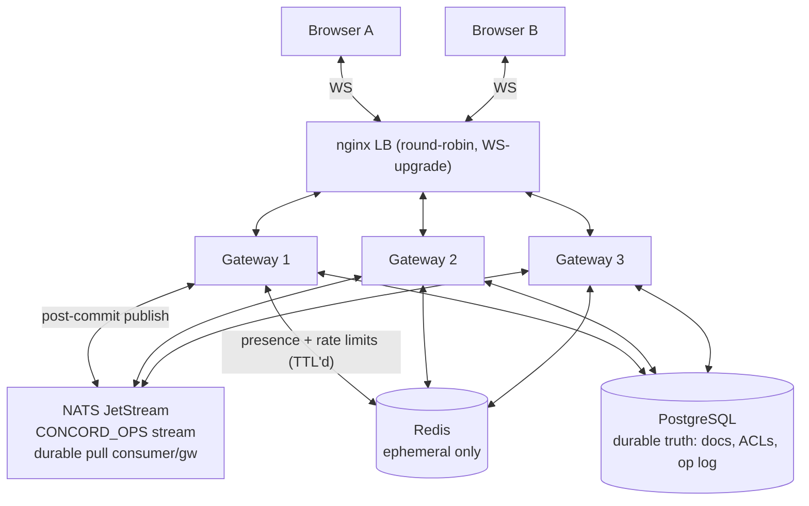
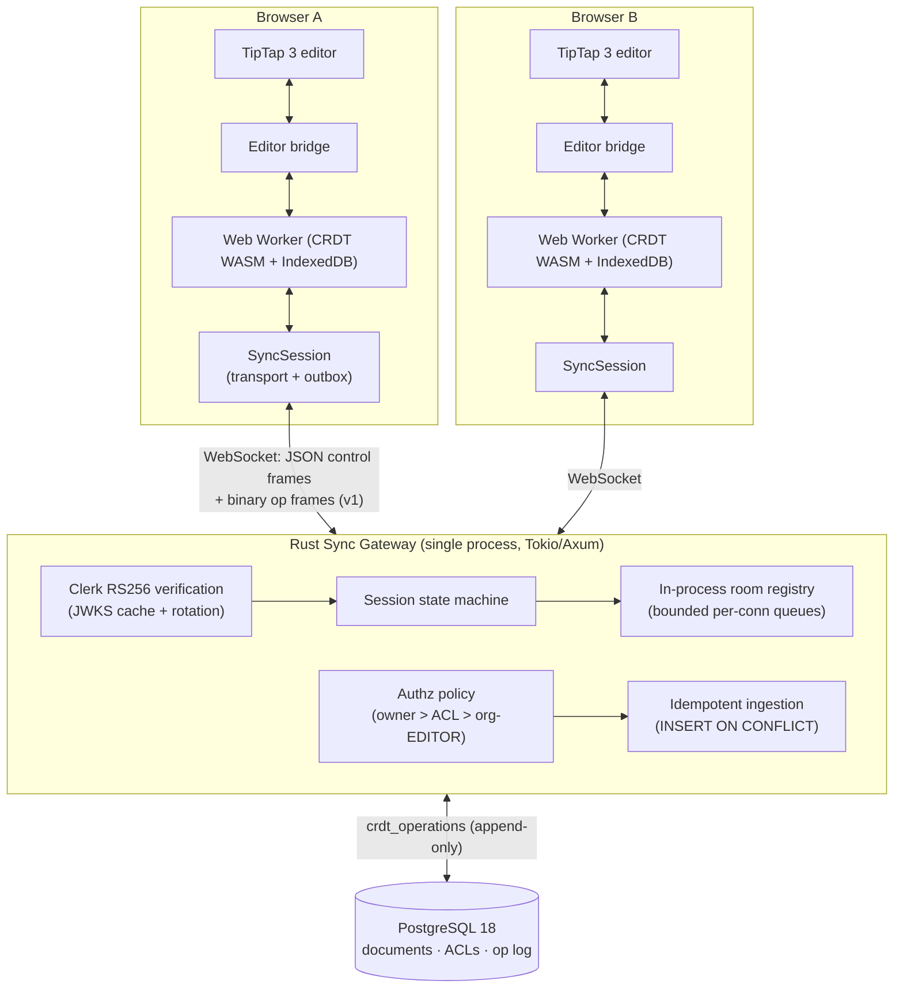
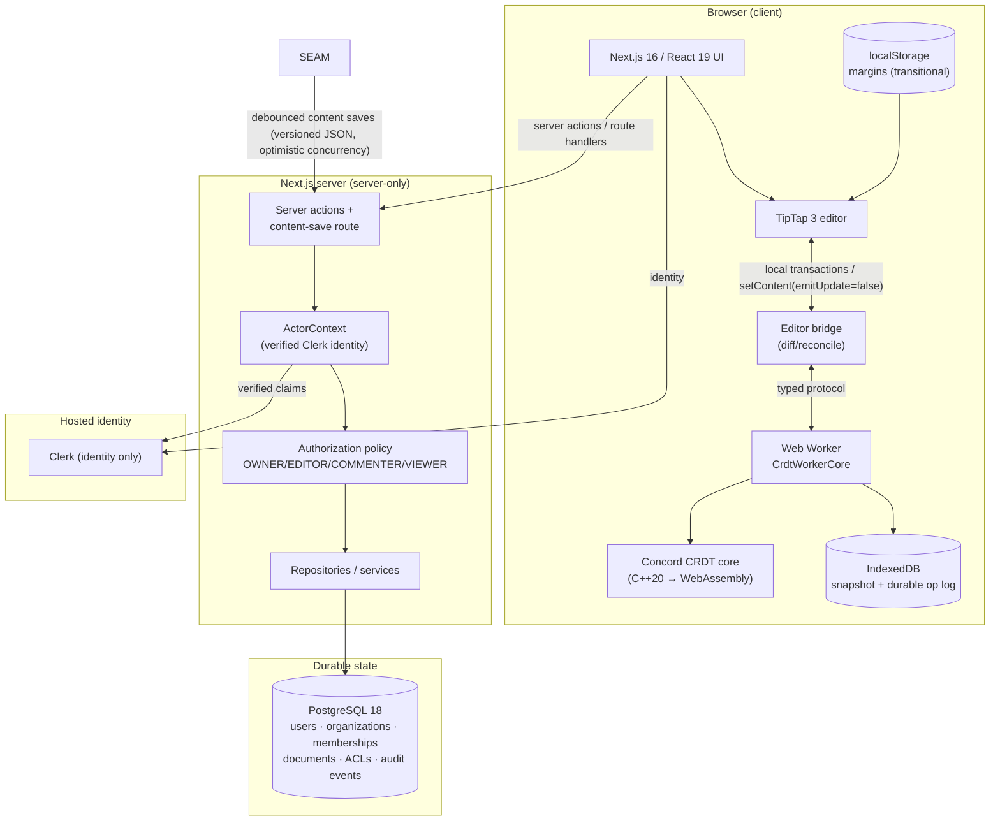
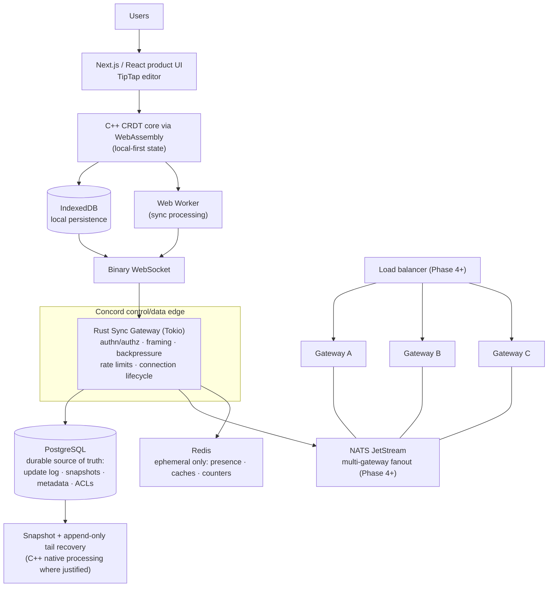

# Concord — Architecture

Status: Authoritative (Phase 4 completion version)
Version: 1.5
Last updated: 2026-09-07

This document distinguishes three architecture states at all times:

- **CURRENT** — what exists and runs today.
- **TRANSITIONAL** — the explicitly temporary states created while moving
  between CURRENT and TARGET (each is scheduled, bounded, and documented).
- **TARGET** — the planned end state. Nothing here is claimed as implemented.

Nothing in the TARGET section should be read as an implemented capability.

---

## 0. CURRENT — Durable, recoverable, history-aware storage (Phase 5 complete)

Phase 5 extends the Phase 4 distributed plane with a durable
recovery/history subsystem. Everything below is implemented and gated
(P5 suites; see docs/STORAGE.md, docs/RECOVERY.md, docs/HISTORY.md):

- **Server snapshots** (`crdt_snapshots`): PostgreSQL-stored, versioned
  wrappers (DEC-035) around the unchanged C++ v1 snapshot bytes, with
  SHA-256 checksums over the exact stored bytes and a canonical state
  digest. Lifecycle `building → verifying → finalized | failed`
  (finalized is immutable and the ONLY state recovery reads; DEC-036).
- **Native recovery worker** (`concord-worker`, C++20 process,
  DEC-038): folds the durable op log / imports snapshots /
  verifies equivalence / generates seeded test streams / computes
  restore diffs — always bounded, deterministic, content-silent.
  Rust spawns it per request with fixed argv, bounded IO, timeouts,
  and kill-on-drop (no shell, no FFI).
- **Recovery = snapshot + tail** (M020, proven continuously by the
  differential verifier, M021): a stale client or gateway needs only
  the newest VALID snapshot plus the post-boundary ops; corrupt newest
  snapshots fall back to older, then to full replay — recovery never
  fails due to corruption (fail-closed per candidate, fail-open across
  candidates).
- **Compaction** (DEC-040): staged and crash-safe — a FINALIZED,
  verified snapshot must cover the prune boundary before ANY op-log
  deletion; pruning runs in transactional batches that advance the
  per-document compaction floor in the SAME transaction; the stale-
  client resync protocol (`snapshot_resync_required` → `fetch_snapshot`
  → `snapshot_payload`) serves the floor snapshot to clients below it.
- **Version history** (`crdt_revisions`, DEC-039): boundary-referencing
  revisions (auto checkpoints, named, restore events); read-only
  historical reconstruction = nearest covering snapshot + bounded
  replay; RESTORE is forward-moving — a worker-computed diff batch is
  ingested through the normal durable path (owner-only, auditable,
  never silently discards acknowledged edits).
- **Maintenance jobs** (`maintenance_jobs`, DEC-037): durable rows
  with compare-and-swap claims + versioned leases; heartbeats extend
  only the current claim; every effectful transition (including
  snapshot finalization) is fenced by the claim_version — a stale
  owner can never act after lease transfer. Coalescing enqueue bounds
  duplicate triggers; scheduler parallelism is bounded independently of
  realtime limits.

```mermaid
flowchart LR
    subgraph PG[("PostgreSQL — durable truth")]
        OP[("crdt_operations<br/>durable op log")]
        SN[("crdt_snapshots<br/>immutable finalized")]
        RV[("crdt_revisions")]
        JB[("maintenance_jobs<br/>claims + leases")]
        DC[("documents<br/>compaction floor")]
    end
    JB -->|"claim (CAS) + lease fence"| SCH["Scheduler<br/>(bounded, per gateway)"]
    SCH -->|"ops ≤ boundary"| W["concord-worker (C++ process)<br/>reconstruct / verify / diff"]
    W -->|"digest + snapshot"| SN
    SCH -->|"verify → finalize"| SN
    SCH -->|"staged prune batches<br/>(floor advances atomically)"| OP
    GW["Sync gateways (Phase 4 plane)"] -->|"ops ingest"| OP
    GW -->|"sync_request below floor ⇒ resync"| CLI["Browser resync<br/>import snapshot + tail"]
    RV -->|"reconstruct ≤ boundary"| W
```

## 0b. CURRENT — Distributed multi-gateway collaboration (Phase 4; the plane Phase 5 extends)


Phase 4 distributes the Phase 3 plane: browsers may connect to ANY healthy
gateway behind the local load balancer; accepted batches propagate across
gateways via NATS JetStream; Redis provides ephemeral presence + distributed
rate limiting. PostgreSQL remains the ONLY durable authority; the CRDT
core is untouched; correctness never requires sticky sessions.



### 0.1 Phase 4 components

| Component | Responsibility |
|---|---|
| `rust/.../broker` | NATS JetStream transport: idempotent stream/consumer provisioning, batch-granular full-payload events (DEC-031), msg-id dedup, bounded pull, ack-after-processing, poison termination |
| `rust/.../bus` | Transport-neutral EventPublisher/Subscriber seams (DEC-031/032 behind traits; publish strictly after durable commit — failures degrade realtime only) |
| `rust/.../ephemeral` | Redis presence (TTL 60s) + fixed-window rate limiting with local fallback (DEC-033); FLUSHALL-safe by design |
| LB + cluster scripts | nginx round-robin (NO sticky sessions) over 3 host gateway processes; compose owns db/nats/redis |
| `tests/multi_gateway` | 9 live-process scenarios: cross-gateway both directions, reconnect-any-gateway, crash isolation, storm containment, slow-consumer isolation, lag drain, NATS restart, compound failure |
| `examples/loadgen` | Reproducible multi-gateway workload generator (JSON output) |

### 0.2 Delivery + failure semantics (implemented + tested)
- ACK_DURABLE unchanged; the broker publish happens AFTER the commit and
  is best-effort — FAILURE_MODEL §7 is the test contract.
- Reconnect-to-any-gateway: all client state is local + PostgreSQL; no
  server affinity anywhere.
- Broadcast fan-out + local room filtering (DEC-034): every gateway gets
  every event; irrelevant events cost one set-membership check. No
  sharding/consistent hashing (evidence-based decision).
- Wipe NATS/Redis at will: durable state is untouched; clients converge
  via DB catch-up (proven by restart/wipe/compound tests).

### 0.3 Honest scaling evidence (MEASURED, docs/BENCHMARKS.md)
1→2→3 gateways at identical 60 ops/s / 12-client workloads: zero loss at
every scale; ACK p50 16.1→17.6→18.4 ms (the growth is the post-commit
publish, not contention). NO linear-scaling claim beyond the data.

## 1. PRIOR STATE — Single-gateway realtime synchronization (Phase 3; superseded by §0)

The CURRENT architecture adds the Phase 3 realtime plane to the Phase 2
stack: browsers synchronize through a **single self-hosted Rust sync
gateway** over a versioned WebSocket protocol, with a durable
append-only operation log in PostgreSQL. The C++/WASM CRDT remains the
collaboration-correctness core (the gateway transports, validates
structurally, authorizes, persists, and fans out — it never computes CRDT
order). Editing remains offline-first; the gateway is the durability and
fanout point.



### 1.1 Phase 3 components

| Component | Responsibility |
|---|---|
| `rust/sync-gateway` | Tokio/Axum service: `/api/v1/sync` WebSocket endpoint, health/live+ready, metrics; fail-fast DB startup + embedded migrations |
| `rust/.../protocol` | Wire protocol v1 codecs: typed JSON control frames + binary op frames; envelope validation + identity extraction; golden fixtures shared with TS |
| `rust/.../auth` | Clerk session-token verification (RS256/JWKS, alg pinning, rotation refresh); FileJwks dev/E2E source |
| `rust/.../db` | Bounded deadpool pool; ONE authz policy layer (SQL join mirrors Phase 1 precedence); `crdt_operations` op-log repo (idempotent ingest, catch-up pagination) |
| `rust/.../sessions` | Connection state machine (§9.13); in-process room registry — the Phase 4 broker seam; bounded fanout |
| `src/lib/sync` | Browser side: protocol mirror, SyncTransport (backoff+jitter reconnect), PendingOpStore (pending→sent→durably_acked outbox), SyncSession orchestration |
| `tests/realtime` | Two-client E2E against the release binary: live collaboration, offline/reconnect, roles + downgrade, duplicate resend, gateway restart, graceful drain |

### 1.2 Phase 3 delivery semantics (implemented + tested)

- **ACK_DURABLE** = authenticated + authorized + validated + committed to
  PostgreSQL under stable identity `(document_id, operation_id)`; atomic
  batches (FAILURE_MODEL §1). Never "exactly once" — at-least-once with
  idempotent handlers and DB-enforced dedup.
- Reconnect: hello → authenticate → join (state summary) → catch-up
  (server-seq cursor, bounded pages) → resend unacked ops (same
  identities) → converge.
- Fanout: in-process registry, bounded per-connection queues; slow
  consumers are disconnected (never silently dropped, never blocking the
  persistence path) and recover via catch-up.
- Write authorization is RECHECKED on every batch inside the ingestion
  transaction (live-downgrade proven in E2E).
- Graceful drain: SIGTERM → stop writes → notify connections → bounded
  grace → exit 0.

### 1.3 Known transitional limitations (honest state)

- Single gateway process (Phase 4 distributes via NATS; the room registry
  is an explicit seam, no hidden multi-node code).
- Rate limiting is a protocol vocabulary placeholder (`rate_limited`
  reserved; enforcement is Phase 4 edge work).
- The Phase 1 whole-document content mirror still runs alongside the op
  log (the product UI migrates to the sync session in later phases; the
  sync layer ships and is proven by the E2E suites in this phase).
- Presence/comments/threads remain `unavailable` (DEC-016) — Phase 3
  delivers the durable operation plane, not the social features.

## 2. CURRENT (Phase 2 state — superseded by §1, kept for context)

Local-first CRDT client on the PostgreSQL control plane.

The CURRENT architecture is the result of Phases 0–2: the modernized product
(Next.js 16, React 19, TipTap 3, Clerk 7) runs on the Phase 1 PostgreSQL
control plane with server-side authorization, **plus a local-first
collaboration core**: a C++20 CRDT engine compiled natively and to
WebAssembly, executing in a Web Worker with IndexedDB local durability and a
TipTap adapter. Editing is offline-first; the Phase 1 server save runs as a
transitional mirror of the visible content.



### 1.1 Current components and responsibilities

| Component | Responsibility |
|---|---|
| `src/lib/collaboration/types.ts` | Vendor-neutral session contract; realtime/presence/threads/inbox are explicit `unavailable` states |
| `src/lib/collaboration/provider.tsx` | Document session: debounced content saves via `/api/documents/[id]/content` with content-version tracking and 409 conflict handling; transitional localStorage margins |
| `src/lib/collaboration/content.ts` | Versioned content envelope (`{v:1, doc}`) serialize/parse |
| `src/app/documents/[documentId]/editor.tsx` | TipTap 3 with local history; editable only for OWNER/EDITOR |
| `src/server/db/*` | Drizzle schema, server-only `pg` pool |
| `src/server/repositories/*` | SQL persistence (users, organizations, documents, permissions, audit) |
| `src/server/services/*` | Business policy + authorization orchestration |
| `src/server/auth/*` | ActorContext projection; centralized capability policy |
| `src/app/actions/*`, `src/app/api/*` | Server actions (create/rename/delete) and route handlers (content save, listing, health) |
| `src/proxy.ts` | Clerk middleware (Next 16 proxy convention) |

### 1.2 Current trust boundaries

- Browser → Next.js: Clerk session; route protection via proxy.
- Every server action / route handler builds an `ActorContext` from verified
  Clerk server APIs and reauthorizes the operation against Concord-owned
  data (docs/AUTHORIZATION.md). Client-supplied owner/org/role fields are
  never trusted.
- Server → PostgreSQL through a single server-only pool (`server-only`
  import guard keeps it out of client bundles).
- No third-party collaboration or data service receives document content.

### 1.3 Current CRDT layer components

| Component | Responsibility |
|---|---|
| `cpp/crdt` | C++20 CRDT engine: YATA-style sequence CRDT over items (text + block delimiters), tombstone deletes, LWW attribute registers, pending-op buffer, state summaries, canonical serialization, versioned snapshots, SHA-256 state digests |
| `wasm/` | Emscripten build of the same core (no semantic fork); narrow C ABI (opaque handles, explicit buffers, structured errors) |
| `src/lib/crdt/runtime.ts` | TypeScript wrapper — the only engine boundary for app code |
| `src/lib/crdt/worker/` | Web Worker runtime (typed protocol, bounded pending map), IndexedDB persistence (snapshot + durable per-document op log), reload restoration with allocation-state recovery |
| `src/lib/crdt/pm-model.ts`, `adapter.ts`, `editor-bridge.ts` | TipTap JSON ⇄ canonical blocks, block/char diff reconciliation, local/remote editor bridge (feedback-loop prevention via emitUpdate=false) |
| `src/lib/crdt` tests | Native golden vectors, WASM parity, worker durability/reload, adapter mapping, multi-replica harness, offline-first flow |

### 1.4 Known transitional limitations (honest state)

- Realtime **transport** does not exist yet (Phase 3): multi-replica exchange
  is proven by the deterministic harness, not a network.
- The collaborative subset is paragraphs, headings (1–6), and basic text
  marks (bold/italic/underline/strikethrough). Documents containing
  images/tables/lists/… fall back to the Phase 1 persistence path — detected,
  never silently corrupted.
- The Phase 1 whole-document server save still runs as a mirror; the
  PostgreSQL content column remains the cross-device source of truth until
  the Phase 3 gateway owns the update log.
- Undo/redo uses the scoped local-inverse model (reconciliation emits
  inverse operations from TipTap's local history), not collaborative undo.
- Margins are per-browser (localStorage), not shared.
- Tombstones are retained until a future compaction design (measured growth
  in benchmarks).

---

## 3. HISTORICAL states

### 2.1 Tutorial baseline (`antonio-original-baseline`, historical)

The imported tutorial product: Next.js 15 + React 19 RC, Convex persistence,
Liveblocks realtime/presence/comments/inbox, binary owner-or-org Liveblocks
authorization with `FULL_ACCESS` grants. Preserved at the tag; superseded by
Phase 0. See git history for details.

### 2.2 Modernized baseline (`phase-0-modernized-baseline`, historical)

The fully modernized stack with Liveblocks still present, verified end-to-end
(all 20 verification-matrix items) and frozen at the tag before extraction.

### 2.3 Phase 1 completion state (`phase-1-complete`, historical)

PostgreSQL control plane: server-only data layer, Clerk identity projection,
explicit document authorization with optimistic-concurrency content saves and
audit events. Superseded by Phase 2 (which keeps the control plane and adds
the local-first CRDT layer on top).

### 2.4 Phase 0 completion state (`phase-0-complete`, historical)

Liveblocks-free product shell with Convex as transitional persistence:
documents table with owner-or-organization function-level checks, versioned
JSON content envelope, debounced Convex saves. Superseded by Phase 1.

---

## 4. TARGET — Concord architecture (planned; NOTHING here is implemented)



### 3.1 Language responsibilities (fixed)

| Language | Owns | Does not own |
|---|---|---|
| TypeScript | Product UI, editor integration, IndexedDB, WebSocket client, WASM interop, workers | Durable state, authorization decisions |
| C++20/23 | CRDT core, merge/dedup, deterministic serialization/hashing, snapshots, simulator, fuzz targets — native + WASM | Product UI, networking services |
| Rust | Async gateway: connections, framing, authn/authz enforcement, bounded queues, backpressure, rate limiting, telemetry | CRDT algorithm core |
| SQL (PostgreSQL) | Durable truth: metadata, ACLs, update log, snapshots metadata, history, audit | Ephemeral presence |
| Redis | Ephemeral presence/caches/counters only | Anything whose loss is unacceptable |

### 3.2 Durable vs ephemeral state

- **Durable (PostgreSQL):** document/organization metadata, memberships, ACLs,
  append-only update log, snapshot metadata, version history, audit events.
- **Ephemeral (Redis/in-memory):** presence, active connection metadata,
  rate-limit counters, temporary room state. Loss is acceptable and tested.
- **Browser-local (IndexedDB):** offline replica state; reconciled via CRDT.

### 3.3 Consistency model (per data class)

| Data class | Guarantee |
|---|---|
| Document contents | Eventually consistent; CRDT convergence; duplicate-safe; offline-capable |
| Security metadata (ownership, membership, ACLs, security config) | Transactionally consistent (PostgreSQL) |
| Presence | Ephemeral, best-effort, latest-wins |

No distributed locks for normal text editing. Leases are reserved for
single-owner maintenance operations (e.g., compaction) if the design needs one.

### 3.4 Delivery model

At-least-once transport with idempotent handlers and deduplication at the
CRDT identity level (`replica id` + monotonic sequence or equivalent).
Duplicate packets never corrupt document state. Durable edits and cursor
motion have different delivery priorities (P0 vs P3 classes per the
backpressure model).

### 3.5 Control plane vs data plane

- **Data plane:** client↔gateway WebSocket updates, gateway→storage log
  appends, cross-gateway document fanout.
- **Control plane:** identity/authorization, document routing/sharding
  decisions, membership/ACL changes, maintenance (snapshot/compaction
  scheduling), health/telemetry aggregation.

### 3.6 Trust boundaries (target)

1. Browser ↔ Gateway: authenticated session (Clerk identity), per-document
   authorization enforced inside the gateway against durable ACL data.
2. Gateway ↔ PostgreSQL: service credentials; the database trusts no client.
3. Gateway ↔ NATS/Redis: service-scoped credentials; ephemeral data only in
   Redis; NATS carries events, never authorization decisions.
4. Client authorization state is advisory UI only.

### 3.7 Failure assumptions (target direction)

- Any single gateway may crash or be drained at any time; clients reconnect.
- PostgreSQL may restart; acknowledged durable updates survive.
- NATS may be interrupted; the system degrades and recovers without durable
  loss (per the documented failure model in later-phase docs).
- Redis data may vanish; presence/metrics degrade; documents are unaffected.
- Clients may be offline for arbitrary periods; convergence on reconnect.

### 3.8 Deployment direction

Local development is Docker Compose (PostgreSQL, Redis, NATS, observability
stack as phases introduce them). Production deployment — hosting, TLS,
secrets, staging, rollout/draining, rollback — is designed and executed in
Phase 7 based on the final architecture (DEC-010).

---

## 5. Document lifecycle (target view)

1. **Create** — metadata row + ACL (PostgreSQL); document opens locally.
2. **Edit offline** — updates applied to local CRDT replica (WASM), persisted
   to IndexedDB.
3. **Sync online** — updates exchanged via binary WebSocket; deduplicated by
   identity; appended to the durable log.
4. **Snapshot/compact** — at policy thresholds, snapshot materializes state;
   tail replays shrink; recovery time stays bounded (Phase 5).
5. **History/restore** — reconstruct revisions from log + snapshots.

## 6. Reading guide

- Implemented behavior: Sections 1–2 (CURRENT).
- Temporary, scheduled states: Section 2 (each is gated by a phase).
- Planned behavior: Section 3 — never presented as existing.
- Decisions behind this structure: [DECISIONS.md](DECISIONS.md).
