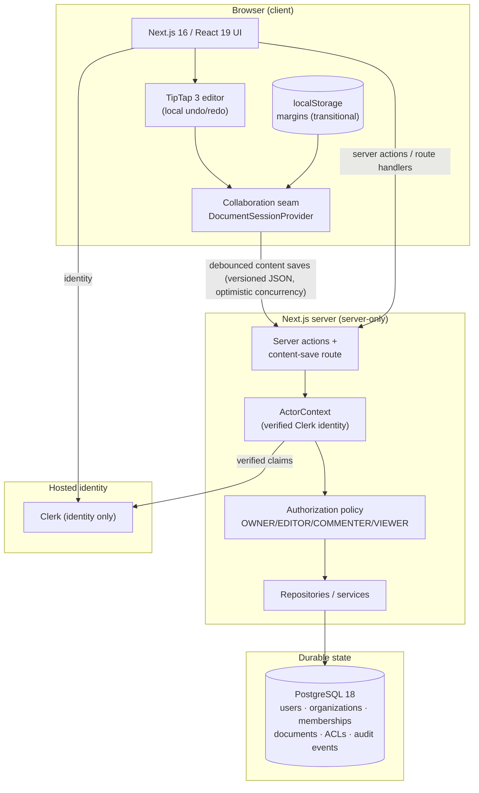
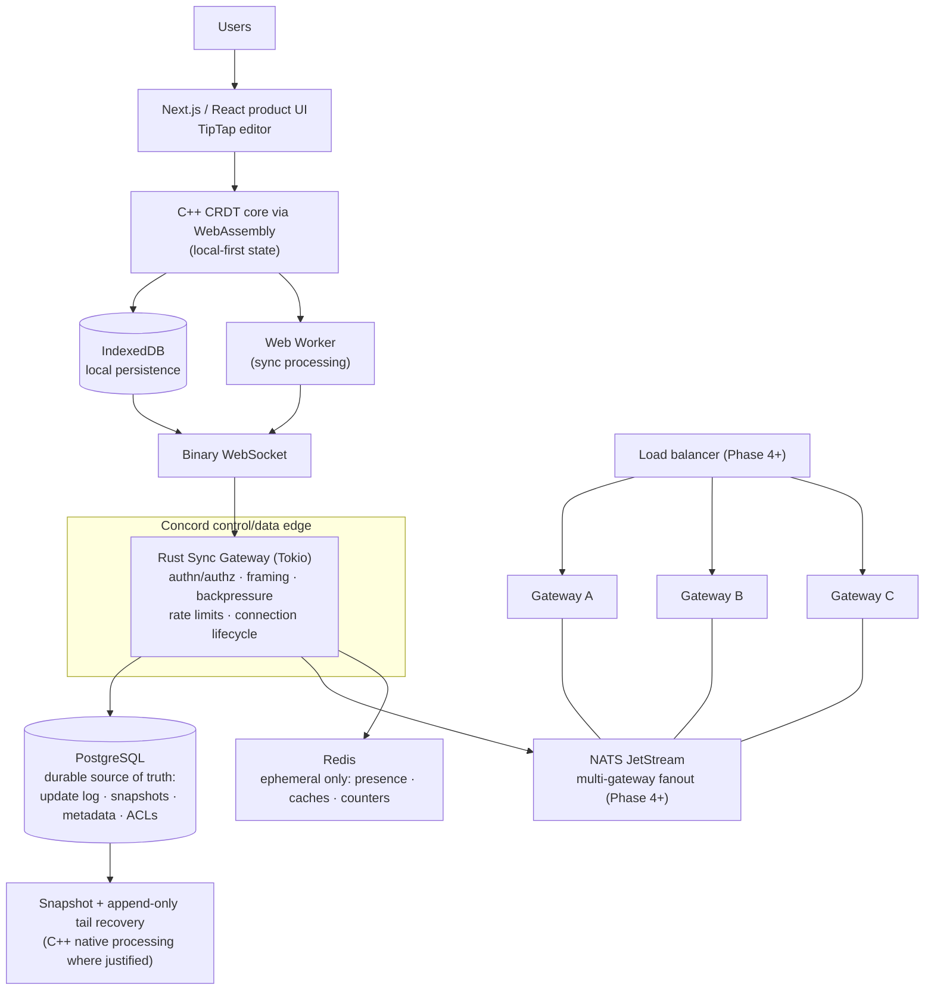

# Concord — Architecture

Status: Authoritative (Phase 1 completion version)
Version: 1.2
Last updated: 2026-09-06

This document distinguishes three architecture states at all times:

- **CURRENT** — what exists and runs today.
- **TRANSITIONAL** — the explicitly temporary states created while moving
  between CURRENT and TARGET (each is scheduled, bounded, and documented).
- **TARGET** — the planned end state. Nothing here is claimed as implemented.

Nothing in the TARGET section should be read as an implemented capability.

---

## 1. CURRENT — PostgreSQL control plane with server-side authorization (Phase 1 complete)

The CURRENT architecture is the result of Phases 0–1: the tutorial stack is
fully modernized (Next.js 16, React 19 stable, Tailwind 4, TipTap 3, Clerk 7),
**Liveblocks and Convex are both removed entirely**, and all durable
application data lives in PostgreSQL behind a server-only data layer with
explicit authorization (OWNER / EDITOR / COMMENTER / VIEWER).

### 1.1 Current components and responsibilities

| Component | Responsibility |
|---|---|
| `src/lib/collaboration/types.ts` | Vendor-neutral session contract; realtime/presence/threads/inbox are explicit `unavailable` states |
| `src/lib/collaboration/provider.tsx` | Document session: debounced content saves via `/api/documents/[id]/content` with content-version tracking and 409 conflict handling; transitional localStorage margins |
| `src/lib/collaboration/content.ts` | Versioned content envelope (`{v:1, doc}`) serialize/parse |
| `src/app/documents/[documentId]/editor.tsx` | TipTap 3 with local history; editable only for OWNER/EDITOR |
| `src/server/db/*` | Drizzle schema, server-only `pg` pool |
| `src/server/repositories/*` | SQL persistence (users, organizations, documents, permissions, audit) |
| `src/server/services/*` | Business policy + authorization orchestration |
| `src/server/auth/*` | ActorContext projection; centralized capability policy |
| `src/app/actions/*`, `src/app/api/*` | Server actions (create/rename/delete) and route handlers (content save, listing, health) |
| `src/proxy.ts` | Clerk middleware (Next 16 proxy convention) |

### 1.2 Current trust boundaries

- Browser → Next.js: Clerk session; route protection via proxy.
- Every server action / route handler builds an `ActorContext` from verified
  Clerk server APIs and reauthorizes the operation against Concord-owned
  data (docs/AUTHORIZATION.md). Client-supplied owner/org/role fields are
  never trusted.
- Server → PostgreSQL through a single server-only pool (`server-only`
  import guard keeps it out of client bundles).
- No third-party collaboration or data service receives document content.

### 1.3 Known transitional limitations (honest state)

- Realtime, presence, comments, inbox: unavailable by design (DEC-016).
- Content persistence is whole-document JSONB with optimistic concurrency —
  a stale writer gets a typed conflict instead of overwriting (DEC-022);
  the CRDT update log (Phase 2) replaces this path.
- Margins are per-browser (localStorage), not shared (DEC-017).
- Sharing UI does not exist yet; the ACL service is implemented and tested
  (foundation for the later sharing surface).

---

## 2. HISTORICAL states

### 2.1 Tutorial baseline (`antonio-original-baseline`, historical)

The imported tutorial product: Next.js 15 + React 19 RC, Convex persistence,
Liveblocks realtime/presence/comments/inbox, binary owner-or-org Liveblocks
authorization with `FULL_ACCESS` grants. Preserved at the tag; superseded by
Phase 0. See git history for details.

### 2.2 Modernized baseline (`phase-0-modernized-baseline`, historical)

The fully modernized stack with Liveblocks still present, verified end-to-end
(all 20 verification-matrix items) and frozen at the tag before extraction.

### 2.3 Phase 0 completion state (`phase-0-complete`, historical)

Liveblocks-free product shell with Convex as transitional persistence:
documents table with owner-or-organization function-level checks, versioned
JSON content envelope, debounced Convex saves. Superseded by Phase 1.

---

## 3. TARGET — Concord architecture (planned)

### 3.1 Language responsibilities (fixed)

| Language | Owns | Does not own |
|---|---|---|
| TypeScript | Product UI, editor integration, IndexedDB, WebSocket client, WASM interop, workers | Durable state, authorization decisions |
| C++20/23 | CRDT core, merge/dedup, deterministic serialization/hashing, snapshots, simulator, fuzz targets — native + WASM | Product UI, networking services |
| Rust | Async gateway: connections, framing, authn/authz enforcement, bounded queues, backpressure, rate limiting, telemetry | CRDT algorithm core |
| SQL (PostgreSQL) | Durable truth: metadata, ACLs, update log, snapshots metadata, history, audit | Ephemeral presence |
| Redis | Ephemeral presence/caches/counters only | Anything whose loss is unacceptable |

### 3.2 Durable vs ephemeral state

- **Durable (PostgreSQL):** document/organization metadata, memberships, ACLs,
  append-only update log, snapshot metadata, version history, audit events.
- **Ephemeral (Redis/in-memory):** presence, active connection metadata,
  rate-limit counters, temporary room state. Loss is acceptable and tested.
- **Browser-local (IndexedDB):** offline replica state; reconciled via CRDT.

### 3.3 Consistency model (per data class)

| Data class | Guarantee |
|---|---|
| Document contents | Eventually consistent; CRDT convergence; duplicate-safe; offline-capable |
| Security metadata (ownership, membership, ACLs, security config) | Transactionally consistent (PostgreSQL) |
| Presence | Ephemeral, best-effort, latest-wins |

No distributed locks for normal text editing. Leases are reserved for
single-owner maintenance operations (e.g., compaction) if the design needs one.

### 3.4 Delivery model

At-least-once transport with idempotent handlers and deduplication at the
CRDT identity level (`replica id` + monotonic sequence or equivalent).
Duplicate packets never corrupt document state. Durable edits and cursor
motion have different delivery priorities (P0 vs P3 classes per the
backpressure model).

### 3.5 Control plane vs data plane

- **Data plane:** client↔gateway WebSocket updates, gateway→storage log
  appends, cross-gateway document fanout.
- **Control plane:** identity/authorization, document routing/sharding
  decisions, membership/ACL changes, maintenance (snapshot/compaction
  scheduling), health/telemetry aggregation.

### 3.6 Trust boundaries (target)

1. Browser ↔ Gateway: authenticated session (Clerk identity), per-document
   authorization enforced inside the gateway against durable ACL data.
2. Gateway ↔ PostgreSQL: service credentials; the database trusts no client.
3. Gateway ↔ NATS/Redis: service-scoped credentials; ephemeral data only in
   Redis; NATS carries events, never authorization decisions.
4. Client authorization state is advisory UI only.

### 3.7 Failure assumptions (target direction)

- Any single gateway may crash or be drained at any time; clients reconnect.
- PostgreSQL may restart; acknowledged durable updates survive.
- NATS may be interrupted; the system degrades and recovers without durable
  loss (per the documented failure model in later-phase docs).
- Redis data may vanish; presence/metrics degrade; documents are unaffected.
- Clients may be offline for arbitrary periods; convergence on reconnect.

### 3.8 Deployment direction

Local development is Docker Compose (PostgreSQL, Redis, NATS, observability
stack as phases introduce them). Production deployment — hosting, TLS,
secrets, staging, rollout/draining, rollback — is designed and executed in
Phase 7 based on the final architecture (DEC-010).

---

## 4. Document lifecycle (target view)

1. **Create** — metadata row + ACL (PostgreSQL); document opens locally.
2. **Edit offline** — updates applied to local CRDT replica (WASM), persisted
   to IndexedDB.
3. **Sync online** — updates exchanged via binary WebSocket; deduplicated by
   identity; appended to the durable log.
4. **Snapshot/compact** — at policy thresholds, snapshot materializes state;
   tail replays shrink; recovery time stays bounded (Phase 5).
5. **History/restore** — reconstruct revisions from log + snapshots.

## 5. Reading guide

- Implemented behavior: Section 1 (CURRENT).
- Temporary, scheduled states: Section 2 (each is gated by a phase).
- Planned behavior: Section 3 — never presented as existing.
- Decisions behind this structure: [DECISIONS.md](DECISIONS.md).
