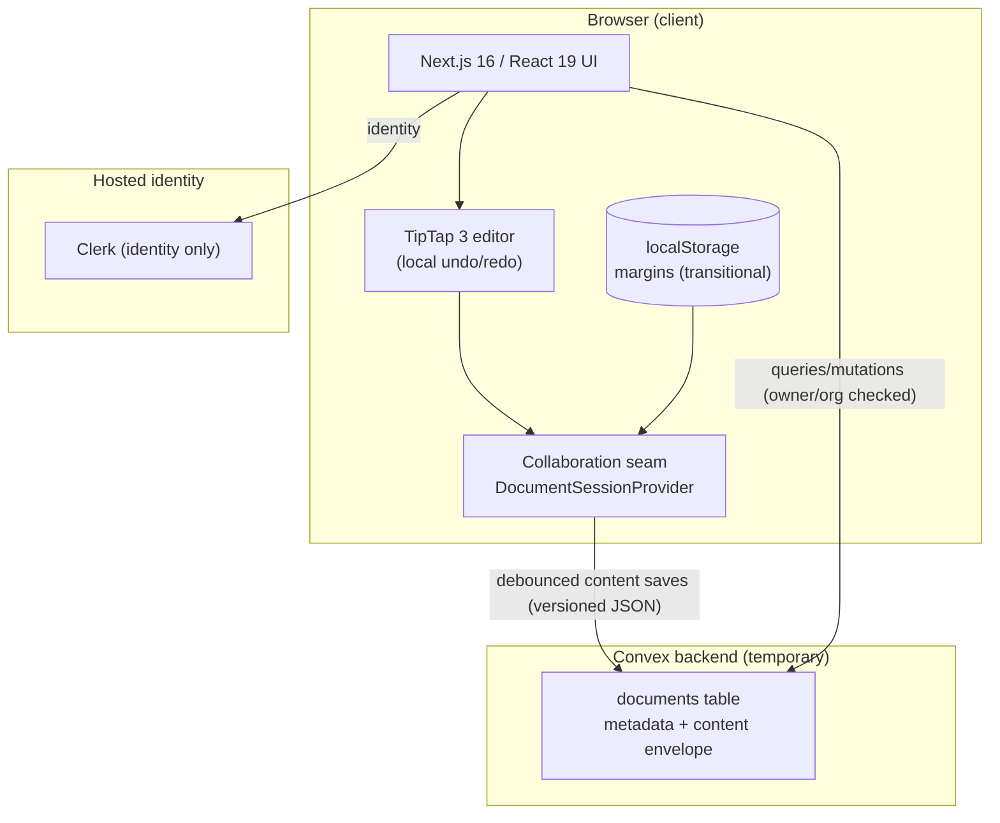
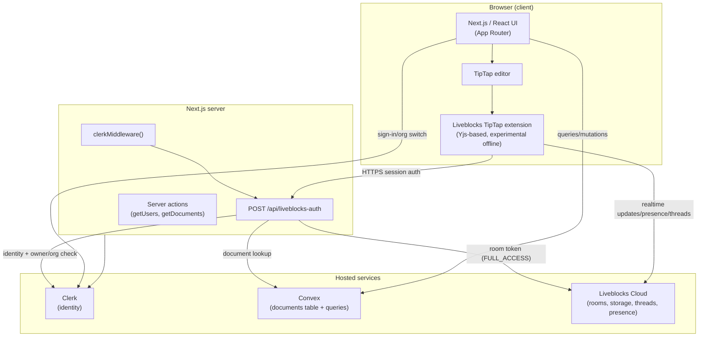
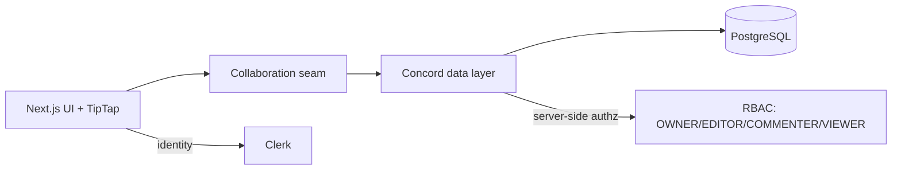
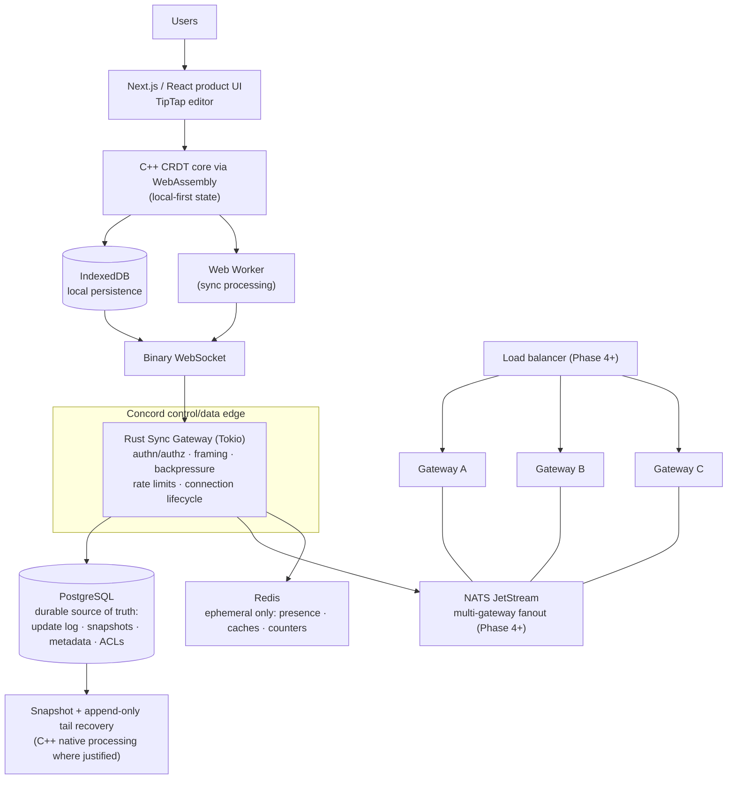

# Concord — Architecture

Status: Authoritative (Phase 0 completion version)
Version: 1.1
Last updated: 2026-09-06

This document distinguishes three architecture states at all times:

- **CURRENT** — what exists and runs today.
- **TRANSITIONAL** — the explicitly temporary states created while moving
  between CURRENT and TARGET (each is scheduled, bounded, and documented).
- **TARGET** — the planned end state. Nothing here is claimed as implemented.

Nothing in the TARGET section should be read as an implemented capability.

---

## 1. CURRENT — Liveblocks-free product shell with transitional persistence (Phase 0 complete)

The CURRENT architecture is the result of Phase 0: the tutorial stack is fully
modernized (Next.js 16, React 19 stable, Tailwind 4, TipTap 3, Clerk 7,
Convex 1.45) and **Liveblocks is removed entirely**. Realtime collaboration,
presence, comments, and notifications are intentionally deferred; the UI
consumes the vendor-neutral collaboration seam.

### 1.1 Current components and responsibilities

| Component | Responsibility |
|---|---|
| `src/lib/collaboration/types.ts` | Vendor-neutral session contract; realtime/presence/threads/inbox are explicit `unavailable` states |
| `src/lib/collaboration/provider.tsx` | Document session: debounced Convex content saves (status/error surfaced), transitional localStorage margins |
| `src/lib/collaboration/content.ts` | Versioned content envelope (`{v:1, doc}`) serialize/parse |
| `src/app/documents/[documentId]/editor.tsx` | TipTap 3 with local history; consumes the session interface only |
| `convex/documents.ts` | CRUD + search + content mutation; all access owner-or-organization checked |
| `src/proxy.ts` | Clerk middleware (Next 16 proxy convention) |

### 1.2 Current trust boundaries

- Browser → Next.js: Clerk session; route protection via proxy.
- Browser → Convex: Clerk-issued JWT (template `convex`, audience `convex`);
  every query/mutation enforces identity + owner-or-organization membership.
- No third-party collaboration service receives document content.

### 1.3 Known transitional limitations (honest state)

- Realtime, presence, comments, inbox: unavailable by design (DEC-016).
- Content persistence is whole-document, last-write-wins (DEC-017).
- Margins are per-browser (localStorage), not shared (DEC-017).

---

## 2. HISTORICAL states

### 2.1 Tutorial baseline (`antonio-original-baseline`, historical)

The imported tutorial product: Next.js 15 + React 19 RC, Convex persistence,
Liveblocks realtime/presence/comments/inbox, binary owner-or-org Liveblocks
authorization with `FULL_ACCESS` grants. Preserved at the tag; superseded by
Phase 0. See git history for details.

### 2.2 Modernized baseline (`phase-0-modernized-baseline`, historical)

The fully modernized stack with Liveblocks still present, verified end-to-end
(all 20 verification-matrix items) and frozen at the tag before extraction.

---

#### Components and responsibilities (historical)

| Component | Responsibility |
|---|---|
| `src/app/(home)/*` | Document listing (paginated), title search, templates gallery, rename/remove dialogs |
| `src/app/documents/[documentId]/page.tsx` | Server component: Clerk token → Convex `preloadQuery(getById)` |
| `room.tsx` | `LiveblocksProvider` (throttle 16 ms), custom auth endpoint, user/mention/room-info resolvers |
| `editor.tsx` | TipTap instance; extension set; margins via Liveblocks Storage; `offlineSupport_experimental` |
| `toolbar.tsx` / `navbar.tsx` | Formatting commands (via Zustand editor store), export (JSON/HTML/TXT/print), document ops |
| `ruler.tsx` | Draggable page margins stored in Liveblocks room Storage |
| `threads.tsx`, `inbox.tsx`, `avatars.tsx` | Comments, notifications, presence UI |
| `convex/documents.ts` | CRUD + search + auth checks (owner or same-organization member) |
| `api/liveblocks-auth/route.ts` | Issues Liveblocks room sessions after Clerk identity + document-access check |
| `src/middleware.ts` | Clerk middleware on all app routes |

### 2.3.1 Data flow (edit path, historical)

1. Keystroke → TipTap → Liveblocks extension applies the update to the local
   Yjs document and sends it to Liveblocks Cloud over WebSocket.
2. Liveblocks fans the update out to other room members; their extensions
   apply it remotely.
3. Room Storage (margins) and Threads (comments) follow the same room
   transport; document *metadata* (title) goes through Convex mutations.
4. The initial document content is fetched from Convex once at page load and
   handed to the editor as `initialContent`.

#### Trust boundaries (historical)

- Browser → Next.js: Clerk session cookie; middleware gates routes.
- Browser → Liveblocks: session token minted by `/api/liveblocks-auth` after
  a server-side owner-or-organization check.
- Next.js → Convex: Clerk JWT (template `convex`) or server key.
- Authorization granularity today: binary (owner/org member ⇒ `FULL_ACCESS`).
  There are no EDITOR/COMMENTER/VIEWER distinctions, and `documents.getById`
  performs no ownership check.

#### Known weaknesses (historical, resolved or tracked)

- Authorization gaps and binary access model (see PRD R4, DEC-005).
- Environment-specific configuration committed in code (Clerk dev domain in
  `convex/auth.config.ts`).
- No tests, no CI, no toolchain pinning.
- Collaboration, presence, comments, and persistence are externally owned and
  not inspectable or measurable (the reason for this project).

---

## 3. NEXT TRANSITIONAL state (Phase 1): Convex removal

Document metadata, ACLs, memberships, and durable application data move to
PostgreSQL behind a repository/data layer; Convex is fully removed.

- Server-side authorization against PostgreSQL ACL data becomes the single
  access-decision point (DEC-005).
- Liveblocks-era features (threads/inbox) remain degraded or locally
  implemented until the Concord collaboration stack lands (Phases 2–3).

---

## 4. TARGET — Concord architecture (planned)

### 4.1 Language responsibilities (fixed)

| Language | Owns | Does not own |
|---|---|---|
| TypeScript | Product UI, editor integration, IndexedDB, WebSocket client, WASM interop, workers | Durable state, authorization decisions |
| C++20/23 | CRDT core, merge/dedup, deterministic serialization/hashing, snapshots, simulator, fuzz targets — native + WASM | Product UI, networking services |
| Rust | Async gateway: connections, framing, authn/authz enforcement, bounded queues, backpressure, rate limiting, telemetry | CRDT algorithm core |
| SQL (PostgreSQL) | Durable truth: metadata, ACLs, update log, snapshots metadata, history, audit | Ephemeral presence |
| Redis | Ephemeral presence/caches/counters only | Anything whose loss is unacceptable |

### 4.2 Durable vs ephemeral state

- **Durable (PostgreSQL):** document/organization metadata, memberships, ACLs,
  append-only update log, snapshot metadata, version history, audit events.
- **Ephemeral (Redis/in-memory):** presence, active connection metadata,
  rate-limit counters, temporary room state. Loss is acceptable and tested.
- **Browser-local (IndexedDB):** offline replica state; reconciled via CRDT.

### 4.3 Consistency model (per data class)

| Data class | Guarantee |
|---|---|
| Document contents | Eventually consistent; CRDT convergence; duplicate-safe; offline-capable |
| Security metadata (ownership, membership, ACLs, security config) | Transactionally consistent (PostgreSQL) |
| Presence | Ephemeral, best-effort, latest-wins |

No distributed locks for normal text editing. Leases are reserved for
single-owner maintenance operations (e.g., compaction) if the design needs one.

### 4.4 Delivery model

At-least-once transport with idempotent handlers and deduplication at the
CRDT identity level (`replica id` + monotonic sequence or equivalent).
Duplicate packets never corrupt document state. Durable edits and cursor
motion have different delivery priorities (P0 vs P3 classes per the
backpressure model).

### 4.5 Control plane vs data plane

- **Data plane:** client↔gateway WebSocket updates, gateway→storage log
  appends, cross-gateway document fanout.
- **Control plane:** identity/authorization, document routing/sharding
  decisions, membership/ACL changes, maintenance (snapshot/compaction
  scheduling), health/telemetry aggregation.

### 4.6 Trust boundaries (target)

1. Browser ↔ Gateway: authenticated session (Clerk identity), per-document
   authorization enforced inside the gateway against durable ACL data.
2. Gateway ↔ PostgreSQL: service credentials; the database trusts no client.
3. Gateway ↔ NATS/Redis: service-scoped credentials; ephemeral data only in
   Redis; NATS carries events, never authorization decisions.
4. Client authorization state is advisory UI only.

### 4.7 Failure assumptions (target direction)

- Any single gateway may crash or be drained at any time; clients reconnect.
- PostgreSQL may restart; acknowledged durable updates survive.
- NATS may be interrupted; the system degrades and recovers without durable
  loss (per the documented failure model in later-phase docs).
- Redis data may vanish; presence/metrics degrade; documents are unaffected.
- Clients may be offline for arbitrary periods; convergence on reconnect.

### 4.8 Deployment direction

Local development is Docker Compose (PostgreSQL, Redis, NATS, observability
stack as phases introduce them). Production deployment — hosting, TLS,
secrets, staging, rollout/draining, rollback — is designed and executed in
Phase 7 based on the final architecture (DEC-010).

---

## 5. Document lifecycle (target view)

1. **Create** — metadata row + ACL (PostgreSQL); document opens locally.
2. **Edit offline** — updates applied to local CRDT replica (WASM), persisted
   to IndexedDB.
3. **Sync online** — updates exchanged via binary WebSocket; deduplicated by
   identity; appended to the durable log.
4. **Snapshot/compact** — at policy thresholds, snapshot materializes state;
   tail replays shrink; recovery time stays bounded (Phase 5).
5. **History/restore** — reconstruct revisions from log + snapshots.

## 6. Reading guide

- Implemented behavior: Section 1 (CURRENT).
- Temporary, scheduled states: Section 2 (each is gated by a phase).
- Planned behavior: Sections 3–4 — never presented as existing.
- Decisions behind this structure: [DECISIONS.md](DECISIONS.md).
