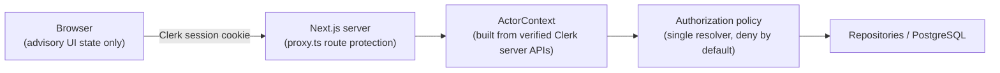

# Concord — Authorization Model (Phase 1)

Status: Authoritative
Version: 1.1
Last updated: 2026-09-09

This document defines how Concord decides *what an authenticated actor may do
to a specific resource*. Authentication (who the actor is) is delegated to
Clerk. Authorization is owned entirely by Concord server code operating on
Concord-owned data in PostgreSQL. No client-supplied field — owner ID,
organization ID, role, or capability flag — is ever accepted as authorization
evidence.

Companion documents: [DATABASE.md](DATABASE.md),
[ARCHITECTURE.md](ARCHITECTURE.md), [DECISIONS.md](DECISIONS.md) (DEC-005,
DEC-019, DEC-020).

---

## 1. Trust boundaries

1. **Browser → Next.js.** Clerk session cookie. `proxy.ts` blocks
   unauthenticated access to application routes (coarse gate only).
2. **Server → Clerk.** The server resolves identity through Clerk's server
   APIs (`auth()`). Session claims provide the user ID and, when an
   organization context is active, the verified organization ID and the
   actor's organization role.
3. **Server → PostgreSQL.** Concord's own tables (`users`,
   `organizations`, `organization_memberships`, `documents`,
   `document_user_permissions`) are the only source for authorization
   decisions.
4. **Client state is advisory.** Effective roles returned to the UI only
   drive cosmetic hints (disabled buttons, labels). Every mutation
   reauthorizes server-side.

## 2. ActorContext

`ActorContext` is a server-only value object built per request:

| Field | Source | Notes |
|---|---|---|
| `userId` | Concord `users.id` | Resolved idempotently from the verified Clerk user ID |
| `clerkUserId` | Clerk session claim | |
| `organization` | Verified active-org claim + Concord `organizations` | `null` in personal workspace |
| `organization.id` | Concord `organizations.id` | |
| `organization.clerkOrganizationId` | Clerk session claim | |
| `organization.membershipRole` | Clerk claim, mirrored into `organization_memberships` | `admin` or `member` |

Construction rules:

- Unauthenticated requests never build an ActorContext and never create rows.
- The local user and (when applicable) the local organization + membership are
  projected idempotently from verified claims (unique constraints make
  concurrent projection safe).
- A request body or query parameter can never choose the organization scope;
  only the verified active-organization claim can.

## 3. Effective document roles

Effective role resolution for a document, evaluated in order (first match wins):

1. **OWNER** — the document's `owner_user_id` equals the actor's user ID.
2. **Direct grant** — a row in `document_user_permissions` for this actor and
   document (`EDITOR`, `COMMENTER`, or `VIEWER`).
3. **Organization-derived** — the document belongs to an organization and the
   actor is a verified member of that organization → **EDITOR**.
4. Otherwise there is no effective role: **deny**.

Roles are never additive; the highest applicable role wins. There is no way
to obtain `OWNER` through ACL rows — ownership is intrinsic to
`documents.owner_user_id`.

### Capability matrix

| Capability | OWNER | EDITOR | COMMENTER | VIEWER |
|---|:-:|:-:|:-:|:-:|
| Read metadata + content | ✓ | ✓ | ✓ | ✓ |
| Edit document content | ✓ | ✓ | — | — |
| Rename document | ✓ | ✓ | — | — |
| Delete document | ✓ | — | — | — |
| Grant/change/revoke user permissions | ✓ | — | — | — |
| Comment (future capability) | ✓ | ✓ | ✓ | — |

Notes:

- **Rename by EDITOR** preserves the verified Phase 0 behavior (every
  owner-or-org-member could rename). Owner-only rename would be a product
  regression; it is recorded here deliberately.
- **COMMENTER** exists in the data model and policy ahead of the comments
  feature (Phases 2+). Today it honestly means *read access plus future
  comment permission* — never content editing.
- Organization-derived access is EDITOR (parity with the Phase 0 verified
  behavior where any organization member had full access to organization
  documents). A future ADR may narrow this per-organization default.

## 4. Operation authorization map

| Operation | Minimum effective role | Additional conditions |
|---|---|---|
| List personal documents | authenticated | Query scoped to actor's user ID |
| List/search organization documents | authenticated + active org membership | Query scoped to verified organization ID |
| Create document | authenticated | Owner/org scope derived from ActorContext |
| Open document (metadata + content) | VIEWER | |
| Search titles | VIEWER-equivalent within scope | Scope filter in SQL |
| Rename | EDITOR | Metadata-version conditional update |
| Save content | EDITOR | Content-version conditional update |
| Delete | OWNER | |
| Grant ACL entry | OWNER | Target must be an existing user |
| Update ACL entry | OWNER | Role limited to EDITOR/COMMENTER/VIEWER |
| Revoke ACL entry | OWNER | |

## 5. Denial semantics

- **Deny by default.** Incomplete or inconsistent context (no local user, no
  resolvable membership, malformed identifier) always denies.
- **No existence leak.** A document that does not exist *or* that the actor is
  not allowed to see produces the same indistinguishable "not found" outcome.
  Only the owner of a valid document sees success; validation failures
  (malformed UUID) are reported as validation errors, which do reveal
  nothing about resource existence.
- **Typed errors.** Services raise `ForbiddenError`, `NotFoundError`,
  `ConflictError`, `ValidationError`, `UnauthenticatedError`; one mapping
  layer converts them to HTTP/server-action outcomes. `ForbiddenError` on
  document reads is masked as `NotFoundError`; on mutations it may surface as
  an explicit denial result to the UI (still without existence guarantees).
- **Authorization failures on protected mutations are audit-worthy** and are
  logged without sensitive payloads.

## 6. ACL management rules

- Only `OWNER` may create, change, or revoke `document_user_permissions`
  entries.
- Grantable roles are `EDITOR`, `COMMENTER`, `VIEWER` — the ACL path cannot
  create or modify ownership.
- The owner's access cannot be downgraded through the ACL path (owner role is
  not stored in the ACL table).
- Duplicate grants are impossible (unique `(document_id, user_id)`); a re-grant
  updates the role.
- Every ACL mutation writes an audit event (actor, target, role, document).

## 7. Considered and deferred

- **PostgreSQL Row Level Security:** considered; deferred (DEC-020). The
  server pool uses one service credential, so RLS would duplicate policy
  without a per-user database identity.
- **Clerk organization role mapping:** Clerk `admin`/`member` roles are stored
  on `organization_memberships` for future use (e.g., org-scoped admin
  capabilities) but do not grant document-level capabilities in Phase 1.
- **Ownership transfer:** not implemented in Phase 1 (no product surface);
  the model does not prevent adding it as an owner-only operation later.

## 8. Realtime session revocation (gateway policy, proven P6-M022)

The Rust sync gateway enforces the same effective-role policy on live
WebSocket sessions, and permission changes are enforced on every batch:

**Policy:** Permission changes are enforced on every batch via an
in-transaction authorization recheck; no TTL cache exists at the
gateway; enforcement is immediate at the next batch boundary.

Concretely (all E2E-proven in `rust/sync-gateway/tests/phase6_revocation.rs`,
across real gateway processes with shared PostgreSQL + NATS):

- Join-time check gates room entry (read role), and every `client_ops`
  batch re-runs the authorization query INSIDE the ingest transaction
  against a fresh snapshot — revoking a direct ACL grant, downgrading
  EDITOR→VIEWER, or removing an org membership denies the very next
  batch on every gateway the session is connected to, without any
  reconnect.
- A denied write is a non-fatal `forbidden` error frame: the session
  stays alive for reads (catch-up/ping continue on the same socket).
- Upgrades are live in the same direction: a VIEWER promoted to EDITOR
  may write the next batch without reconnecting.
- Ordering semantics: a batch whose ingest transaction begins before
  the revoke commit is acked (durable under the then-current grant);
  one that begins after is denied. There is no third outcome — no TTL
  window, no stale-cache bypass.
- The web (HTTP/server-action) surface reauthorizes every request
  identically (`tests/db/idor-matrix.test.ts`, P6-M021).
