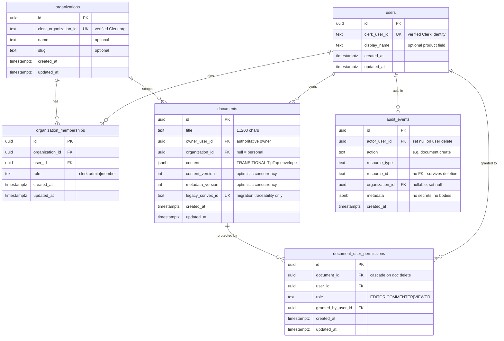

# Concord — Database (Phase 1)

Status: Authoritative
Version: 1.0
Last updated: 2026-09-06

Concord's durable application data lives in PostgreSQL. This document
describes the schema, invariants, migration policy, and local development
workflow as of Phase 1. The CRDT update log, snapshots, and version history
are later-phase additions (see [ARCHITECTURE.md](ARCHITECTURE.md) §4) and are
intentionally absent here.

Companion documents: [AUTHORIZATION.md](AUTHORIZATION.md),
[DECISIONS.md](DECISIONS.md) (DEC-019, DEC-020),
[MIGRATION_CONVEX_TO_POSTGRES.md](MIGRATION_CONVEX_TO_POSTGRES.md).

---

## 1. Stack

| Concern | Choice | Notes |
|---|---|---|
| Database engine | PostgreSQL 18 | Pinned image `postgres:18.6-alpine`, run via Docker Compose |
| Schema definition | Drizzle ORM (TypeScript) | Single source for typed schema |
| Migrations | Drizzle Kit → reviewed SQL files | Applied in order; replayable from empty DB |
| Runtime driver | `node-postgres` (`pg`) | Server-only connection pool |
| Validation | Zod | Environment config + mutation boundaries |
| Access model | Single service credential pool | Application-layer authorization (RLS deferred, DEC-020) |

## 2. Entity–relationship overview



## 3. Table semantics and invariants

### users

Local principal projected from the verified Clerk identity. Keyed uniquely by
`clerk_user_id`. Only fields the product needs (display name) — no
unnecessary Clerk profile mirroring. Projection is idempotent
(find-or-create with `ON CONFLICT`), so concurrent first requests converge on
one row.

### organizations / organization_memberships

Local mirrors of Clerk organizations, projected only from the verified
active-organization session claim — never from client parameters. Memberships
store the Clerk org role (`admin`/`member`) for future use; they do not grant
document capabilities directly (organization documents grant effective
EDITOR — see [AUTHORIZATION.md](AUTHORIZATION.md) §3).

### documents

- `owner_user_id` is the authoritative owner; there is no owner row in the
  ACL table.
- `organization_id` NULL = personal document; NOT NULL = organization-scoped.
- `content` (JSONB) is **transitional** pre-CRDT persistence: the versioned
  TipTap envelope `{ "v": 1, "doc": <TipTap JSON> }`, capped at 2 MiB on
  write. It is NOT the future collaboration data model (Phases 2–3 replace it
  with the CRDT update log).
- `content_version` / `metadata_version` are independent counters (≥1) used
  for optimistic concurrency: saves/rename submit the version they loaded and
  are applied with a conditional `UPDATE ... WHERE version = expected`, so a
  stale writer can never silently overwrite newer server state.
- `legacy_convex_id` (nullable, unique) exists solely for Convex→PostgreSQL
  migration traceability.

### document_user_permissions

Direct user grants. Role constrained to `EDITOR`/`COMMENTER`/`VIEWER` —
`OWNER` is intentionally not expressible here. Unique per
`(document_id, user_id)`. Rows cascade-delete with their document;
`granted_by_user_id` records the granting actor for audit correlation.

### audit_events

Append-only record of significant mutations (document create/rename/delete,
ACL grant/update/revoke). `resource_id` is plain text **without a foreign
key**, so deleting a document never destroys its audit history. Metadata is
structured JSONB containing IDs/roles/titles only — never document bodies,
tokens, or secrets. Content autosaves are deliberately NOT audited
(per-keystroke-volume policy; see AUTHORIZATION.md §4 and DECISIONS).

## 4. Indexes

| Index | Purpose |
|---|---|
| `users.clerk_user_id` UNIQUE | Identity projection lookups |
| `organizations.clerk_organization_id` UNIQUE | Org projection lookups |
| `organization_memberships (organization_id, user_id)` UNIQUE + `(user_id)` | Duplicate-proof membership; "my memberships" lookups |
| `documents (owner_user_id, updated_at DESC)` | Personal document list ordering |
| `documents (organization_id, updated_at DESC)` | Organization document list ordering |
| `documents legacy_convex_id` UNIQUE | Migration idempotency |
| `document_user_permissions (document_id, user_id)` UNIQUE + `(user_id)` | Grant uniqueness; "docs shared with me" |
| `audit_events (created_at DESC)`, `(resource_id)`, `(actor_user_id)` | Audit lookups |
| `documents` trigram (GIN) on `title` (`pg_trgm`) | Case-insensitive substring title search (ILIKE '%q%') |

`gen_random_uuid()` (built into PostgreSQL 13+) generates primary keys; no
extension is required for UUIDs. `pg_trgm` is the single explicitly managed
extension, created by migration.

## 5. Migration policy

- The Drizzle schema in `src/server/db/schema.ts` is the typed definition;
  SQL migrations under `drizzle/` are the authoritative change history.
- `drizzle-kit generate` produces candidate SQL; every migration is reviewed
  before commit. `drizzle push` (ad-hoc schema sync) is not used as source of
  truth.
- Migrations apply in lexicographic order and must replay cleanly from an
  empty database (verified by the test suite and the phase gate).
- Application start must not unexpectedly mutate schema; migrations run
  explicitly via scripts (and automatically in the test harness against the
  test database).
- Production deployment/migration strategy is a Phase 7 concern (DEC-010).

## 6. Local development workflow

```bash
docker compose up -d db         # start PostgreSQL (named volume `concord_pgdata`)
npx drizzle-kit migrate         # apply pending migrations (or npm run db:migrate)
npm run dev                     # Next.js dev server
```

Useful scripts: `npm run db:generate` (new migration from schema changes),
`npm run db:migrate` (apply), `npm run db:studio` (Drizzle Studio),
`npm run test:db` (integration suite against the test database).

Environment (names only — see `.env.example`): `DATABASE_URL` (dev pool),
`DATABASE_TEST_URL` (isolated test database). Local dev credentials are
explicitly non-production placeholders defined in `docker-compose.yml`.

## 7. Delete behavior summary

| Edge | Behavior |
|---|---|
| Document deleted | ACL rows cascade; **audit events are kept** (no FK on resource_id) |
| User deleted | Not supported in Phase 1; if ever added: audit actor set NULL, memberships cascade, owned documents blocked or transferred deliberately (decision deferred) |
| Organization deleted | Not supported in Phase 1; membership/document cascade semantics to be decided with that feature |
