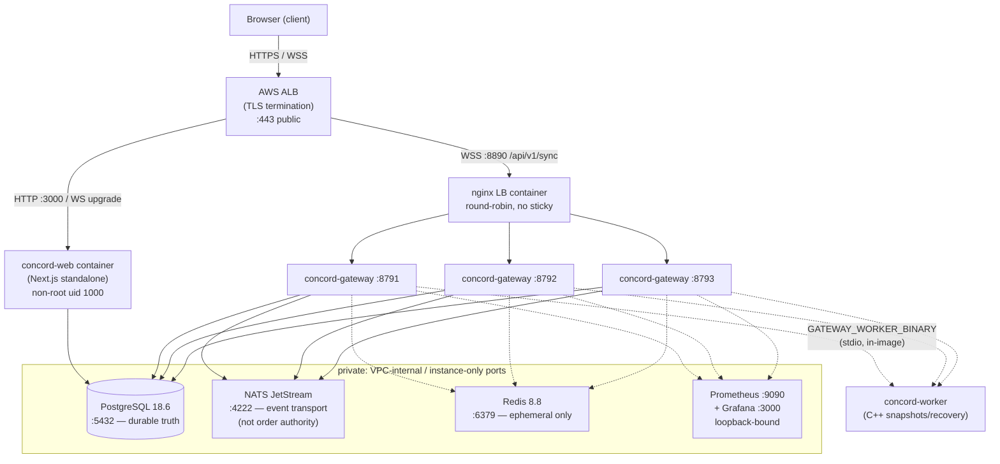
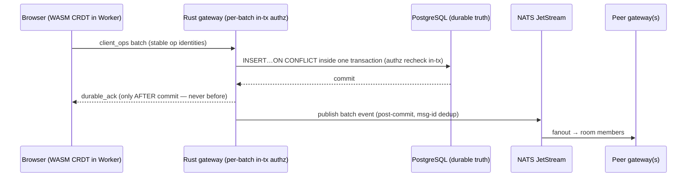
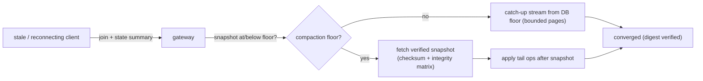

# Concord — Deployment Topology (v1)

Status: Authoritative (Phase 7) · Implements DEC-050 · Staging-first rule
per `docs/MIGRATIONS.md` and `docs/OPERATIONS.md`.

The AWS topology below is a deployable owner runbook and records the
historical Phase 7 exercise. No AWS environment is running in the current
repository state; DNS, TLS, cloud credentials, and the live deployment are
owner actions.

One compose stack per environment; staging and production are separate
EC2 instances with identical shape. Replica counts are deliberately
small and truthful — this is not an HA deployment (see §4).

## 1. Staging / production topology (identical shape)

Public/private boundary:

| Port | Service | Exposure |
|---|---|---|
| 443 | ALB (TLS) | Public — the only public entrypoint |
| 3000 | web | ALB target only (security group: ALB → instance) |
| 8890 | nginx LB | ALB target only |
| 8791-8793 | gateways | nginx LB only (localhost) |
| 5432 | PostgreSQL | Instance/VPC only — never public |
| 4222 | NATS | Instance only |
| 6379 | Redis | Instance only |
| 9090/3000 | Prometheus/Grafana | Loopback only (SSH tunnel to inspect) |

## 2. Durable operation flow (what deployment must preserve)

## 3. Recovery flow (why the topology is safe)

Failure model reference: `docs/FAILURE_MODEL.md`; chaos evidence:
`docs/VERIFICATION.md` §3 (27/27 scenarios, 0 lost durable-ACKed
operations, 0 divergent replicas).

## 4. What v1 IS and IS NOT (honest claims)

- IS: 3 gateway replicas behind an LB (connectivity/fanout scale-out);
  Postgres as the single durable truth; verified snapshots + bounded
  tails; graceful drain on SIGTERM (rolling restart safe); automated
  backups (see `docs/OPERATIONS.md`).
- IS NOT: multi-AZ failover, auto-scaling, multi-region, Redis Cluster,
  or NATS clustering. Nothing here claims HA — recovery from component
  loss is tested (chaos), but failover between instances is not
  implemented in v1. Single-node data services per environment.

## 5. Environment matrix

| | Staging | Production |
|---|---|---|
| Instance | 1× Graviton (2 vCPU min) | 1× Graviton (2+ vCPU) |
| Gateway replicas | 3 | 3 |
| Web replicas | 1 | 1 |
| Postgres | compose + volume + nightly dump | compose + volume + nightly dump |
| DNS | ALB DNS name (no custom domain) | ALB DNS name (no custom domain) |
| Secrets | env injection at launch | env injection at launch |
| Migrations | applied per `docs/MIGRATIONS.md` | same runbook, after staging |
