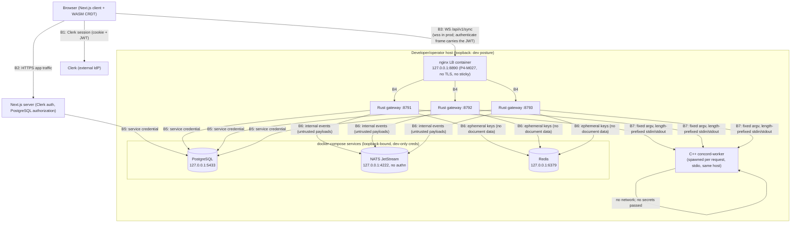

# Concord — Security Model (Phase 3 + 4)

Status: Authoritative (Phase 6 threat model current; Phase 4 §1–6 and
Phase 5 §7 remain in force as described below)
Version: 2.1
Last updated: 2026-09-09

> **Document structure.** §1–§5 record the Phase 3 posture, §6 the Phase 4
> distributed additions, §7 the Phase 5 storage-integrity additions, and
> §8 the Phase 6 formal threat model (P6-M020), which supersedes nothing
> below it but sits above it as the systematic map: every named threat is
> traced to either an existing executable test (file/suite named) or a
> planned Phase 6 test (marked `PLANNED → P6-Mxxx`). §9 records the
> Phase 6 scanning tooling (P6-M024 secret scanning, P6-M025 supply-chain
> scanning). §10 records the Phase 7 production security configuration
> (P7-M020 sign-off: TLS/Clerk posture, required env, network exposure,
> rate limits, CSP posture, runtime secrets, IAM recommendations).

## 1. Trust boundaries (CURRENT)

1. **Browser ↔ Rust gateway**: WebSocket at `/api/v1/sync`. Authentication
   = Clerk session JWT verified SERVER-SIDE (RS256 via JWKS, issuer/exp/nbf,
   algorithm pinned — HS256-with-public-JWKS style attacks rejected). The
   token travels in the `authenticate` frame after upgrade — never in a URL
   query string (browser WebSocket APIs cannot set headers; the tradeoff
   is documented in PROTOCOL §9.5).
2. **Gateway ↔ PostgreSQL**: service credentials; every query is a static
   parameterized statement (no concatenation of untrusted input anywhere
   in `rust/.../db`).
3. **Client identity state is advisory only** — the verified token `sub`
   is the sole principal source; client-supplied user ids/roles are never
   trusted (non-negotiable #14).

## 2. Authorization (CURRENT)

- ONE canonical policy layer (`rust/.../db/authz.rs`): SQL join resolves
  the Phase 1 effective role (owner > direct ACL > org-member EDITOR >
  deny); capabilities: read = all roles; content-write = OWNER/EDITOR.
- Join-time check gates room entry; **write authorization is rechecked on
  every batch inside the ingestion transaction** (live downgrade denied —
  E2E-proven).
- Nonexistent and no-access documents are indistinguishable (`forbidden`)
  — no existence oracle. Document ids must be UUIDs; SQLi-shaped values
  are rejected as malformed.

## 3. Protocol input hardening (CURRENT)

- All frames are untrusted: strict decoders with bounded limits (8 MiB
  frame, 1024 ops/batch, 64 KiB/op, 32 KiB token) — enforced at decode
  before allocation; oversized frames severed at the transport cap.
- Unknown versions/types → safe errors; fatal errors close the socket.
- Envelope validation mirrors the C++ core rules (identity ranges,
  bounded strings, exact-consume) — structurally invalid ops are never
  persisted.
- Error frames carry vocabulary codes + safe messages only: no SQL, table
  names, stack traces, or token material (banned-substring sweep tested).

## 4. Resource bounds (CURRENT)

- Per-connection outbound queue is bounded (config; slow consumers are
  disconnected and recover via catch-up — durable ops never silently
  dropped).
- DB pool bounded; JWKS refresh attempts bounded (rotation without
  unbounded fetch loops); heartbeat/idle timeouts reap dead sockets
  (verified: the M021-M030 deadlock fix — every connection now reaps).

## 5. Known accepted limitations

- `rate_limited` is enforced for the connect upgrade and all snapshot
  read paths (the `fetch` scope); the `write`/`malformed` scopes remain
  policy-defined but not yet enforced at the frame layer (documented
  target for the Phase 6 edge work).
- SIGKILL skips the drain notice (by design; durability is never at risk
  since ACK requires PostgreSQL commit).
- FileJwks (`GATEWAY_JWKS_FILE`) is an explicit dev/E2E-only source;
  production always verifies against the live issuer over HTTPS.

See docs/AUTHORIZATION.md (Phase 1 product-layer policy) and
docs/FAILURE_MODEL.md (durability/failure contract).


---

## 6. Phase 4 distributed security (CURRENT)

### 6.1 Broker trust boundary
NATS is an INTERNAL transport, but its payloads are treated as UNTRUSTED
input: every event passes the same strict envelope validation as hostile
client frames (schema version, size caps, checksum, per-op structure —
M015). The consumer:
- never persists received events (durable rows ONLY flow through the
  authenticated client-ingest path — forged events die in RAM);
- routes only to connections already joined to that exact document
  (no cross-tenant delivery);
- terminates poisoned messages (`+TERM`, bounded deliveries) with
  structured class-only logging.

### 6.2 Redis trust boundary
Ephemeral by contract (DEC-033): presence, rate-limit counters, hints —
namespaced `concord:<env>:` with TTLs; wipe-tested. No document content,
ACLs, or operations EVER touch Redis (keyspace audit + FLUSHALL test).
Redis loss degrades to local per-gateway limits (documented fail-open)
and absent presence — never to a durable error.

### 6.3 Distributed authorization
Authorization is re-evaluated on EVERY gateway from PostgreSQL: join check
+ per-batch write recheck inside the ingest transaction. No gateway holds
cached grants; there is no "alternate gateway" bypass. Sticky sessions
are NOT used — reconnecting to a different instance re-runs the same
server-side checks.

### 6.4 Rate limiting + abuse
Fixed-window budgets per (scope, principal) shared through Redis when
available (connect 240/min/peer default — GATEWAY_RATE_CONNECT_PER_MIN
override; writes 2000/min; malformed 50/min; snapshot reads 30/min per
connection — the `fetch` scope covering `fetch_snapshot` and the
`sync_request` resync decision). Gateway-hopping cannot evade the global
budget (cross-instance test). Local fallback keeps per-gateway bounds
during Redis outages (accepted N× residual, bounded).

### 6.5 Findings (all documented, none high-severity)
F4-1 local-fallback N× budgets during Redis outage (accepted; DEC-033).
F4-2 local NATS without authn (dev-only, loopback; Phase 7 hardening).
F4-3 forged broker events may transiently fan out to already-joined
clients before dying unpersisted (never durable; signing = later phase).

## 7. Phase 5 storage integrity (CURRENT as of 2026-09-07)

### 7.1 Snapshot integrity (fail-closed)
Every snapshot consumer path validates BEFORE trust: format version →
document association → declared size → SHA-256 over exact stored bytes →
state-digest shape → wrapper structure → wrapper/row metadata agreement
(the row/payload-swap defense). Only `finalized` (immutable) rows are
ever served; corrupt candidates fail closed and recovery falls back to
older snapshots, then full replay — corruption never aborts recovery
and never silently serves bad state.

### 7.2 Snapshot serving (WS resync)
`fetch_snapshot` rechecks document READ access, document association,
integrity, and FINALIZED status before sending base64 payload; errors
are uniform (unavailable) — no existence oracle across tenants. The
client independently re-validates (checksum over wrapper bytes,
document/coverage agreement) before import — defense in depth.

### 7.3 Maintenance-job ownership
Claims are compare-and-swap on (state, claim_version) with leases
computed in PostgreSQL (one clock for all gateways). Heartbeats,
completions, failures, and snapshot finalizations all carry the
claim_version and are rejected for stale owners — a gateway that lost
its lease can never act again on that job (DEC-037; race-tested, M046).

### 7.4 Native worker boundary (DEC-038)
The worker is a local trusted binary (fixed argv, no shell, bounded
stdin/stdout/stderr, wall-clock timeouts, kill-on-drop). Its outputs
are never trusted blindly: every persisted snapshot passes the build
verification oracles (fresh-instance import + independent re-fold) and
the M013 integrity matrix before finalization; a worker under operator
control is inside the trust boundary (local deployment), and the
pipeline's verify stages would refuse inconsistent output regardless.

### 7.5 History/restore authorization
Listing/viewing history requires document READ; creating named
revisions requires EDITOR+; restore requires OWNER. Restores are
forward-moving auditable events; acknowledged concurrent edits are
never silently discarded (restores merge as ordinary CRDT batches).

### 7.6 Findings (P5-M045 audit: fixed; see disposition)
The adversarial audit found 2 MEDIUM + 1 MEDIUM-latent + several LOW/INFO
findings, zero HIGH/CRITICAL. All MEDIUMs are fixed and regression-pinned
(`phase5_security.rs`):

- **SEC5-1 (fixed)** — `fetch_snapshot` was unthrottled (each fetch = full
  payload read + SHA-256 + base64 serve): an authenticated VIEWER could
  generate unbounded read/bandwidth amplification. Fix: a `fetch`
  rate-limit scope (30/min/connection, shared with the `sync_request`
  resync path — both snapshot read paths bounded by one budget); bursts
  beyond it get `rate_limited` errors.
- **SEC5-2 (fixed)** — compaction eligibility ignored `crdt_revisions`:
  pruning could delete a live revision's op basis (silent history
  degradation). Fix: pruning refuses boundaries above the lowest revision
  target (`RetentionProtected`), re-checked inside every prune transaction
  under the documents row lock; revision creation validates its boundary
  against the floor and the durable high-water at insert time.
- **SEC5-3 (fixed)** — the `snapshot_payload` frame omitted the declared
  payload size, leaving the client's `size_mismatch` defense unexercised
  on the WS path. Fix: `payloadSize` is now a wire field, and the server
  refuses to serve any snapshot whose base64 form would exceed the frame
  cap (`payload_too_large`, never a truncated/undeliverable frame).
- LOW/INFO (documented in the audit): oversize-serve guard (now fixed via
  SEC5-3), `write`/`malformed` scopes still unenforced at frame level
  (documented target), lease-expiry re-queue class reset (fixed),
  `enqueue_unique` coalescing race (documented, tolerable), uniform
  not-found refusal for malformed snapshot ids (accepted — no existence
  oracle), `token_head` logging (JWT header prefix only, public by
  construction).

---

## 8. Phase 6 formal threat model (P6-M020, CURRENT as of 2026-09-09)

This section is the systematic map over everything §1–§7 state pointwise.
Conventions:

- **Boundary numbering (B1–B7)** is used only in this section.
- **Mapping column** names the executable evidence. `rust/…` paths are
  under `rust/sync-gateway/tests/`. A row mapped to an existing test is
  enforced today; a `PLANNED → P6-Mxxx` row is a declared gap with a
  named owner milestone (M021 IDOR/authorization matrix, M022 revocation,
  M023 internal NATS/Redis trust, M017/M018 fuzzing). No threat row is
  left unmapped — that is the acceptance criterion of this model.
- Severity = worst-case impact if the threat materialized *given the
  control exists* (residual), or "exposure" where the control is planned.

### 8.1 Trust boundary diagram



Boundary-by-boundary reading (dev loopback posture noted where it is the
actual control):

- **B1 Browser ↔ Clerk**: the browser holds a Clerk session; Concord never
  sees the Clerk password. The gateway verifies only the resulting JWT
  (RS256, issuer/exp/nbf, pinned algorithm).
- **B2 Browser ↔ Next.js**: Clerk session cookie; `proxy.ts` gates routes.
  All HTTP authorization is PostgreSQL-backed (`src/server/`); client state
  is advisory (§1.3).
- **B3 Browser ↔ gateway cluster**: WebSocket, `authenticate` frame with
  the JWT (never a query string — PROTOCOL §9.5). `wss://` is a deployment
  configuration; the dev nginx LB terminates plain `ws://` on loopback.
- **B4 nginx LB ↔ gateways**: round-robin, deliberately no sticky sessions
  (reconnect-any-gateway must be safe — §6.3). Dev-only: no TLS, no
  mTLS between LB and gateways.
- **B5 Gateway/Next.js ↔ PostgreSQL**: one service credential per
  process family; static parameterized SQL only; RLS deferred (DEC-020).
  Dev credential `concord_local_dev` is documented and loopback-bound.
- **B6 Gateways ↔ NATS/Redis**: NATS carries inter-gateway events whose
  payloads are validated as hostile input (§6.1); Redis holds only
  namespaced ephemeral keys (§6.2). Dev NATS has no authn (F4-2) —
  loopback is the boundary control; production hardening is Phase 7.
- **B7 Gateway ↔ native worker**: same-host process, fixed argv (no
  shell), bounded stdio framing, wall-clock timeouts, kill-on-drop
  (§7.4). The worker receives no tokens, DSNs, or other secrets.

### 8.2 Assets and attacker models

**Assets** (per boundary crossing):

| Asset | Where it lives |
|---|---|
| A1 Document content and CRDT op streams | PostgreSQL `documents`, `crdt_operations`; NATS (transient copies); gateway RAM; browser WASM heap |
| A2 Authorization state (roles, org membership, ACLs) | PostgreSQL tables; resolved per-join/per-batch in gateway RAM |
| A3 Identity credentials | Clerk JWT (short-lived, in browser and `authenticate` frame); Clerk secret key + DB DSN in server env only |
| A4 Snapshot/history artifacts | PostgreSQL `crdt_snapshots`, `crdt_revisions`; worker RAM during build |
| A5 Ephemeral coordination state | Redis (presence, rate counters) — declared non-authoritative (DEC-033) |
| A6 Service credentials | Server/gateway environment variables; docker-compose dev values |
| A7 Availability | Bounded queues, pools, and budgets in the gateway; DB write throughput |

**Attacker models** (what each actor can and cannot do):

| Attacker | Capabilities | Non-capabilities |
|---|---|---|
| AT1 Unauthenticated network client | Open sockets to exposed ports; send arbitrary bytes/frames | No valid JWT; cannot read TLS-protected traffic in production posture |
| AT2 Authenticated low-privilege user (VIEWER/COMMENTER) | Valid JWT; join permitted docs; send protocol frames; guess document UUIDs | Cannot sign tokens; cannot edit content (policy-enforced) |
| AT3 Malicious org member (EDITOR) | Everything AT2 can, plus content writes and protocol-shaped abuse from inside the tenant | Cannot grant/escalate own role (OWNER-only ACL mutations); cannot reach other tenants' docs |
| AT4 Compromised peer gateway / internal infra (NATS publisher, Redis writer, another gateway process) | Publish arbitrary broker events; write arbitrary Redis keys; read NATS streams | Cannot write PostgreSQL durable rows (no ingest path); cannot forge JWTs; every published event is re-validated (§6.1) |
| AT5 Loopback network observer (dev machine local user/process) | Sniff loopback traffic (dev: plaintext ws/pg/nats); read docker-compose values | Not a production threat model — the loopback dev posture is documented, and production hardening (TLS everywhere, broker authn) is Phase 7 |

### 8.3 Threat catalog (each row maps to a test or a planned milestone)

Boundary key: B1–B7 (§8.1). Existing-test rows are enforced today; rows
ending in `PLANNED → P6-Mxxx` declare the gap and its owner milestone.

#### B2/B3 — HTTP + WebSocket edge (unauthenticated and low-priv clients)

| # | Threat | Attacker | Control | Mapping |
|---|---|---|---|---|
| T1 | Forged/expired/wrong-issuer JWT replayed at `authenticate` | AT1 | RS256 via JWKS, issuer/exp/nbf, algorithm pinned | `src/auth/mod.rs` unit tests (`forged_signature_rejected`, `expired_token_rejected`, `wrong_issuer_rejected`, `malformed_and_empty_rejected`, `unknown_kid…`, `jwks_refresh_resolves_rotated_kid`); `ws_integration::unauthorized_and_forged_tokens_rejected` |
| T2 | JWT replay beyond expiry / cross-service token reuse | AT1/AT2 | Short-lived Clerk session tokens; exp enforced server-side; no refresh path in gateway | Same auth unit tests as T1. Note: the WS session itself lives as long as the socket; revocation semantics for live sockets → row T9 |
| T3 | Client-supplied identity/role claims honored (identity spoofing) | AT1/AT2 | Verified `sub` is the only principal source (§1.3) | `ws_integration::adversarial_forged_identity_claims_never_trusted` |
| T4 | IDOR — guessed or cross-tenant `documentId` at join/read/write/snapshot/history/restore | AT2/AT3 | PostgreSQL join resolves effective role; no-access == nonexistent (`forbidden`); UUID shape gate | `ws_integration::join_no_access_is_forbidden_without_leak`; `phase5_history::revision_lifecycle_and_acl_matrix`, `::restore_requires_owner_and_anchors_the_target`; `phase5_restore_concurrency::restore_authorization_matrix_and_concurrent_edits`; `phase5_security::sec5_clean_cross_document_fetch_refused_uniformly`; `tests/authorization.test.ts` (product layer); full cross-role/cross-org gateway matrix `phase6_authz_matrix` (P6-M021, LIVE); web-side IDOR matrix `tests/db/idor-matrix.test.ts` (P6-M021, LIVE) |
| T5 | Tenant cross-talk through fan-out (ops delivered to wrong room/connection) | AT4 | Route only to connections joined to that exact document id | `broker_integration::publish_and_cross_gateway_delivery`; wrong-document/forged event routing `phase6_internal_trust::nats_wrong_document_event_never_reaches_other_document_or_db` (P6-M023, LIVE) |
| T6 | Malformed/oversized frames (header bombs, hostile binary layouts, truncated ops) | AT1/AT2 | Bounded decoders (8 MiB frame, 1024 ops/batch, 64 KiB/op, 32 KiB token), reject-before-allocate | `src/protocol/tests.rs` (`control_decode_rejects_hostile_shapes`, `control_decode_rejects_oversized_token`, `data_decode_rejects_hostile_inputs`, `data_encode_enforces_limits`); `ws_integration::malformed_frames_are_safe_errors`, `::adversarial_oversized_frame_is_rejected_and_closed`; continuous fuzzing of decoders `PLANNED → P6-M018` |
| T7 | Protocol-state abuse (frames out of order, second join, ops before READY) | AT1/AT2 | Connection state machine rejects illegal transitions (PROTOCOL §9.13) | `ws_integration::state_machine_rejects_out_of_order_frames` |
| T8 | Op replay/duplication (resent batches double-apply or double-ACK) | AT2 | SQL-layer idempotency on op identities; deterministic ACK | `ws_integration::duplicate_resend_yields_single_durable_row_and_deterministic_ack`; `tests/realtime/e2e.test.ts` "duplicate resend across the network boundary"; `broker_integration::replayed_event_is_idempotent_at_every_layer` |
| T9 | Stale permissions — role downgraded/revoked while a session is live | AT3/AT4 | Write authorization rechecked per batch inside the ingest transaction (live downgrade denied) | `tests/realtime/e2e.test.ts` "live downgrade"; multi-gateway/revocation propagation matrix `phase6_revocation` (P6-M022, LIVE: revoke ACL row mid-stream, revoke across two live gateways, org-membership removal, live VIEWER→EDITOR upgrade, no stale-cache window) |
| T10 | Resource exhaustion — connect storms, fetch spam, slow consumers, oversized snapshots | AT1/AT2 | Rate scopes (connect 240/min/peer, fetch 30/min/conn), bounded outbound queue + slow-consumer disconnect, `payload_too_large` serve refusal | `multi_gateway::reconnect_storm_is_contained_by_admission_control`, `::slow_consumer_does_not_stall_global_collaboration`; `ws_integration::adversarial_rapid_reconnects_are_contained`, `::slow_consumer_disconnected_not_blocking_writer`; `phase5_security::sec5_1_fetch_snapshot_spam_is_throttled`, `::sec5_1_fetch_scope_exists_and_limits`; residual: `write`/`malformed` scopes defined but unenforced at frame layer (§5) — documented target for Phase 6 edge work |
| T11 | Error/message/log leakage (SQL text, stack traces, token material in errors) | any | Safe error vocabulary; banned-substring sweep; token logging is header prefix only | `ws_integration::adversarial_error_messages_never_leak_internals`; `token_head` documented LOW/INFO in §7.6; log redaction verified across the P6 suites (`phase6_authz_matrix`, `phase6_revocation`, `phase6_internal_trust` assert error frames carry only the safe vocabulary — P6-M023 log-surface assertions, LIVE) |
| T12 | Existence oracle via differentiated errors (found vs forbidden) | AT2 | Uniform `forbidden`/`unavailable`/not-found outcomes | `ws_integration::join_no_access_is_forbidden_without_leak`; `phase5_security::sec5_clean_cross_document_fetch_refused_uniformly`; uniform-refusal regression in IDOR matrix `phase6_authz_matrix::matrix_guessed_document_ids_indistinguishable`, `::matrix_fetch_snapshot_cross_tenant_and_guessed_ids` (P6-M021, LIVE); `tests/db/idor-matrix.test.ts` masked-NotFound cells |

#### B5 — PostgreSQL service boundary

| # | Threat | Attacker | Control | Mapping |
|---|---|---|---|---|
| T13 | SQL injection via document ids, token material, snapshot ids | AT1/AT2 | Static parameterized statements everywhere; UUID/document-id shape gates reject SQLi-shaped values | `ws_integration::malformed_frames_are_safe_errors`; hardening tests `tests/db/hardening.test.ts`; injection-shaped corpus into decoders+DB: `phase6_authz_matrix::matrix_fetch_snapshot_cross_tenant_and_guessed_ids` (SQLi-shaped snapshot/document ids, P6-M021, LIVE); `phase6_internal_trust::nats_malformed_payloads_are_structured_rejections` (P6-M023, LIVE) |
| T14 | Durable-ACK forgery — acking ops that were not durably committed | AT4 (or crash timing) | ACK is emitted only after the PostgreSQL commit (FAILURE_MODEL contract); DB outage never fakes ACK | `ws_integration::db_outage_never_fakes_durable_ack_and_readiness_flips`; `phase5_crash::crash_matrix_leaves_documents_recoverable` |
| T15 | Durable state corruption via forged broker-originated "ops" | AT4 | Durable rows only originate from the authenticated client-ingest path; broker events are never persisted | `broker_integration::forged_broker_cannot_fabricate_durable_state` |
| T16 | Maintenance-job hijack — stale worker finalizes/steals snapshot jobs | AT4 | Lease fencing: CAS on (state, claim_version), one clock, stale-owner rejection (§7.3) | `phase5_races::two_workers_same_job_single_winner`, `::lease_expiry_midwork_fences_stale_finalizer`, `::duplicate_triggers_from_many_gateways_coalesce` |
| T17 | Silent history degradation — pruning deletes live revision basis | AT3/AT4 (timing) | Prune eligibility refuses below revision floor, rechecked inside the prune transaction (SEC5-2) | `phase5_security::sec5_2_prune_refuses_past_live_revision`; `phase5_compaction::prune_refuses_when_revision_created_below_boundary_concurrently`, `::prune_reevaluates_eligibility_inside_transaction`; `phase5_races::retention_racing_with_new_revision_cannot_delete_it`; `phase5_retention::retention_cannot_mark_or_purge_the_floor_or_below` |

#### B6 — NATS / Redis internal trust boundary

| # | Threat | Attacker | Control | Mapping |
|---|---|---|---|---|
| T18 | Forged/malformed/oversized broker events crash or poison consumers | AT4 | Same strict envelope validation as client frames; `+TERM` bounded deliveries | `broker_integration::malformed_event_is_rejected_without_crash`, `::oversized_broker_payload_is_contained` |
| T19 | Replayed broker events re-fan-out or double-apply | AT4 | Msg-id dedup + idempotency at every layer | `broker_integration::duplicate_publish_is_deduped_by_msg_id`, `::replayed_event_is_idempotent_at_every_layer` |
| T20 | Redis key collision/prefix manipulation across tenants or scopes | AT4 | `concord:<env>:` namespacing, TTLs; no document data in Redis (DEC-033) | `redis_integration::presence_upsert_count_remove_with_ttl`, `::full_wipe_loses_nothing_durable_and_presence_rebuilds`; cross-tenant key collision corpus `phase6_internal_trust::redis_cross_namespace_key_poisoning_cannot_affect_other_tenants`, `::redis_midsession_flushall_and_reinjection_is_degraded_but_safe`, `::redis_hostile_presence_values_are_never_trusted` (P6-M023, LIVE) |
| T21 | Rate-limit evasion via gateway hopping or Redis outage fail-open | AT1/AT2 | Shared Redis budgets across instances; bounded local fallback | `redis_integration::distributed_rate_limit_across_instances`, `::local_fallback_when_redis_is_down` (accepted N× residual, F4-1); no-authn NATS in dev (F4-2, Phase 7) |

#### B7 — Native worker boundary

| # | Threat | Attacker | Control | Mapping |
|---|---|---|---|---|
| T22 | Worker input injection (argv/shell interpolation, oversized stdin frames) | AT4 (compromised peer writing to the pipeline) | Fixed argv, no shell, bounded stdin/stdout/stderr, 256 MiB frame cap, wall-clock timeout, kill-on-drop (§7.4) | `rust/…/src/worker/mod.rs` framing limits + `phase5_pipeline` suite (worker invocation paths); adversarial worker-input fuzzing `PLANNED → P6-M017` |
| T23 | Malicious/buggy worker output persisted as truth | AT4/accidental | Build verification oracles: fresh-instance import + independent re-fold + M013 integrity matrix before finalize; only `finalized` rows served | `phase5_recovery::differential_verifier_proves_equivalence_and_reports_mismatch`, `::selection_prefers_newest_valid_and_falls_back_on_corruption`; `phase5_snapshots::stored_row_validates_end_to_end`, `::finalized_rows_are_immutable` |
| T24 | Corrupted snapshot rows served to clients (row/payload swap, bitrot) | AT4/accidental | Full consumer-path validation chain: version → association → size → SHA-256 → digest shape → wrapper structure → metadata agreement (§7.1) | `phase5_snapshots::guards_reject_illegal_transitions`, `::create_attempt_rejects_metadata_mismatch_before_insert`, `::duplicate_document_boundary_attempt_is_rejected`; corruption corpus `PLANNED → P6-M017` |

#### Snapshot/history/restore ACLs (cross-boundary, per §7.2/§7.5)

| # | Threat | Attacker | Control | Mapping |
|---|---|---|---|---|
| T25 | Snapshot read bypass (`fetch_snapshot` for a foreign doc) | AT2 | Read recheck + document association + integrity + FINALIZED gate; uniform `unavailable` | `phase5_security::sec5_clean_cross_document_fetch_refused_uniformly`, `::sec5_1_fetch_scope_exists_and_limits`; `tests/realtime/e2e.test.ts` resync E2E |
| T26 | Client-side import of a tampered snapshot (defense in depth) | AT4 | Client re-validates checksum over wrapper bytes, declared size, document/coverage agreement before import | `tests/sync/snapshot-resync.test.ts` (decode/validation suite incl. hostile-length/truncation cases) |
| T27 | Revision/history privilege escalation (list/create/restore role bypass) | AT2/AT3 | History read = VIEWER, revision create = EDITOR, restore = OWNER; boundary validated against floor and durable high-water | `phase5_history::revision_lifecycle_and_acl_matrix`, `::restore_requires_owner_and_anchors_the_target`, `::create_revision_rejects_boundary_above_high_water`, `::create_revision_rejects_boundary_at_or_below_compaction_floor`; `phase5_restore_concurrency::restore_authorization_matrix_and_concurrent_edits` |
| T28 | Restore discards concurrent acknowledged edits (integrity under concurrency) | AT3 | Restores merge as ordinary CRDT batches; forward-moving auditable events | `phase5_restore_concurrency::restore_authorization_matrix_and_concurrent_edits`; `phase5_history::reconstruction_survives_pruning_when_covered` |

#### Secrets and supply chain (cross-cutting)

| # | Threat | Attacker | Control | Mapping |
|---|---|---|---|---|
| T29 | Secret leakage into git history, logs, docs, or client bundle (`NEXT_PUBLIC_`) | any (opsec) | Multi-pattern secret scanner over tree + full git history with redacted reporting (§9.1) | `scripts/security/secret-scan.sh` (this phase, P6-M024); CI wiring `PLANNED → P6-M043/M045` (workflows owned by SA-CI6) |
| T30 | Vulnerable dependencies (npm prod/dev, Rust crates, container base images) | supply chain | Per-ecosystem audit scripts with severity classification and exact scanner versions (§9.2) | `scripts/security/dep-scan.sh` (this phase, P6-M025); SBOMs generated + committed as the release-candidate inventory (P6-M026, LIVE): `scripts/sbom/{web,rust-gateway,native-worker}.cdx.json`, reproducible via `scripts/security/sbom.sh` (deterministic: byte-identical regeneration proven); image hardening `PLANNED → P6-M027` |
| T31 | Dev-loopback exposure (compose ports, plaintext ws/pg in dev) | AT5 | All compose services bind 127.0.0.1 only; documented non-production credentials; `.env*` gitignored | `docker-compose.yml` (loopback binds are reviewable config); posture documented §8.1; production TLS/broker-authn is Phase 7 (ROADMAP) |
| T32 | C/C++ third-party supply chain | supply chain | The CRDT core and worker vendor no third-party libraries (CMake confirms header-only stdlib usage; no fetch/find_package of externals) | Verified in P6-M025 review — see `scripts/security/dep-scan.sh` header note and the CMake audit trail in `cpp/CMakeLists.txt` |

### 8.4 Durable-ACK authorization semantics (in scope of this model)

The ACK is the security-critical promise: `durable_ack` is emitted only
after the batch has committed in PostgreSQL **and** the per-batch write
authorization recheck inside that same transaction passed. Consequences
that this model pins:

- A client that receives `durable_ack` holds proof of (a) durability and
  (b) that the *then-current* role permitted the write. Revocation that
  lands after the commit cannot retroactively invalidate an ACK — the
  next batch is denied (T9).
- The DB-outage path never fakes an ACK (T14) and readiness flips so
  clients and LBs stop trusting the instance.
- Duplicate resends of an ACKed batch are single-row idempotent and return
  the same deterministic ACK (T8) — replay cannot inflate durable state.

### 8.5 Coverage accounting

Threat rows: 32. Mapped to existing executable tests: **32** (as of
P6-M021/M022/M023, 2026-09-09: the four Phase 6 authorization/trust
milestones landed — T4, T5, T9, T10 residual note, T11, T12, T13, T20
now carry their `phase6_*` suite mappings, LIVE).
`PLANNED → P6-Mxxx` gaps remaining: T6 (P6-M018), T22 (P6-M017),
T24 (P6-M017), T29 (P6-M043/M045), T30 (P6-M026 SBOM — generated,
`scripts/sbom/`, reproducible via `scripts/security/sbom.sh`; remaining
planning covers P6-M027 image hardening). Rows T2 and T31 are
documented posture statements (T2: WS-session lifetime vs token
lifetime — revocation behavior is owned by T9/P6-M022, now LIVE; T31:
dev loopback posture with Phase 7 hardening).

---

## 9. Phase 6 scanning tooling (P6-M024 / P6-M025, CURRENT)

### 9.1 Secret scanning (P6-M024)

`scripts/security/secret-scan.sh` scans the tracked working tree and the
full git history (`git log -p --all`) for high-confidence secret shapes:
Clerk secret keys, Liveblocks keys, AWS access keys, private-key PEM
blocks, password-bearing `postgres://` URLs (beyond the documented dev
credential), JWTs, `NEXT_PUBLIC_`-prefixed secret variables, and Convex
deploy keys. Findings print file + line + pattern name with the matched
value redacted (first 4 characters + length only). `--json` emits a
machine-readable array; exit is non-zero on any non-allowlisted finding.

Allowlist entries (each justified inline in the script; never a
wholesale file exclusion):

- `docker-compose.yml` / `.env.example`: documented loopback dev
  credential `concord_local_dev` and `*_replace_me` placeholders.
- `rust/sync-gateway/src/auth/test_rsa_key{,2}.der`: TEST-ONLY keys
  compiled into the binary solely as the local JWKS fixture for unit
  and integration tests (referenced by `src/auth/mod.rs` tests and
  `ws_integration`/`phase5_*` suites). They are not used for any
  production signing path; production verifies against the live issuer
  over HTTPS.
- `fixtures/protocol/v1/golden.json` and
  `rust/sync-gateway/src/protocol/golden.rs`: a two-segment wire-fixture
  token (`eyJhbGciOiJSUzI1NiJ9.test-token`) — a header-only JWT shape
  with no signature or claims; protocol golden-vector data, not a
  credential.

Run it as `bash scripts/security/secret-scan.sh` (see `--help` for the
history-bounded mode). CI wiring is deferred to the Phase 6 CI milestones
(P6-M043/M045).

### 9.2 Dependency / supply-chain scanning (P6-M025)

`scripts/security/dep-scan.sh` aggregates, classifies, and reports per
ecosystem, with the exact scanner versions in every run. Exit policy:
non-zero only for critical/high findings not covered by a documented
acceptance; medium/low are reported for triage.

- **npm** (`npm audit --omit=dev` + `npm audit` + `npm ls` critical
  paths): 0 critical / 0 high / 4 moderate / 0 low, production and full
  tree identical. All four moderates are the one known chain:
  drizzle-kit → @esbuild-kit/esm-loader → @esbuild-kit/core-utils →
  esbuild 0.18.20 (GHSA-67mh-4wv8-2f99, esbuild ≤0.24.2 dev-server
  request-forgery advisory). ACCEPTED (documented, not hidden): Concord
  invokes drizzle-kit exclusively as a local CLI (`drizzle-kit
  generate` / `studio`); no esbuild dev server is ever started or
  reachable, so the advisory's vector is not exposed. The suggested
  `npm audit fix --force` would downgrade drizzle-kit to a breaking
  version — not taken (schema-tooling regression risk outweighs an
  unreachable dev-server advisory). Residual risk: moderate, dev-only,
  unreachable vector. Note drizzle-kit is currently declared in
  `dependencies` (not devDependencies) — moving it is a package.json
  change deferred to the CI/wiring milestone owner; the scanner
  classifies the chain honestly regardless.
- **Rust** (`cargo audit 0.22.2` over Cargo.lock; installed this phase
  via `cargo install cargo-audit --locked`): 0 critical / 0 high /
  0 medium / 0 low — no RustSec advisories against the locked crate set.
- **Containers** (`docker scout v1.24.0` over the four pinned dev
  images; all loopback-bound per docker-compose.yml):

  | Image | Critical | High | Medium | Low | Top critical/high packages |
  |---|---:|---:|---:|---:|---|
  | postgres:18.6-alpine (PG 18.6, alpine 3.24.1) | 6 | 38 | 21 | 5 | golang stdlib(22), alpine base(22), openssl(9), curl(9) |
  | nats:2.11.6-alpine (nats 2.11.6, alpine 3.22.1) | 13 | 52 | 46 | 7 | alpine base(30), openssl(29), golang stdlib(22), go crypto(13) |
  | redis:8.8.2-alpine (redis 8.8.2, alpine 3.23.5) | 2 | 10 | 2 | 0 | alpine base(12), openssl(9), util-linux(3) |
  | nginx:1.29-alpine (nginx 1.29.8, alpine 3.23.4) | 8 | 35 | 24 | 8 | alpine base(43), openssl(18), curl(18), util-linux(3) |

  ACCEPTED for Phase 6 (documented residual): zero of the critical/high
  findings are in the database/server applications themselves
  (postgresql, nats-server, redis-server, nginx packages are clean);
  every critical/high sits in base-image OS packages (openssl, curl,
  util-linux, musl) or in the images' embedded Go toolchain artifacts.
  These images are dev-only, loopback-bound (`127.0.0.1` port maps),
  never exposed to unauthenticated networks in this phase's posture
  (§8.1 B5/B6; attacker AT5 only), and the upstream tags are the current
  stable pins (upgrades probed: postgres 18.x is the newest tag family
  with identical counts; nats 2.12-alpine reduces criticals to 3 but is
  a feature-release jump not validated against the Phase 4/5 suites).
  Remediation of base-image packages is release-image work: P6-M027
  (harden images) and Phase 7 productionization own the rebuild-on-
  patched-base pass with gateway test-matrix validation. The scanner
  fails the run on these counts by design — the acceptance lives in
  this document, not in a hidden flag.
- **C/C++**: no third-party C or C++ dependencies exist (verified
  against `cpp/CMakeLists.txt`, `cpp/crdt/CMakeLists.txt`,
  `cpp/worker/CMakeLists.txt`: C++20 standard library only; no
  FetchContent / ExternalProject / find_package of externals; no
  vendored sources), so the native audit surface is the toolchain
  itself, covered by the P6-M016/M017 sanitizer and fuzz matrices.

Scan-of-record (2026-09-09): npm 11.19.0 / node v24.20.0; cargo-audit
0.22.2 (cargo 1.98.1); docker scout v1.24.0 (docker 29.7.2). Re-run any
time with `bash scripts/security/dep-scan.sh` (`--json` for
machine-readable). CI wiring is deferred to the Phase 6 CI milestones
(P6-M043/M045).

### 9.3 SBOMs (P6-M026)

`scripts/security/sbom.sh` generates CycloneDX 1.5 SBOMs for every
shipped component; the outputs are committed once as the
release-candidate inventory under `scripts/sbom/` and are reproducible
byte-for-byte from the same lockfiles:

- **web.cdx.json** — the Next.js app via npm 11's built-in `npm sbom
  --sbom-format cyclonedx --omit dev --package-lock-only` (production
  tree, 251 components). Determinism: the random `serialNumber` and
  `metadata.timestamp` are normalized to fixed values by the script
  (documented inside the SBOM's own metadata properties).
- **rust-gateway.cdx.json** — 331 crates parsed from `rust/Cargo.lock`
  by the script itself (name/version from the lockfile; licenses
  best-effort resolved OFFLINE from the local cargo registry cache —
  crates without a cached Cargo.toml carry no license: honest absence,
  never a guess). The generation method is stated in the SBOM's
  metadata: a lockfile-derived inventory, deterministic for a given
  Cargo.lock. `cargo-cyclonedx` was evaluated but not installed to
  avoid toolchain drift; the lockfile parser is the honest, minimal
  alternative.
- **native-worker.cdx.json** — hand-authored manifest (the C++ CRDT
  core, the concord-worker, and the WASM build of the same source have
  ZERO third-party dependencies per the P6-M025 CMake audit), listing
  the components plus the build toolchains (clang 21.0.0, cmake 4.2.1,
  ninja 1.13.2, emcc 6.0.9-git — captured via `--version` at
  generation, mirroring `scripts/bench/capture-env.mjs`). The WASM
  component is included with build metadata noting the Emscripten
  toolchain and identical source.

Validation performed: every SBOM parses as JSON; `secret-scan.sh` runs
clean against the tree including `scripts/sbom/` (SBOMs contain package
names/versions/licenses only — no secrets by construction); double
regeneration produced byte-identical files for all three. Regenerate
any time with `bash scripts/security/sbom.sh` (`web` / `rust` /
`native` / `all` / `validate` subcommands).

---

## 10. Production security configuration (P7-M020, CURRENT as of 2026-09-09)

This section is the security sign-off record for the Phase 7 staging/
production deployment (DEC-050 topology: ALB → web :3000 + nginx :8890
→ 3 gateways; PG/NATS/Redis private; Prometheus/Grafana loopback).
It states the REQUIRED configuration, the honest posture where v1 falls
short, and who owns each item.

### 10.1 TLS / WSS posture (DEC-050) — BLOCKER documented

**Decision review (SA-SEC7):** v1 owns no domain, so ACM DNS validation
is impossible; email validation is not offered for ALB-managed ACM certs
in practice; an ALB cannot serve a cert for its own default DNS name
(`*.elb.amazonaws.com` certs are AWS-internal). There is therefore **no
supported way to get TLS on the ALB DNS name without owning a domain**
— the no-TLS v1 posture is airtight as stated. `CERT_ARN` in
`scripts/deploy/provision.sh` is now a REAL upgrade path: when set, the
script provisions `HTTPS :443` (web) + `HTTPS :8443` (sync/WSS)
listeners with the ACM cert; unset, it serves plain `:80` + `:8890`.

**Risk quantification (plain ws://):** the sync gateway receives the
Clerk session JWT in the `authenticate` control frame. Over `ws://`, that
JWT is sniffable by anyone on-path (same LAN, ISP, or any hop). The JWT
is short-lived (~60 s) and revocable, but on-path capture ⇒ session
hijack for the token lifetime. The web tier over `http://` additionally
ships the whole app + Clerk publishable key (public by design) — no
secret leak there, but no integrity either.

**Clerk + plain HTTP — the FUNCTIONAL blocker (verified):**

- Production Clerk (`pk_live_`) **requires an owned domain** in the
  dashboard (Clerk production-deploy docs: "You will need to have a
  domain you own"; FAPI/cookies assume the CNAME'd frontend API). It
  cannot serve the ALB DNS name.
- Development Clerk (`pk_test_`, `<id>.clerk.accounts.dev`) is NOT
  hard-gated to `localhost` — Clerk's own docs recommend it for
  non-local preview domains (`*.vercel.app`). But dev instances run the
  **dev-browser handshake**: clerk-js opens a popup to
  `https://<id>.clerk.accounts.dev/v1/dev_browser/init?origin=<app
  origin>&redirect=<app url>`; the user must click "Trust this
  application". The handshake works from any origin INCLUDING plain
  `http://` origins (there is no `isSecureContext` gate in clerk-js 4.x
  — verified in the shipped bundle; cookies are set with `secure:
  <isDevInstance || https:>` so dev cookies stay non-Secure over http).
  Sign-in on plain http from a non-localhost origin therefore WORKS but
  requires the trust popup on every browser, marks the session as a
  dev-browser token, and caps at 100 users.
- **Net verdict:** the no-domain posture is FUNCTIONAL only in the
  Clerk-*development*-instance sense (trust popup + relaxed security +
  100-user cap), over plaintext. It is acceptable for **staging on a
  trusted network**, and NOT acceptable for production sign-in. The
  recommendation stands: v1 production deploy must either (a) obtain a
  domain (then ACM DNS validation + Clerk production instance — the
  one-step upgrade), or (b) stay staging-only. This is recorded as the
  single open security blocker for production.

### 10.2 Required staging/prod settings (env block)

```bash
# --- gateway.env (SSM-backed / bundle) — EXACT values ---
GATEWAY_BIND_HOST=0.0.0.0                       # IP literal (validated)
GATEWAY_BIND_PORT=8791                           # 8791/8792/8793 per replica
GATEWAY_ALLOWED_ORIGINS=http://<ALB-DNS-NAME>   # the ORIGIN the browser
                                                # shows (scheme+host, no
                                                # path, no trailing /).
                                                # With TLS: https://<host>.
GATEWAY_DATABASE_URL=postgres://...              # SSM SecureString
GATEWAY_CLERK_ISSUER=https://<instance>.clerk.accounts.dev
GATEWAY_NATS_URL=nats://nats:4222
GATEWAY_REDIS_URL=redis://redis:6379
GATEWAY_NATS_SUBJECT_PREFIX=concord.<env>        # same on ALL gateways
GATEWAY_WORKER_BINARY=/app/concord-worker
GATEWAY_RATE_CONNECT_PER_MIN=60                  # see 10.4
GATEWAY_MAX_FRAME_SIZE=8388608                   # 8 MiB (PROTOCOL §9.11)
# --- web env (concord.env) ---
NEXT_PUBLIC_SYNC_GATEWAY_URL=ws://<ALB-DNS-NAME>:8890/api/v1/sync
                                                # wss://<host>:8443/... with TLS
```

**`GATEWAY_ALLOWED_ORIGINS` is ENFORCED at the upgrade (closed in
P7-M046, commit `3dbd5d9` — finding F-P7-SEC-01):** the gateway rejects
a present-but-disallowed `Origin` header with 403 before any protocol
work (CSWSH defense); an absent Origin (non-browser clients) is allowed
— the verified JWT remains the authentication boundary. Regression:
`ws_integration::upgrade_rejects_disallowed_origin_before_protocol_work`.

### 10.3 Network exposure (verified against provision.sh + compose)

| Port | Exposure | Enforcement |
|---|---|---|
| 443/80 | ALB only — public | ALB SG `concord-<env>-alb-sg` |
| 3000 (web) | ALB SG only | instance SG rule: source = ALB SG |
| 8890 (nginx sync LB) | ALB SG only | same |
| 8791–8793 (gateways) | compose network only | no `ports:` in compose |
| 5432 (PG) | `127.0.0.1` on instance only | compose `ports: "127.0.0.1:5432:5432"` |
| 4222/6379 (NATS/Redis) | compose network only | no `ports:` |
| 9090/3001 (Prometheus/Grafana) | loopback only + NOT in SG | compose `127.0.0.1:` binds; SSH-tunnel access (OPERATIONS.md) |

No SSH ingress is created; SSM Session Manager is the access path.
Grafana anonymous-Admin is bound to loopback (never exposed; if it ever
is, auth MUST be enabled — see OPERATIONS.md tunnel note).

### 10.4 Rate limits for public internet (recommended values)

Defaults (`connect 240/min/IP`, `write 2000/min`, `malformed 50/min`,
`fetch 30/min/conn`) are tuned for LOCAL dev. Behind nginx (round-robin
across 3 gateways) the connect-limit principal is the LB's source IP —
ALL clients share one bucket per gateway (finding F-P7-SEC-04). Public
exposure therefore needs:

- `GATEWAY_RATE_CONNECT_PER_MIN=60` — 240 is too generous as a GLOBAL
  bucket; 60/min shared ≈ 1 reconnect-storm of 20 tabs × 3 gateways.
- Keep `write 2000/min` and `fetch 30/min/conn` (per-connection or
  per-user scopes — safe under LB).
- `GATEWAY_MAX_FRAME_SIZE=8388608` (8 MiB) stays: it is the protocol
  cap validated against snapshot-serve size (SEC5-3), per-frame, not
  per-bucket.
- Long-term fix (P8, `rust/`-owned): rate-limit on `X-Forwarded-For`
  (trusted only from nginx/ALB) or the authenticated principal rather
  than the TCP peer IP.

### 10.5 CSP, cookies, verbose errors, source maps (honest posture)

- **CSP: shipped since P7-M027 (b0d233f), hardened in P7-M033
  (e367827).** All responses carry a baseline CSP via `next.config.ts`
  `headers()`: `default-src 'self'`; `script-src 'self'
  'wasm-unsafe-eval' 'unsafe-inline' https://*.clerk.accounts.dev`;
  `worker-src 'self' blob:`; `child-src 'self' blob:`; `connect-src
  'self' https://*.clerk.accounts.dev ws: wss:`; `img-src 'self' data:
  blob: …`; `object-src 'none'`; `base-uri 'self'`; `form-action
  'self'`; `frame-ancestors 'none'`; plus nosniff, X-Frame-Options
  DENY, Referrer-Policy, and Permissions-Policy on every response.
  **Live production E2E (P7-M033) found the cost of the initial
  omission of `'wasm-unsafe-eval'`: WebKit gates
  `WebAssembly.instantiate` on script-src, so the CRDT worker's engine
  init died inside the Emscripten glue with ZERO error signal (a
  swallowed promise rejection) and every session silently degraded to
  the fallback save path.** The fix added the narrow wasm directive and
  a fail-fast rejection path in the worker's `instantiateWasm` hook;
  both are regression-pinned. A nonce-based CSP (removing
  `'unsafe-inline'`) remains the documented follow-up.
- **Cookies/session: Clerk defaults, not overridden.** Concord code
  never touches `document.cookie` or Clerk cookie options (verified by
  grep) — Clerk's httpOnly/secure/sameSite defaults apply unmodified.
  Clerk sets `secure` on its session cookies whenever the instance is
  production OR the origin is `https:`; dev-instance cookies over http
  are non-Secure by Clerk's own choice (see 10.1).
- **Verbose errors: fixed + audited.** `error.tsx` (M007) shows plain
  copy + `error.digest`; the "Technical details" disclosure renders
  `error.message`, which in production for SERVER-side errors is
  Next.js's generic redacted message (digest only); client-thrown
  messages are Concord's own vocabulary-coded strings
  (`src/server/result.ts` maps every error to a fixed user-safe table).
  Server actions + API routes return only `type` + fixed `message`
  (verified across `src/app/actions`, `src/app/api`). The single
  `console.error` (`src/server/db/client.ts` idle-client message) is
  server-side log only.
- **Source maps: not uploaded.** Production Next.js build emits only a
  4KB stub map (Phase 6 audit; re-verified 2026-09-09: exactly one 4KB
  `.map` in `.next/static`). The deploy path is S3 bundle → docker
  images; nothing uploads `.next/static` to the ALB webroot beyond what
  the image serves, and the stub leaks no source. No change needed.

### 10.6 Secrets at runtime (accepted container reality)

Chain: SSM SecureString `/concord/<env>/concord.env` → written at
launch by `user-data.sh` with mode 600 root-only → compose `env_file`.
`user-data.sh` never echoes values (only status lines; the SSM
parameter is redirected straight to the file). **Accepted limitation:**
any process inside a container (and anyone with docker/SSH access on
the instance) can read its own container's env via `/proc/<pid>/environ`
or `docker inspect` — this is inherent to env-injected secrets in
compose. The compensating controls are: instance access is SSM-only (no
public SSH), the env file is root-600, and the operators list is the
deployment owners. Post-v1 hardening path (documented, not built):
secrets as docker secrets files / SSM Agent APIs rather than env vars.

### 10.7 Post-v1 IAM posture (ROOT-credential account — DEC-050 flag)

The account currently deploys with ROOT credentials. Recommended
post-v1 hardening (account-level actions, owned by the deployment
owner, NOT part of this repo):

1. Create a scoped `concord-deploy` IAM user (programmatic, MFA on the
   console login if kept at all) with a minimal policy: the EC2
   run/describe subset for the Concord instance tags, ALB/TG/listener
   create+describe, SG create+authorize for `concord-*` groups, S3
   read/write on the bundle bucket only, SSM GetParameter on
   `/concord/*` only, CloudWatch Logs read. Nothing else.
2. Rotate/remove the ROOT access keys entirely (root should hold no
   standing keys; root MFA stays).
3. Secrets (SSM SecureString) written via a separate
   `concord-secrets-admin` role; the deploy user needs only
   GetParameter, never PutParameter.
4. Enable CloudTrail (if not already) and alert on any root-identity
   API call.
5. Instance profile instead of ambient credentials on the EC2 instance:
   an instance role with only `s3:GetObject` on the bundle path and
   `ssm:GetParameter` on `/concord/<env>/*` — then user-data needs no
   user credentials at all.

### 10.8 Clerk dashboard checklist (external user actions)

The Clerk instance is configured OUTSIDE the repo (dashboard). Before
production sign-in works, the deployment owner must, in the Clerk
dashboard:

- [ ] Add the app origin (`https://<domain>`; for the v1 no-domain
      posture: the ALB DNS origin, dev instance only) to **Paths →
      Sign-in/Sign-up redirects** allowed URLs.
- [ ] Record the matching `GATEWAY_CLERK_ISSUER` (the instance's
      issuer) in gateway env — JWTs are refused otherwise (auth fails,
      indistinguishable from unauthorized).
- [ ] Production: associate the owned domain (Domains page), pull
      `pk_live_`/`sk_live_` keys, and restrict Frontend API access via
      the subdomain allowlist (Clerk strongly recommends; rejects
      non-allowlisted subdomains).
- [ ] Set `authorizedParties` (via `clerkMiddleware`) to the exact
      origin(s) once TLS lands — protects against subdomain cookie
      leaking; omitted today because there is no domain (documented).
