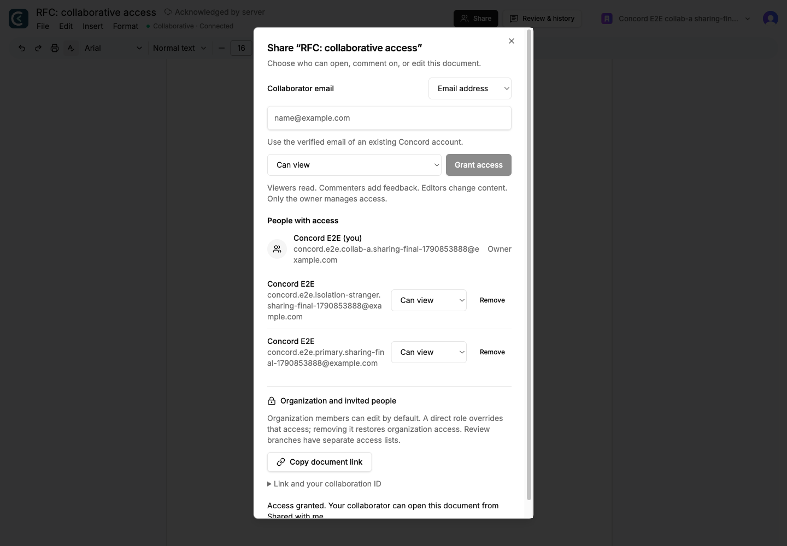
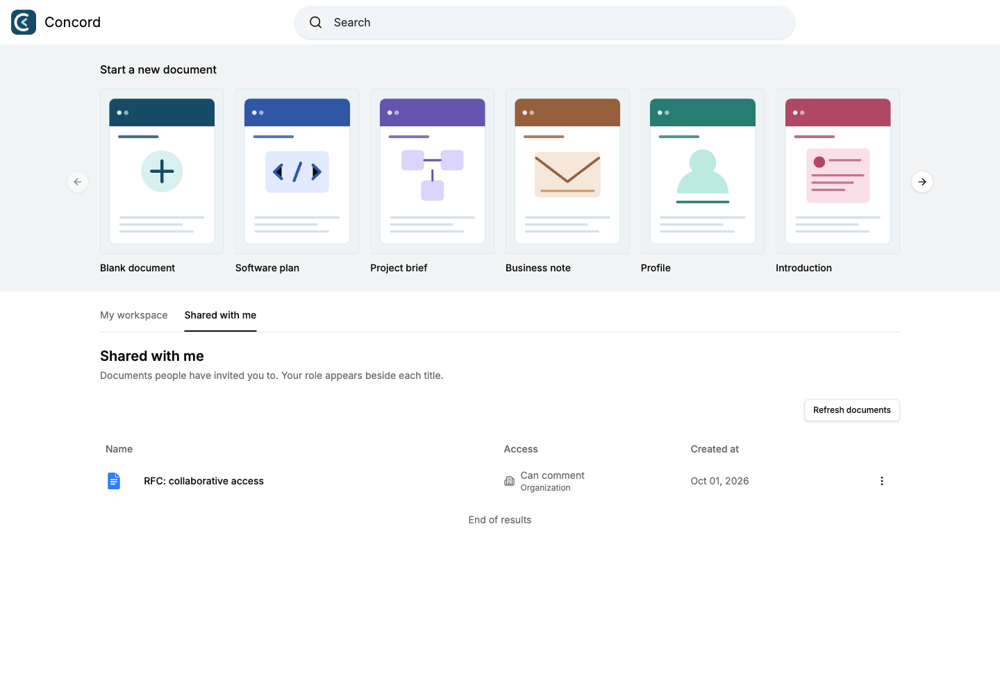

# Sharing documents and finding invitations

Use **Share** in the editor to give an existing Concord account access by
verified email. The recipient finds the document in **Shared with me** on
home, even when their active workspace differs from the owner's workspace.
A review branch uses the same dialog and has its own access list.

## Share a document

1. Open a document you own and choose **Share** in the top bar.
2. Enter your collaborator's verified account email and choose **Can view**,
   **Can comment**, or **Can edit**. Choose **Grant access**.
3. The account appears under **People with access**. Change its role there or
   choose **Remove** to revoke its direct grant.
4. Use **Copy document link** when you want to pass the link through your usual
   channel. A link does not grant access. The recipient can also open the
   document directly from **Shared with me**.

The email must belong to a verified account in the same Clerk instance. A
recipient can be granted access before their first Concord visit. An unknown
or unverified email leaves the form intact with instructions to sign up and
verify the address. Granting access sends no email; discovery happens inside
Concord. **Collaboration ID** remains an alternative for existing integrations.



## Find shared documents

Choose **Shared with me** on home. Each row shows your effective role. Search
by title, load subsequent pages, and open the title link. This collection
contains explicit invitations, including review branches; it excludes your
own documents. Organization-wide documents remain in **My workspace**.

The collection refreshes when the browser regains focus or connectivity. Use
**Refresh documents** for an invitation granted while you stay on that page.
Changing collections retains your title search; subsequent pages use the same
account, collection, and search constraints.



## Roles and organization access

| Role | Read | Edit and rename | Add comments | Manage access or delete |
|---|---|---|---|---|
| Owner | Yes | Yes | Yes | Yes |
| Can edit | Yes | Yes | Yes | No |
| Can comment | Yes | No | Yes | No |
| Can view | Yes | No | No | No |

Ownership is intrinsic and cannot be granted, transferred, or removed through
this dialog. Direct grants override organization-derived editor access.
Removing a direct grant from an organization member restores their normal
organization access. The dialog explains this rule; removing a grant does
not remove organization membership.

An open non-owner editor checks its role every ten seconds while visible,
and when focus or connectivity returns. A successful check updates edit and
comment controls or renders the masked unavailable-document page after
revocation. Failed checks preserve the local replica for offline use.

Server authorization is independent of that UI refresh. HTTP reads and
mutations reauthorize, write batches recheck permissions inside their database
transaction, and local/broker broadcasts recheck current read access before
queuing new content or presence. A revoked reader is closed; a database failure
also closes recipients rather than trusting a cached join role. An in-flight delivery authorized before the revoke commit may still finish. Revocation does not
remove content someone already received or their previously cached local copy.

## Implementation and verification

The dialog reuses the existing permission service, PostgreSQL ACL table,
audit records, Clerk SDK, and Radix dialog. It adds no dependency or schema
migration. Account lookup runs only after an owner authorization check and
requires an exact, verified email match. Non-owners receive their own role
without the other collaborators' profile list. Profile-service failure falls
back to saved collaboration IDs so owners can still change or remove access.

Shared discovery and effective roles are selected in one SQL query. Recipient
identity derives from the verified session; the listing accepts no target-user
or organization selector. Results are paginated and title wildcards are
escaped. Grant/update/revoke operations retain the existing transactional audit
behavior. JSON requests remain size-bounded and reject unexpected fields;
mutations reject a foreign origin. The configured public origin takes
precedence over the request host when the app sits behind a proxy.

Run the browser acceptance driver with the normal documented browser-test
prerequisites: PostgreSQL, NATS, Redis, the native worker, a current Rust
release gateway, bundled WASM, and a development Clerk instance.

```bash
CONCORD_E2E_MODE=production npm run test:sharing:browser -- --headed
npm test
npm run test:db
cd rust
cargo test --test db_integration -- --test-threads=1
```

The browser driver provisions disposable accounts and the isolated
`concord_e2e` database. It exercises email grants before first visit, comments,
shared discovery, unrelated-account denials, live promotion/downgrade, copy-link
and keyboard interaction, mobile layout, accessibility, service failure/retry,
and gateway revocation while HTTP permission polling is unavailable. Evidence
is written to `output/playwright/sharing/`; authenticated state used for optional
manual inspection stays in that ignored directory. See the
[acceptance report](audits/SHARING_REPORT.md) for the verified run.
