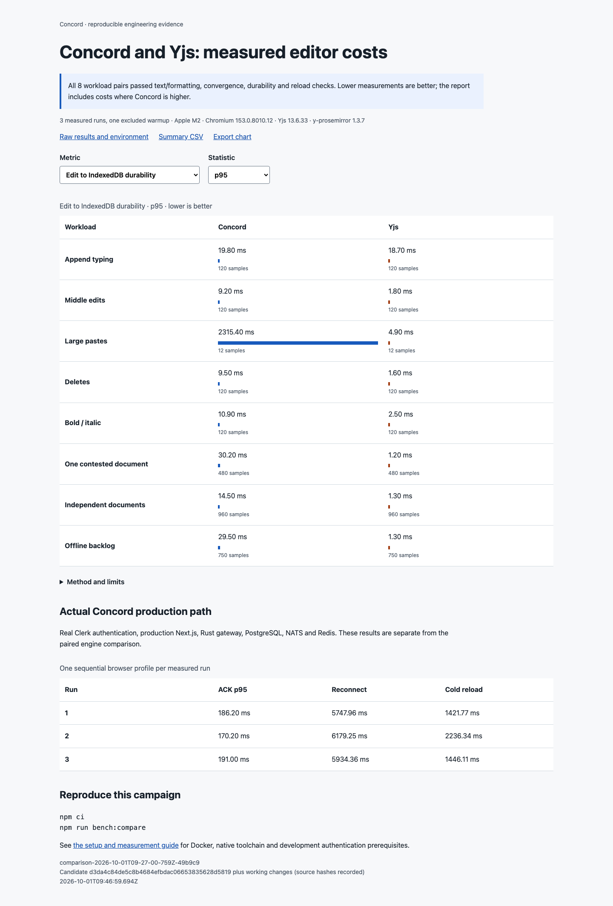

# Reproducible performance comparison: implementation and acceptance

## Published campaign: passed

Recorded on **2026-10-01**, from **09:27:00 to 09:46:59 UTC**, on an Apple M2
with eight cores and 8 GiB RAM, macOS 27.0, and headless Chromium 153.0.8010.12.
The native worker and gateway use Release builds. Node 24.20.0, Playwright
1.63.0, TipTap 3.31.3, PostgreSQL 18.6, and the full toolchain/service versions
are recorded in the raw environment.

Candidate identity is base commit
`d3da4c84de5c8b4684efbdac06653835628d5819` plus the working changes
committed with this report. All **12 recorded source/binary hashes** matched
the published candidate after measurement; this includes the sync-session
correction, workload and driver code, dependency lock, WASM/worker assets,
native worker, and gateway binary. Timing reproduction does not imply
byte-identical compiler output on another host.

- **64 paired cells passed:** 48 measured cells and 16 excluded warmups,
  covering all eight workloads and both engines.
- **5,364 measured paired user edits** are retained in the raw file; warmups,
  initial seeding, and the extra online-peer markers are separate.
- **Three authenticated application trials passed**, each with 164 online
  edits and 250 offline edits. The actual disconnected intervals were
  60,002, 60,015, and 60,008 ms. Every final pending outbox was empty.
- Report metric/statistic controls worked, all eight rows rendered,
  WCAG-tagged Axe checks reported **zero violations**, and the
  **390 × 844** viewport had no horizontal overflow.
- Additional browser review exercised **all 18 metric/statistic combinations**,
  checked the CSV download against the published bytes, and visually inspected
  the standalone SVG and report screenshot. All **131 local Markdown links**
  across the changed guides and README resolved; the CI YAML parsed correctly.
- Typecheck and lint passed; **314 web tests passed with two intentional
  skips**, and **two report/publication checks passed**. npm audit reported
  **zero vulnerabilities**. The production Next.js build passed.

## Measured editor comparison

All timings below are milliseconds. Each paired entry is **Concord / Yjs**;
edit sample counts are per engine across the three measured runs. Warmups
are excluded. Both engines use the common persistence contract.

| Workload | Edit samples / engine | Rendering p95 | Local durability p95 | Committed ACK p95 |
|---|---:|---:|---:|---:|
| Append typing | 120 | 34.40 / 33.20 | 19.80 / 18.70 | 27.20 / 28.50 |
| Middle edits | 120 | 34.40 / 33.90 | 9.20 / 1.80 | 17.60 / 9.80 |
| Large pastes | 12 | 29.40 / 33.20 | 2315.40 / 4.90 | 2336.10 / 10.50 |
| Deletes | 120 | 34.30 / 34.00 | 9.50 / 1.60 | 16.50 / 9.10 |
| Bold / italic | 120 | 34.20 / 33.60 | 10.90 / 2.50 | 21.20 / 9.30 |
| One contested document | 480 | 32.50 / 33.80 | 30.20 / 1.20 | 62.20 / 5.90 |
| Independent documents | 960 | 33.00 / 33.30 | 14.50 / 1.30 | 37.60 / 13.90 |
| Offline backlog | 750 | 34.10 / 34.10 | 29.50 / 1.30 | Unavailable offline |

The rendering opportunity is similar on these workloads; it can occur before
local persistence completes. Large-paste local durability was **2,315.40 ms
for Concord versus 4.90 ms for Yjs** at p95. The median retained PostgreSQL
payload after that workload was **985,092 versus 19,117 bytes**, and all
replicas' local payloads totaled **1,818,592 versus 38,154 bytes**.

Concord also retained more measured V8 memory: the append workload's median
across both pages and their workers was **10,714,561 versus 8,415,084 bytes**.
The exported paste state was **1,098,813 versus 18,998 bytes**. These are
specific retained representations, not peak process memory or complete
database disk usage. The chart and interactive report expose every workload,
including costs where Concord is higher.

Offline catch-up after the 250-edit backlog had median **5,216.04 ms for
Concord versus 564.19 ms for Yjs**. Cold reload on that workload had median
**498.65 versus 164.64 ms**. Recovery metrics have only three measured run
samples, so their p95 values should be read with that small sample count.

## Actual application profile

These results include the real authenticated application and its default
gateway write policy. They are separate from the controlled Yjs comparison.
Each trial contains 164 online edits, including only four large pastes:
overall p95 can miss those rare, costly edits, so the maximum is shown too.
All values except the last column are milliseconds.

| Trial | ACK p50 | ACK p95 | ACK maximum | Reconnect | Cold reload | Rate-limit responses |
|---|---:|---:|---:|---:|---:|---:|
| 1 | 106.90 | 186.20 | 8868.70 | 5747.96 | 1421.77 | 27 |
| 2 | 101.60 | 170.20 | 8984.40 | 6179.25 | 2236.34 | 26 |
| 3 | 102.60 | 191.00 | 8043.10 | 5934.36 | 1446.11 | 25 |

All gateway error frames recorded here were the expected `rate_limited`
vocabulary; unexpected gateway/browser errors fail the campaign. Limits
were enabled, writes retained their identities across retry, and the final
connection and acknowledged-by-server state were required before the trial
could pass. Every trial retained **27,669 durable operations** totaling
**1,332,544 payload bytes**, with zero pending operations after recovery.
The source application's memory accounting included **three dedicated
workers** in addition to the page; their allocations are recorded separately
from the controlled editor's single Concord worker.



## What was built

`npm run bench:compare` runs real Chromium editors with the production
Concord bridge, stock WASM worker, and IndexedDB implementation, and the
official Yjs ProseMirror binding. Both receive the same recorded user edits,
use the same TipTap schema, and persist binary update batches through the
same loopback HTTP/PostgreSQL server. Yjs 13.6.33 and y-prosemirror 1.3.7
are exact development dependencies; the full tree is locked.

The shared server commits before acknowledging a batch, enables PostgreSQL
synchronous commit, serializes sequence assignment and commit order per
document, and checks retry identities against the original payload. Both
clients retain local history and use the same durable retry outbox. Concord
operation capture uses the existing worker notifications used by its sync
integration. The comparison does not add a second product sync protocol.

Eight workloads cover actual keyboard append input, middle insertion,
large paste, deletion, formatting, a document with four concurrent writers,
eight independent documents, and a 250-edit offline backlog on 10,000
starting characters. The shared subset is ASCII text, one paragraph, bold,
and italic. The [guide](../PERFORMANCE_COMPARISON.md) specifies every workload
and measurement boundary.

A separate lane runs the existing production browser stack with real Clerk
authentication, Next.js, the Rust gateway, PostgreSQL, NATS, Redis, and the
native recovery worker. It measures Concord's actual write and recovery
path; its numbers are not mixed into the Yjs ranking. A benchmark-only probe
observes the stock worker's local commit response and requires the exact
last operation counter and an empty pending/sent outbox before reporting a
whole edit's server acknowledgement.

## Recovery defect found and corrected

The full production workload reached the gateway's default 2,000-operation
write budget per connection per minute. The gateway closed the rate-limited
connection and the client retried with stable operation identities. After
all writes were acknowledged, the browser's pending outbox was empty but a
prior `rate_limited` error remained visible: the last ACK had not triggered
the durable catch-up needed to compact acknowledged rows and confirm its
cursor.

`SyncSession` now requests a silent catch-up after its final pending ACK.
Errors and ACK records still clear only after the worker atomically persists
the server's cursor coverage. This confirmation does not create a new
"while you were away" notice for the writer's own edits. Reconnects and
explicit history/branch pulls retain their summaries. The existing real-WASM
session regression was extended; it failed before the fix and checks that
missing cursor coverage cannot discard an acknowledged row.

The production browser reproduction then showed both replicas connected,
zero pending operations, and the acknowledged-by-server state after the
60-second offline backlog and reload. Rate limits remain enabled; their
responses are recorded in the production raw results and their retry costs
remain in the timings.

## Evidence and reproduction

Published artifacts live together in [assets/performance](../assets/performance/):

- [Raw results and environment](../assets/performance/raw.json): exact edits,
  individual timing samples, warmups, correctness receipts, package versions,
  hardware, toolchains, source and binary hashes.
- [Interactive report](../assets/performance/report.html): metric and percentile
  controls, sample counts, raw downloads, and the separate production profile.
- [Summary CSV](../assets/performance/summary.csv) and
  [summary JSON](../assets/performance/summary.json).
- [Exportable SVG charts](../assets/performance/charts.svg),
  [report screenshot](../assets/performance/report.png), and
  [production editor screenshot](../assets/performance/production-editor.png).

Keep the HTML report beside its companion files when opening it locally.
The full command, after the [documented prerequisites](../PERFORMANCE_COMPARISON.md#prerequisites), is:

```bash
npm ci
npm run bench:compare
```

On the recorded macOS host, the separately installed Command Line Tools were
selected for the command with
`DEVELOPER_DIR=/Library/Developer/CommandLineTools`. The harness recreates only
the isolated `concord_e2e` database and cleans up its temporary schema, test
identities, and spawned servers. It preserves its output directory.

## Validation built into the campaign

Every paired sequential case checks its final text and per-character formatting
against a user-level reference. Independent documents are checked separately.
The contested case checks every unique edit exactly once and matching peer
states within each engine. Tied concurrent insert order may differ between
engines. The offline case checks that local text survives in order, the
peer's online insertion appears once, all replicas converge, and the retry
outbox drains. Each cell reloads its editor and checks the exact final state.

The report generator rejects incomplete matrices, missing samples, mismatched
workloads, missing worker memory, invalid measurements, and pending writes.
Two Node standard-library checks exercise those rejection paths and verify
warmup exclusion, percentile calculation, and omission of unavailable offline
ACK samples. CI runs them and a secretless quick Chromium/WASM/PostgreSQL
campaign. CI's smaller profile is correctness evidence; its shared-runner
timings are not published performance claims.

## Measurement limits

- Three measured runs and one excluded warmup give descriptive observations
  on one machine. The campaign alternates engine order and retains slow
  samples. Small-sample recovery p95 values are maxima, not confidence bounds.
- Rendering ends at the second animation-frame callback: a presentation
  opportunity, not physical screen paint. Worker persistence, editor rendering,
  and committed server acknowledgement have separate timing boundaries.
- Memory is retained, post-GC V8 heap plus backing storage for all participating
  pages and their dedicated workers. It includes Concord's WASM storage and
  excludes native browser, DOM, graphics, and operating-system allocations.
  It is not peak process RSS.
- Stored byte counts cover binary payloads. They exclude PostgreSQL headers,
  indexes, and WAL. Local payloads sum all replicas; server logs and exported
  states are separate measurements. The paired comparison retains all batches
  without compaction.
- The common transport is an editor/engine comparison, not a comparison of
  two complete deployments. The actual-app lane uses local infrastructure;
  it does not establish hosted network latency or maximum throughput.
- Each writer waits for the prior edit's completion. The concurrent workloads
  run multiple such writers; they do not model a fixed-rate keystroke arrival
  stream or queue saturation.
- This work does not establish asymptotic complexity, universal superiority,
  or responsive editing at every document size. The existing 100,000-operation
  fold/import gate remains a broad regression guard. Historical ingest and
  recovery tables keep their original candidate identities and were not rerun.
